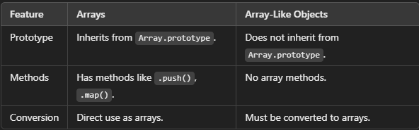
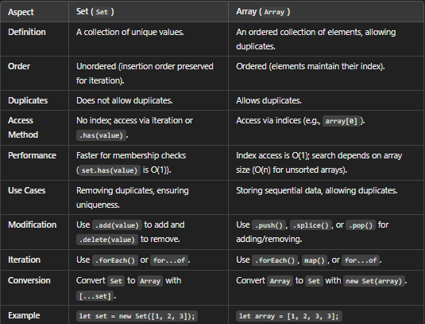
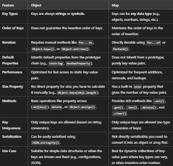
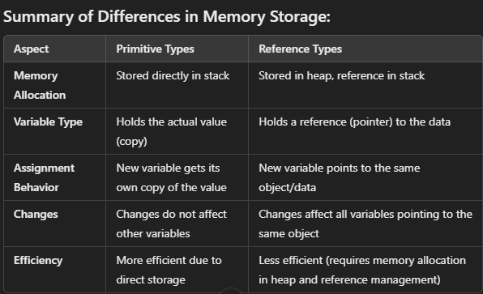

# Use split() to make string to array

# Array

--> Created using [ ]
--> ordered Collection of items / elements
--> Reference types Also known as objects
--> [1, 2, 3, 4, "String", null, undefined ]
--> semi colon

# Objects

--> Created using { }
--> Array are good but not sufficient for real world data
--> objects store key value pairs
--> objects don't have index
--> { name:"Shanu", age:23}
--> comma at end of each object

# Array.from() --> Converts any iterable or array-like object into a real array

# The spread operator (...) --> can also convert array-like objects into arrays.

# Array like object

--> Objects that resemble arrays but do not have all the features of a true array
--> Manipulating DOM NodeLists when working with the DOM.
--> Performing array operations on any object with a length and indexed properties.
--> They lack array-specific methods like .push(), .map(), or .filter().

# 

--> Core distinction --> a real Array has array methods (.push, .map, .filter...) and Array.isArray() returns true for it; an array-like object only has a .length and numeric-indexed properties (e.g. arguments, NodeList) but lacks those methods and Array.isArray() returns false.
--> Use Array.from(arrayLike) or [...arrayLike] to convert an array-like into a real array before using array methods on it.

# Sets

--> ([ ])
--> It is iterable
--> used to store data , of any type, whether primitive values or object references.
--> Unique items only (no duplicate allowed)
--> It also have its own methods
--> No index based access
--> Order is not guaranteed  
--> Best uses in creating id's because it takes only unique values

# 

--> Core distinction --> an Array can have duplicate values and is accessed by numeric index; a Set stores only unique values, has no index-based access, and is checked/added/removed with .has()/.add()/.delete() instead of [].

# Map

--> Map is a collection of key-value pairs where the keys can be of any data type (objects, functions, primitives, etc.).
--> It is similar to an object but provides more flexibility and useful methods for working with key-value pairs.
--> It is an iterable.
--> Store data in ordered fashion.
--> Store key value pair(like object).
--> Duplicate keys are not allowed like objects.

# 

--> Core distinction --> an Object's keys are strings/symbols only and it is not directly iterable; a Map's keys can be any type (objects, functions, primitives), preserves insertion order reliably, has a .size property, and is directly iterable with for...of.

# Memory Layout:

--> Primitive (x and y):
--> x is in the stack with value 20.
--> y is in the stack with value 10.
--> x and y are independent copies.

# Reference Type (obj1 and obj2):

--> obj1 and obj2 are in the stack, both holding the same reference to an object in the heap.
--> The object in the heap looks like { name: "Bob" }.
--> Both obj1 and obj2 point to the same object, so modifying the object through either reference affects both.
--> array , objects
--> To access string we use square bracket []


# Iterables

--> An iterable is an object that can be iterated over, meaning its elements can be accessed sequentially
--> Arrays: [1, 2, 3], Strings: 'Hello', Maps: new Map() ,Sets: new Set(), Typed Arrays: Int32Array, Uint8Array, etc., Arguments Object (function arguments)

# Non-Iterable Objects

--> Objects like plain JavaScript objects {} are not iterable by default.

--> In javascript key are in string

# Dot Notation:

--> Uses a period (.) to access object properties
--> Used for static property access

# Bracket Notation:

--> Uses square brackets [] to access properties
--> Required when property names are not valid identifiers
--> When property names contain special characters or spaces,using variables or expressions to access properties,property names start with numbers:

==> window.alert(),console.log(),document.write() are correct syntax for writing output in JavaScript

# Destructuring

--> Array destructuring --> const [a, b] = [1, 2]
--> Object destructuring --> const { name, age } = { name: "Shanu", age: 23 }

# Spread and Rest Syntax

--> Spread (...) expands an iterable/object into individual elements --> const arr2 = [...arr1, 4, 5]; const obj2 = { ...obj1, city: "Delhi" }
--> Rest (...) collects remaining items into an array/object --> const [first, ...rest] = [1, 2, 3]; const { a, ...others } = obj

# Object Shorthand Property Syntax

--> When a variable name matches the desired key name, can skip writing it twice --> const name = "Shanu"; const obj = { name } is same as { name: name }

# Deep Dive -- WeakMap and WeakSet

--> `WeakMap` and `WeakSet` are variants of `Map`/`Set` that hold their KEYS "weakly" -- meaning if the only remaining reference to an object is as a WeakMap key, the JavaScript engine's garbage collector is free to reclaim that memory entirely, automatically removing the entry. A regular `Map`, by contrast, holds a STRONG reference to its keys, keeping them (and any memory they use) alive for as long as the Map itself exists, even if nothing else in the program still needs them.

```javascript
let user = { name: "Alice" };
const cache = new WeakMap();
cache.set(user, "some cached data");

user = null;   // No other references to the original object remain
// The WeakMap entry is now eligible for garbage collection automatically --
// a regular Map would keep the {name: "Alice"} object alive forever, causing a memory leak
```

--> **Why this matters practically** -- WeakMaps are ideal for attaching extra metadata to objects (caching a computed result tied to a specific DOM element, for instance) WITHOUT preventing that object from being garbage-collected once the rest of the application is done with it -- directly solving a real, easy-to-introduce memory leak pattern that a regular Map would create.
--> **The trade-off** -- WeakMap/WeakSet are NOT iterable (no `.forEach()`, no `for...of`, no `.size`) precisely because their contents can silently disappear at any time due to garbage collection -- iterating over a collection whose membership can change unpredictably wouldn't produce reliable results, so the API deliberately doesn't expose that capability at all.
--> Keys in a WeakMap/WeakSet MUST be objects (or, more recently, certain other collectable values) -- primitives can't be used as keys, since primitives aren't garbage-collected the same way objects are.

# Deep Dive -- Shallow Copy vs Deep Copy

--> The spread operator (`...`) and `Object.assign()` both perform a SHALLOW copy -- only the top-level properties are actually copied; any NESTED object/array inside is still shared by reference between the original and the copy.

```javascript
const original = { name: "Alice", address: { city: "NYC" } };
const shallowCopy = { ...original };

shallowCopy.name = "Bob";              // Fine -- doesn't affect original.name
shallowCopy.address.city = "Boston";    // Mutates the SHARED nested object -- original.address.city is now "Boston" too!

console.log(original.address.city);   // "Boston" -- the nested object was never actually copied
```

--> **Deep copy** -- creates fully independent copies at EVERY level of nesting, with no shared references anywhere.

```javascript
const deepCopy = structuredClone(original);   // Modern, built-in deep clone -- handles most data types correctly
deepCopy.address.city = "Chicago";
console.log(original.address.city);   // Still "Boston" -- fully independent

// Older, more limited approach (fails on functions, undefined, Dates, etc.)
const deepCopyOld = JSON.parse(JSON.stringify(original));
```

--> `structuredClone()` is the modern, native, widely-supported way to deep clone -- it correctly handles Dates, Maps, Sets, and circular references, all of which `JSON.parse(JSON.stringify(...))` either mishandles or throws on entirely.

# Deep Dive -- Map/Set vs Object/Array Performance Characteristics

--> `Map` provides guaranteed, predictable performance for frequent insertion/deletion of key-value pairs, especially with a very large number of entries -- Objects are technically capable of the same, but were not originally designed as general-purpose hash maps, and can suffer real performance degradation patterns as key-insertion patterns grow more dynamic and unpredictable.
--> `Set` provides O(1) average-case `.has()` membership checks, directly connecting to the Data Structures Deep Dive file's hash-map coverage -- checking `set.has(value)` against thousands of items is dramatically faster than `array.includes(value)`, which must scan the array linearly (O(n)) in the worst case.

```javascript
const hugeArray = [/* 100,000 items */];
const hugeSet = new Set(hugeArray);

hugeArray.includes(someValue);   // O(n) -- potentially scans all 100,000 items
hugeSet.has(someValue);            // O(1) average case -- dramatically faster for large collections
```
