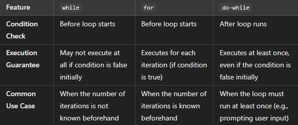
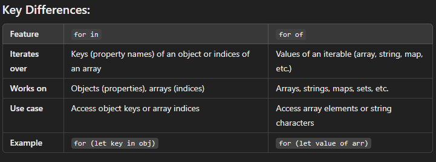
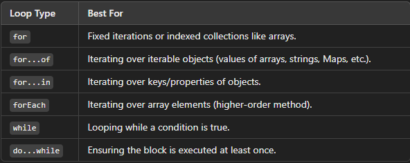

# Switch Statement

--> evaluates a value against multiple cases and executes the code block of the matching case
--> Provide break if want to stop the execution and no further responses from code otherwise it will provide all the given cases
--> Fallthrough --> if a case is missing its break, execution continues into the next case's code regardless of whether it matches, until a break or the end of the switch is reached

# While loop

--> Condition is checked before the loop body executes.
--> Use while when don't know in advance how many times the loop will execute, and want to repeat the loop as long as a condition remains true.
--> we declare variable before starting while

# For loop function

--> for loop Condition is checked before the loop body executes, similar to while, but it has an initialization step, a condition, and an increment step all in one line
--> Use for when the number of iterations is known or easily determined before the loop starts (e.g., looping over a range or through an array).
--> If we declare variable inside starting parenthesis then it will became local variable
--> we can use var instead of let for making it from local to global

# Do while

--> Condition is checked after the loop body executes.
--> Use do-while when want the loop to execute at least once before checking the condition (e.g., when a menu is presented to the user and want to ensure the menu shows up at least once).

# 

# 

--> for...in --> iterates over the enumerable property KEYS of an object (or array indices as strings) -- best for plain objects.
--> for...of --> iterates over the VALUES of an iterable (arrays, strings, Maps, Sets, etc.) -- best for arrays/iterables, doesn't work directly on plain objects.

# 

--> Types include the classic for loop, for...in (object keys), for...of (iterable values), and forEach (array method, see below) -- each suited to a different kind of collection.

# forEach (loop alternative)

--> Array method that runs a callback for each element instead of writing a manual for loop -- e.g. arr.forEach(item => console.log(item))
--> Cannot be stopped with break/continue and doesn't return a new array (see Array Methods notes for forEach vs map)

# Labeled Loops

--> A label lets break/continue target a specific outer loop instead of just the innermost one.
--> outer: for (let i = 0; i < 3; i++) { for (let j = 0; j < 3; j++) { if (j === 1) break outer; } }

# Break

--> It will stop after given condition satisfy

# Continue

--> continue the output from starting to end except the desire result.

# push and pop is faster than unshift & shift because push and pop have to create and dealt with last element whereas unshift & shift have to make changes in starting and deal with all other elements

# Deep Dive -- Why break/continue Don't Work Inside forEach

--> `forEach` is a normal function receiving a callback -- `break`/`continue` are loop-control keywords that only make sense inside an ACTUAL loop syntax (`for`, `while`), not inside a function call. Attempting `break` inside a `forEach` callback throws a `SyntaxError`.

```javascript
[1, 2, 3, 4].forEach(n => {
  if (n === 3) break;   // SyntaxError -- break is not allowed here
});

for (const n of [1, 2, 3, 4]) {
  if (n === 3) break;    // Works fine -- for...of is real loop syntax
}
```

--> This is one of the concrete, practical reasons to reach for a real `for`/`for...of` loop instead of `forEach` when you need the ability to exit early -- `.some()` or `.find()` (covered in the Array Methods file) can sometimes substitute for an early-exit `forEach`, since both stop iterating as soon as their condition is satisfied.

# Deep Dive -- switch Fallthrough as an Intentional Feature

--> While missing a `break` is a common accidental bug, deliberate fallthrough is sometimes used intentionally to group multiple cases that should share the same code path.

```javascript
function isWeekend(day) {
  switch (day) {
    case "Saturday":
    case "Sunday":         // Deliberately no break -- falls through to share the same result
      return true;
    default:
      return false;
  }
}
```

# Deep Dive -- Loop Performance -- Classic for vs for...of vs .forEach()

--> A plain, classic `for` loop is generally the FASTEST option across JS engines, since it has the least overhead (no function call per iteration, no iterator protocol machinery) -- but the difference is genuinely negligible for most everyday code, and readability should usually win over micro-optimization unless profiling (covered in the Web Performance and Debugging Tools file) has specifically identified a loop as a real bottleneck.
--> `for...of` and `.forEach()` both have small additional overhead compared to a classic `for` loop (iterator protocol calls, or a function call per element respectively) -- for typical application code (looping over a few hundred/thousand items), this overhead is not something worth manually avoiding at the cost of code clarity.
