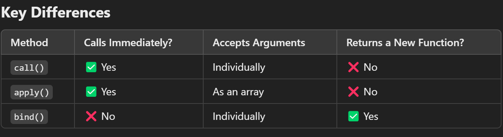

# OOPs / Prototypal Inheritance

# Methods

--> Function inside object

# type console.log(this) or console.log(window) in the browser's developer console, the output depends on the execution context:

--> In JavaScript, call(), apply(), and bind() are methods used to manipulate the this keyword and invoke functions in different ways. Here’s how they differ:

# call() Method

--> Calls a function immediately.
--> Takes arguments individually.

# apply() Method

--> Calls a function immediately.
--> Takes arguments as an array.

# bind() Method

--> Returns a new function instead of calling it immediately.
--> Allows binding this for later execution.

# When to Use?

--> Use call() when passing arguments one by one, apply() when passing arguments as an array, and bind() when need a function to be called later with a fixed this value.

# 

# The Four Rules of `this` Binding

--> For a REGULAR function (not an arrow function), what `this` refers to is decided by HOW the function is called, not where it's defined. There are four rules, checked in this priority order:

1. New Binding (highest priority)
   --> When a function is called with `new`, `this` refers to the brand-new object being constructed.
   ```javascript
   function Person(name) { this.name = name; }
   const p = new Person("Alice");
   console.log(p.name);   // "Alice" -- `this` was the new object
   ```

2. Explicit Binding
   --> When a function is called via `call()`, `apply()`, or `bind()`, `this` is explicitly set to whatever object is passed in.
   ```javascript
   function greet() { console.log(this.name); }
   greet.call({ name: "Bob" });   // "Bob"
   ```

3. Implicit Binding
   --> When a function is called as a method on an object (`obj.method()`), `this` refers to that object (whatever is to the left of the dot at call time).
   ```javascript
   const user = { name: "Carol", greet() { console.log(this.name); } };
   user.greet();   // "Carol" -- `this` is `user`
   ```

4. Default Binding (lowest priority)
   --> When a function is called plainly, with no object context (`myFunction()`), `this` defaults to `undefined` in strict mode (or the global object `window`/`global` in non-strict/sloppy mode).
   ```javascript
   function show() { console.log(this); }
   show();   // undefined (strict mode) or the global object (sloppy mode)
   ```

--> Common pitfall: extracting a method off an object loses its implicit binding, falling back to default binding.
```javascript
const user = { name: "Dave", greet() { console.log(this.name); } };
const fn = user.greet;
fn();   // undefined -- `this` is no longer `user`, because it's now a plain function call
```

--> Arrow functions follow NONE of these four rules -- they don't have their own `this` at all, and always inherit it lexically from the surrounding (enclosing) scope where they were defined, regardless of how they're later called.

# Arrow function

--> Arrow Functions Don’t Have Their Own this
--> Arrow Functions Inherit this from Their Parent Scope
--> Arrow Functions Are Useful for Callbacks

# Name Property

--> Tell the name of the function

--> We can add our own properties.
--> Function provides more useful properties.
--> Only Function provide prototype property

# [[Prototype]], **proto**, and .prototype

# [[Prototype]] (Internal Prototype)

--> It is an internal hidden property that refers to an object's prototype.
--> Every object in JavaScript has this property (except Object.create(null)).
--> It forms the prototype chain used for inheritance.
--> Not directly accessible, but can be retrieved using Object.getPrototypeOf(obj).

# **proto** (Deprecated Public Access to [[Prototype]])

> **Correction:** every occurrence of "**proto**" in this file (in this heading, the section heading above, the summary section, and the Best Practices bullets below) is a Markdown rendering artifact -- the actual JavaScript property being described is `__proto__` (a double underscore on BOTH sides of the word "proto"). The renderer collapsed `__proto__` into bold text because `__..__` is also Markdown's bold syntax, so the literal property name never displayed correctly. Mentally substitute `__proto__` everywhere "**proto**" appears below.
>
> `__proto__` is a legacy, deprecated getter/setter exposed on `Object.prototype` that gives direct read/write access to an object's internal `[[Prototype]]` slot. It originated as a non-standard, browser-only feature before being added to the ES2015 spec only as an "Annex B" legacy-compatibility feature -- meaning browsers must support it for old pages, but new code should not rely on it. It has been superseded by:
> - `Object.getPrototypeOf(obj)` -- reads `obj`'s `[[Prototype]]` (replaces reading `obj.__proto__`).
> - `Object.setPrototypeOf(obj, proto)` -- reassigns `obj`'s `[[Prototype]]` (replaces `obj.__proto__ = proto`).
>
> Reasons to prefer the modern methods: `__proto__` isn't guaranteed present on every object (e.g. objects made with `Object.create(null)` have no prototype chain to inherit the accessor from), and mutating `__proto__` on a live object is a known engine performance pitfall (it can deoptimize property lookups). `Object.getPrototypeOf`/`Object.setPrototypeOf` work uniformly across all objects and are the standard, unambiguous API.

--> It is a getter/setter for [[Prototype]], allowing explicit access to an object's prototype.
--> Deprecated but still works in modern browsers.
--> Avoid using it in production; prefer Object.getPrototypeOf(obj) or Object.setPrototypeOf(obj, proto) instead.

# .prototype (Constructor Function Prototype)

--> Only exists on functions (not regular objects).
--> Used to define methods and properties for instances created by constructor functions.
--> When an object is created using new, its [[Prototype]] is set to the constructor's .prototype

# Summary of [[Prototype]], **proto**, and .prototype

--> [[Prototype]] – The real internal prototype, accessible via Object.getPrototypeOf(obj).
--> **proto** – A public, now-deprecated way to access or modify [[Prototype]].
--> .prototype – A function property used to define methods for objects created via constructors.

# Best Practices

--> Use Object.getPrototypeOf(obj) instead of obj.**proto** (to access the prototype).
--> Use Object.setPrototypeOf(obj, proto) instead of obj.**proto** = proto (to modify the prototype).
--> Use .prototype only when defining methods for constructor functions.

--> ![Difference Between [[Prototype]], __proto__, and .prototype in JavaScript](06-02_Prototype_vs_Proto_vs_DotPrototype.png)
![Key Difference Between [[Prototype]], __proto__, and .prototype in JavaScript](06-03_Prototype_vs_Proto_vs_DotPrototype_KeyDifferences.png)

# New Keyword

--> It gives new empty object
--> Links the new object's [[Prototype]] to the constructor function's .prototype (so it inherits methods defined there)
--> Binds `this` inside the constructor to the newly created object
--> Implicitly returns the new object -- unless the constructor explicitly returns another object, in which case that object is returned instead

# ES6 Classes

--> class Person { constructor(name) { this.name = name } greet() { console.log(this.name) } }
--> Syntactic sugar over prototypal inheritance
--> extends is used for inheritance, super() calls the parent constructor
--> static methods/properties belong to the class itself, not instances

# Getters and Setters

--> get defines a method that runs when a property is accessed
--> set defines a method that runs when a property is assigned a value
--> Useful for computed properties and validation logic

# Private Class Fields (#x)

--> class Person { #age = 0; setAge(a) { this.#age = a } } -- fields prefixed with # are truly private, only accessible inside the class body
--> Accessing #age from outside the class throws a SyntaxError, unlike the old "_age" naming convention which was only a hint

# Static Blocks

--> class Config { static settings; static { Config.settings = loadSettings() } } -- a static {} block runs once when the class is defined, useful for complex static property initialization

# Classes and the Temporal Dead Zone (TDZ)

--> Just like `let`/`const`, class declarations are hoisted but placed in the Temporal Dead Zone -- the class binding exists from the start of the scope, but cannot be accessed before the actual `class` declaration line is reached.
```javascript
console.log(typeof Person);   // ReferenceError: Cannot access 'Person' before initialization
class Person {}
```
--> Unlike `function` declarations (which are fully hoisted and callable before their definition line), classes behave like `let`/`const` in this respect -- always declare/import a class before using it.
--> This applies to both `class Person {}` declarations and `class Person extends Base {}` -- the TDZ restriction covers the whole class body, including any class expression assigned to a `const`/`let`.

# Object.defineProperty() and Property Descriptors

--> Every object property has an underlying "descriptor" controlling its behavior, even when created with normal `obj.prop = value` syntax. `Object.defineProperty()` lets you configure that descriptor explicitly.
--> Descriptor flags:
    - `value` -- the property's value.
    - `writable` -- if false, the value cannot be reassigned (silently fails in non-strict mode, throws in strict mode).
    - `enumerable` -- if false, the property is hidden from `for...in`, `Object.keys()`, and `JSON.stringify()`.
    - `configurable` -- if false, the property cannot be deleted or have its descriptor changed again (except making it less permissive in some cases).

```javascript
const user = {};
Object.defineProperty(user, "id", {
  value: 101,
  writable: false,      // read-only
  enumerable: false,    // hidden from Object.keys()/JSON.stringify()
  configurable: false,  // can't be deleted or redefined
});

console.log(user.id);          // 101
user.id = 999;                  // Silently ignored (or throws in strict mode)
console.log(Object.keys(user)); // [] -- "id" is hidden because enumerable is false
```

--> `Object.getOwnPropertyDescriptor(obj, "prop")` -- inspect an existing property's current descriptor flags.
--> `Object.defineProperties(obj, { ... })` -- define multiple descriptors at once.
--> This is the underlying mechanism that powers `get`/`set` accessor properties, `Object.freeze()` (sets `writable`/`configurable` to false on every property), and read-only constants on built-in objects.

# Deep Dive -- Composition Over Inheritance

--> Deep, multi-level class inheritance hierarchies (`class Dog extends Animal extends LivingThing`) can become brittle as a codebase grows -- a change to a base class can unexpectedly ripple through every descendant, and forcing a real-world concept into a strict single-parent hierarchy often doesn't match reality well (a "FlyingFish" both swims and flies -- which single parent class should it extend?). Composition builds objects by COMBINING smaller, focused pieces of behavior instead of inheriting from one increasingly complex ancestor chain.

```javascript
const canFly = (state) => ({
  fly: () => console.log(`${state.name} is flying`)
});

const canSwim = (state) => ({
  swim: () => console.log(`${state.name} is swimming`)
});

function createFlyingFish(name) {
  const state = { name };
  return { ...state, ...canFly(state), ...canSwim(state) };
}

const nemo = createFlyingFish("Nemo");
nemo.fly();    // "Nemo is flying"
nemo.swim();    // "Nemo is swimming" -- composed from two independent, reusable behaviors, no forced hierarchy
```

--> This is precisely the "favor composition over inheritance" principle widely cited in object-oriented design discussions -- each small function (`canFly`, `canSwim`) is independently testable and reusable across completely unrelated object types, unlike a rigid inheritance chain where behavior can only be reused by inheriting from a specific ancestor.

# Deep Dive -- instanceof and the Prototype Chain

--> `instanceof` checks whether a constructor's `.prototype` appears ANYWHERE in an object's prototype chain -- not simply "was this object literally created by this exact constructor."

```javascript
class Animal {}
class Dog extends Animal {}

const rex = new Dog();
console.log(rex instanceof Dog);      // true
console.log(rex instanceof Animal);    // true -- Animal.prototype is further up rex's prototype chain
console.log(rex instanceof Object);     // true -- every object's chain eventually reaches Object.prototype
```

--> This is why `instanceof` correctly recognizes inherited relationships across an entire `extends` chain, not just the immediate, most specific class -- directly reflecting how the prototype chain (covered earlier in this file) actually works underneath the ES6 class syntax's sugar-coating.
