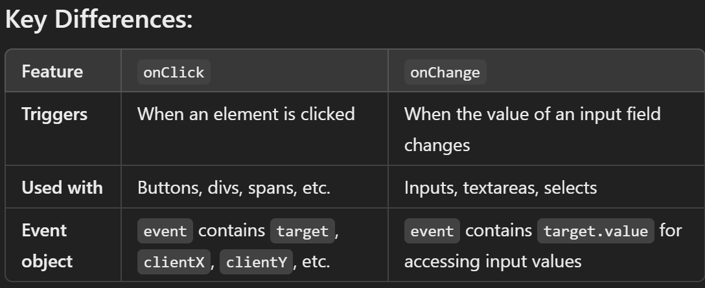

# What is the DOM

--> DOM (Document Object Model) is a tree-like representation of an HTML document that JavaScript can read and manipulate.
--> Every HTML tag becomes a "node" in this tree -- `document` is the root object used to access it.
--> Changes made to the DOM update what's shown on the page immediately, without reloading it.

# Selecting Elements

--> `document.getElementById("id")` --> Selects a single element by its id, returns null if not found.
--> `document.getElementsByClassName("class")` --> Returns a live HTMLCollection of all elements with that class.
--> `document.getElementsByTagName("tag")` --> Returns a live HTMLCollection of all elements with that tag name.
--> `document.querySelector("css-selector")` --> Returns the FIRST element matching any valid CSS selector (e.g. `.card`, `#main`, `div > p`).
--> `document.querySelectorAll("css-selector")` --> Returns a static NodeList of ALL matching elements -- can be looped with `.forEach()`.
--> `querySelector`/`querySelectorAll` are preferred in modern code since they accept any CSS selector, unlike the older `getElementBy...` methods.

# Creating and Modifying Elements

--> `document.createElement("div")` --> Creates a new element (not yet in the page until appended).
--> `parent.appendChild(child)` --> Adds a node as the last child of parent.
--> `parent.append(child)` --> Like appendChild, but can take multiple nodes/strings at once.
--> `parent.prepend(child)` --> Adds a node as the first child of parent.
--> `parent.insertBefore(newNode, referenceNode)` --> Inserts newNode before referenceNode.
--> `element.remove()` --> Removes the element from the DOM directly.
--> `parent.removeChild(child)` --> Older way to remove a child node.
--> `element.cloneNode(true)` --> Creates a copy of the element; `true` also copies all its children (deep clone).

# Reading and Changing Content

--> `element.innerHTML` --> Gets/sets the HTML content inside an element (parses any tags in the string -- risk of XSS with untrusted input).
--> `element.textContent` --> Gets/sets the plain text content only, ignoring/escaping any HTML tags -- safer for untrusted input.
--> `element.innerText` --> Similar to textContent but respects CSS styling (e.g. skips hidden elements), and is more expensive performance-wise.
--> `element.value` --> Gets/sets the current value of form elements (`<input>`, `<textarea>`, `<select>`).

# Attributes and Classes

--> `element.getAttribute("attr")` / `element.setAttribute("attr", "value")` / `element.removeAttribute("attr")` --> Read/set/remove any HTML attribute.
--> `element.id`, `element.className` --> Direct property access for common attributes.
--> `element.classList.add("class")` / `.remove("class")` / `.toggle("class")` / `.contains("class")` --> Preferred way to manage classes without overwriting existing ones.
--> `element.style.propertyName = "value"` --> Sets an inline CSS style directly (camelCase, e.g. `element.style.backgroundColor = "red"`).
--> `element.dataset.key` --> Reads/writes custom `data-key="value"` attributes.

# DOM Traversal

--> `element.parentElement` --> The direct parent element.
--> `element.children` --> HTMLCollection of direct child elements only (not text nodes).
--> `element.firstElementChild` / `.lastElementChild` --> First/last direct child element.
--> `element.nextElementSibling` / `.previousElementSibling` --> Adjacent sibling elements.

# addEventListener

--> `element.addEventListener("event", handlerFunction)` --> Attaches an event handler without overwriting any existing handlers on the same element (unlike `element.onclick = fn`).
--> `element.removeEventListener("event", handlerFunction)` --> Removes a previously attached handler -- the handler must be a named function (not an inline arrow function) to be removable.
--> A third argument `{ once: true }` runs the handler only a single time; `{ capture: true }` listens during the capturing phase instead of bubbling.

# The Event Object

--> Every handler automatically receives an event object as its first argument (commonly named `e` or `event`).
--> `event.target` --> The actual element that triggered/dispatched the event (e.g. the specific button clicked).
--> `event.currentTarget` --> The element the listener is actually attached to (useful in event delegation).
--> `event.preventDefault()` --> Stops the browser's default action for that event (e.g. stops a form from submitting/reloading the page, stops a link from navigating).
--> `event.stopPropagation()` --> Stops the event from bubbling further up to ancestor elements.
--> `event.type` --> The name of the event that fired (e.g. `"click"`).

# onClick / onChange (quick reference)

--> `onClick` --> Triggers when a user clicks an element (button, div, span, etc.). Commonly used for handling button clicks or toggling states.
--> `onChange` --> Triggers when the value of a form element (`<input>`, `<textarea>`, `<select>`) changes, allowing state updates or other actions based on user input.


# Common Event Types

--> Mouse --> `click`, `dblclick`, `mouseover`, `mouseout`, `mousedown`, `mouseup`, `contextmenu`.
--> Keyboard --> `keydown`, `keyup`, `keypress` (deprecated -- prefer keydown).
--> Form --> `submit` (on the form), `input` (fires on every keystroke/value change), `change` (fires when the value is committed, e.g. on blur), `focus`, `blur`.
--> Window/Document --> `DOMContentLoaded` (HTML fully parsed, doesn't wait for images/styles), `load` (everything including images/styles finished loading), `resize`, `scroll`.

# Event Bubbling and Capturing

--> Bubbling --> Event starts from the target element and propagates upward to ancestors (the default phase for most handlers).
--> Capturing --> Event starts from the root and travels down to the target element.
--> `event.stopPropagation()` stops further propagation.
--> Event delegation uses bubbling to handle events on multiple children via a single parent listener -- attach one listener to a parent instead of one per child, then use `event.target` to know which child was actually interacted with. More efficient for lists/tables with many similar items, and automatically works for items added later.

# Timers (setTimeout / setInterval)

--> `setTimeout(callback, delayMs)` --> Runs callback once after the given delay; returns an id that can cancel it.
--> `clearTimeout(id)` --> Cancels a pending setTimeout before it fires.
--> `setInterval(callback, delayMs)` --> Runs callback repeatedly every delayMs until stopped.
--> `clearInterval(id)` --> Stops a running setInterval.
--> Both are handled by the browser's Web APIs and pushed onto the callback (macrotask) queue when their timer completes -- see the Event Loop notes for how this interacts with the call stack.

# BOM -- Browser Object Model (brief)

--> The BOM lets JavaScript interact with the browser itself, not just the page's content (that's the DOM).
--> `window` --> The global object in the browser; all global variables/functions are properties of it.
--> `window.location` --> Info about the current URL; `location.href` (full URL), `location.reload()`, `location.assign(url)`.
--> `window.history` --> `history.back()`, `history.forward()`, `history.pushState()` -- used for navigating/managing browser history.
--> `window.navigator` --> Info about the browser itself, e.g. `navigator.userAgent`, `navigator.onLine`.

# Deep Dive -- Passive Event Listeners and Scroll Performance

--> By default, the browser must WAIT to see if a scroll-related event handler calls `event.preventDefault()` before it can actually start scrolling -- if the handler is slow, this delays the scroll itself, causing visibly janky, laggy scrolling. The `{ passive: true }` option tells the browser upfront "this handler will NEVER call preventDefault()," letting the browser start scrolling immediately without waiting.

```javascript
window.addEventListener("scroll", handleScroll, { passive: true });
window.addEventListener("touchstart", handleTouch, { passive: true });
```

--> This is specifically recommended for `scroll`, `touchstart`, and `touchmove` listeners that only READ scroll position or touch coordinates without ever preventing the default scroll/touch behavior -- a small option with a real, measurable impact on perceived scrolling smoothness, especially on mobile devices.

# Deep Dive -- Custom Events

--> Beyond built-in events (`click`, `submit`), JavaScript lets you define and dispatch your OWN custom events -- useful for decoupled communication between unrelated parts of an application, directly connecting to the Observer Pattern covered in the JavaScript Design Patterns file (a `CustomEvent` is effectively a browser-native implementation of that same publish/subscribe idea).

```javascript
const event = new CustomEvent("userLoggedIn", {
  detail: { username: "alice", timestamp: Date.now() }   // Arbitrary custom data attached to the event
});

document.addEventListener("userLoggedIn", (e) => {
  console.log(`Welcome, ${e.detail.username}`);
});

document.dispatchEvent(event);   // Triggers every listener registered for "userLoggedIn", anywhere in the app
```

--> This lets two entirely unrelated pieces of code (a login form component, and a notification widget elsewhere on the page) communicate without either needing a direct reference to the other -- one dispatches the event, the other listens for it, fully decoupled.

# Deep Dive -- Debouncing and Throttling DOM Events

--> High-frequency events (`scroll`, `resize`, `input` on every keystroke) can fire far more often than a handler actually needs to run — directly connecting to the debounce/throttle utilities covered in the Higher-Order Functions file, applied here specifically to DOM event handling.

```javascript
window.addEventListener("resize", debounce(() => {
  console.log("Resize finished:", window.innerWidth);
}, 300));
```

--> Debouncing a `resize` handler means expensive layout recalculation only runs once the user has actually STOPPED resizing, rather than continuously during every intermediate pixel of the drag -- a common, practical performance optimization for real-world DOM event handling.
