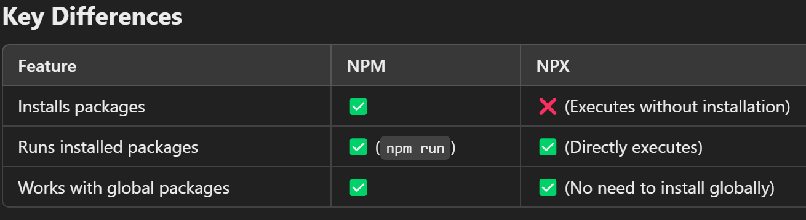

# React

--> Javascript library for building user interfaces
--> Used to build single-page applications.
--> Allows us to create reusable UI components.
--> React creates a VIRTUAL DOM in memory.
--> Instead of manipulating the browser's DOM directly, React creates a virtual DOM in memory, where it does all the necessary manipulating, before making the changes in the browser DOM.
--> Start by including three scripts, the first two let us write React code in our JavaScripts, and the third, Babel, allows us to write JSX syntax and ES6 in older browsers.

# React Variants

react-dom --> for website
react-native --> for mobile

# To Create a new file

==> npx create-react-app my-react-app
--> Node.js is required to use create-react-app.
--> Create-react-app tool is an officially supported way to create React applications.
--> my-react-app == It is the name of new React project folder/directory. It can be replace with preferred project name.
--> A new browser window will pop up with localhost:3000
==> Note: CRA was deprecated by the React team in 2023 -- it is no longer the recommended way to start a new project. Vite, Next.js, or Remix are now the recommended tools for creating a new React project.
--> npm create vite@latest --> for vite create

==> npm start --> Start the development Server
==> npm run build --> Bundles the app into statics files for production
==> npm test --> Starts the test runner
==> npm run eject --> Removes this tool and copies build dependencies, configuration file and scripts into the app directory .If it is done , we can't go back.

# NPM -- node package manager

--> NPM is a package manager for JavaScript and is used to manage dependencies (libraries, frameworks, and tools) in Node.js projects.
--> For Running it we need to install Package globally
--> Installing Packages:
npm install package-name
--> Installing Packages Globally:
npm install -g package-name
--> Running Scripts:
You can define scripts in package.json and run them using:
npm run script-name

# Managing Project Dependencies:

--> package.json contains project dependencies and metadata.
--> node_modules/ stores installed packages.

# NPX -- node package executer

--> NPX is a tool that comes with NPM.
--> It is used to execute packages directly without installing them globally.


# Environment Variables in a React Project

--> Environment variables let configuration (API URLs, public keys, feature flags) change between environments (development/staging/production) without hardcoding values into the source code.
--> In a Vite project, env vars must be defined in a `.env` file at the project root and MUST be prefixed with `VITE_` to be exposed to client-side code -- this is a deliberate safety measure so secrets aren't accidentally leaked into the browser bundle.
```
# .env
VITE_API_URL=https://api.example.com
```
```javascript
// Accessed via import.meta.env in Vite
console.log(import.meta.env.VITE_API_URL);
```
--> In a Create React App project (legacy), the equivalent prefix is `REACT_APP_`, and variables are accessed via `process.env.REACT_APP_API_URL`.
--> Anything exposed this way is still visible in the final JS bundle shipped to the browser -- environment variables in a frontend app are for CONFIGURATION, never for storing real secrets (API keys that grant privileged access still belong on the server only).
--> Multiple env files support different environments: `.env`, `.env.development`, `.env.production` -- the build tool picks the right one automatically based on the run mode.

# Next.js and React Server Components (Brief Overview)

--> Everything covered so far describes a Client-Side Rendered (CSR) React app -- the browser downloads a mostly-empty HTML shell plus a JS bundle, then React renders everything in the browser. Next.js (and frameworks like Remix) extend React with server-side rendering strategies that solve CSR's slow first-paint and poor SEO out of the box.

==> Rendering Strategies
--> CSR (Client-Side Rendering) -- what Create React App/Vite apps do by default: blank HTML + JS bundle, all rendering happens in the browser after JS loads.
--> SSR (Server-Side Rendering) -- the server renders the full HTML for a page on each request and sends it already-populated; React then "hydrates" it (attaches event listeners/interactivity) in the browser. Faster first paint, better SEO, but still requires a JS bundle to hydrate.
--> SSG (Static Site Generation) -- pages are pre-rendered to HTML at BUILD time (not per-request), then served as static files from a CDN -- fastest possible load, best for content that doesn't change per-user (blogs, docs, marketing pages).
--> ISR (Incremental Static Regeneration, Next.js-specific) -- a middle ground: static pages that automatically re-generate in the background after a set time interval, without a full rebuild.

==> Hydration
--> Hydration is the process where React "attaches" to server-rendered HTML in the browser -- reusing the existing DOM nodes instead of re-creating them, then wiring up event listeners/state so the page becomes interactive.
--> A "hydration mismatch" error occurs when the server-rendered HTML doesn't match what the client would have rendered (e.g. using `Date.now()` or `Math.random()` directly in render) -- a common Next.js/SSR gotcha.

==> React Server Components (RSC)
--> A newer model (used by Next.js's App Router) where some components render ONLY on the server and never ship their JavaScript to the browser at all -- reducing bundle size, since server components can directly access databases/filesystems without an API layer.
--> Client Components (marked with the `"use client"` directive at the top of the file) are the traditional interactive components -- they DO ship JS and support hooks/state/event handlers; Server Components cannot use hooks or browser-only APIs.
--> A typical app mixes both: Server Components for static/data-fetching shells, Client Components for interactive islands (buttons, forms, dropdowns) nested inside them.

==> When to Reach for Next.js
--> A plain Vite + React app is simpler and sufficient for dashboards/internal tools/SPAs behind a login where SEO and first-paint speed don't matter as much.
--> Next.js (or Remix) is the standard choice when SEO, fast initial load, or server-side data fetching are priorities -- e.g. public-facing marketing sites, blogs, e-commerce.
