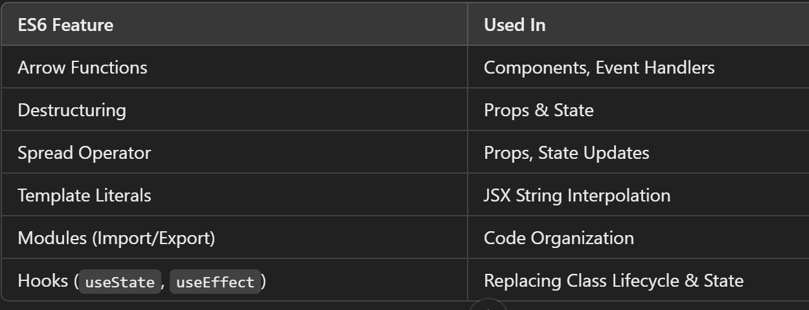

# ES6

--> ES6 stands for ECMAScript 6.
--> Classes, Arrow Functions, Variables (let, const, var), Array Methods like .map(), Destructuring, Modules, Ternary Operator, Spread Operator

# React ES6 Classes(nowdays Function)

--> A class is a type of function, but instead of using the keyword function to initiate it, we use the keyword class, and the properties are assigned inside a constructor() method.
--> In modern React development, functional components with hooks have largely replaced ES6 class components.

==> Methods in function
--> Methods (or functions) are defined inside the component and do not require this like in class components.
--> Can use regular functions or arrow functions inside a functional component.

==> Inheritance Using Functional Components
--> instead of defining a class with methods, you create a functional component with state and props.
--> React does not use class inheritance. Instead, use composition and props.

# Arrow function

--> Arrow functions allow us to write shorter function syntax:
--> hello = () => {
return "Hello World!";
}
==> If the function has only one statement, and the statement returns a value, you can remove the brackets and the return keyword:
--> Arrow Functions Return Value by Default:
hello = () => "Hello World!"; // works only if the function has only one statement.
==> If you have parameters, you pass them inside the parentheses:
--> Arrow Function With Parameters:
hello = (val) => "Hello " + val;
==> if have only one parameter, you can skip the parentheses as well:
--> Arrow Function Without Parentheses:
hello = val => "Hello " + val;

# React ES6 Variables

1. Variables (var x = 5.6;)

--> var has a function scope, not a block scope
--> Before ES6 there was only one way of defining variables: with the var keyword. If did not define them, they would be assigned to the global object. Unless it was in strict mode, then would get an error if variables were undefined.
--> With ES6, there are three ways of defining your variables: var, let, and const.
--> If you use var outside of a function, it belongs to the global scope.
--> If you use var inside of a function, it belongs to that function.
--> If you use var inside of a block, i.e. a for loop, the variable is still available outside of that block.

2. Const (const x = 5.6;)

--> const is a variable that once it has been created, its value can never change.
--> const has a block scope.
-->The keyword const is a bit misleading.It does not define a constant value. It defines a constant reference to a value.
==> Because of const we can NOT:
Reassign a constant value
Reassign a constant array
Reassign a constant object
==> But you CAN:
Change the elements of constant array
Change the properties of constant object

3. let (let x = 5.6;)

--> let has a block scope.
--> let is the block scoped version of var, and is limited to the block (or expression) where it is defined.
-->If you use let inside of a block, i.e. a for loop, the variable is only available inside of that loop.

# React ES6 Array Methods

--> There are many JavaScript array methods.
--> One of the most useful in React is the .map() array method.
--> The .map() method allows you to run a function on each item in the array, returning a new array as the result.
--> In React, map() can be used to generate lists.

# React ES6 Destructuring

--> A convenient way to extract values from objects or arrays and use them directly in components. It simplifies code, making it cleaner and more readable.
--> When destructuring arrays, the order that variables are declared is important.If we want only item 1 and item 3, we can leave out item 2 but keep the comma for item 2 [ item1, , item3]
--> Using ES6 destructuring in React helps to: ✔ Reduce redundant props. and this.state. references
--> Make code more readable
--> Improve maintainability

# React ES6 Spread Operator

--> The JavaScript spread operator (...) allows us to quickly copy all or part of an existing array or object into another array or object.
--> The spread operator is often used in combination with destructuring.
--> The properties that did not match are combined, but the property that did match are overwritten by the last object that was passed

# React ES6 Modules

==> Modules
--> JavaScript modules allow us to break up code into separate files.
--> This makes it easier to maintain the code-base.
--> ES Modules rely on the import and export statements.
--> ES6 modules allow you to split code into reusable files and import/export them as needed. This improves code organization and maintainability.

# React ES6 Ternary Operator \*\*

--> The ternary operator is a simplified conditional operator like if / else.
--> Syntax(If there is one condition ) condition ? <expression if true> : <expression if false>
--> Syntax(If there is two or more condition ) condition1 ? <expression if true> : condition2 ? <expression if true> : condition3 ? <expression if true> : <expression if false>;

# React ES6 Template Literals

--> Template literals use backticks (`) instead of quotes, and allow embedded expressions with ${ }.
--> const greeting = `Hello, ${name}!`; -- easier to read than string concatenation and supports multi-line strings.

# React ES6 Async/Await

--> async/await is syntactic sugar over Promises, making asynchronous code look synchronous and easier to read.
--> async function fetchData() { const res = await fetch(url); const data = await res.json(); return data; }
--> Commonly used inside useEffect (via an inner async function) to fetch data from an API.

# React ES6 Optional Chaining (?.)

--> Safely accesses a nested property without throwing an error if an intermediate value is null/undefined.
--> const city = user?.address?.city; -- returns undefined instead of crashing if user or address is missing.

# React ES6 Nullish Coalescing (??)

--> Returns the right-hand value only when the left-hand value is null or undefined (unlike || which also falls back on 0, "", or false).
--> const displayName = user.name ?? "Guest"; -- keeps a valid name of "" or 0 instead of replacing it.
