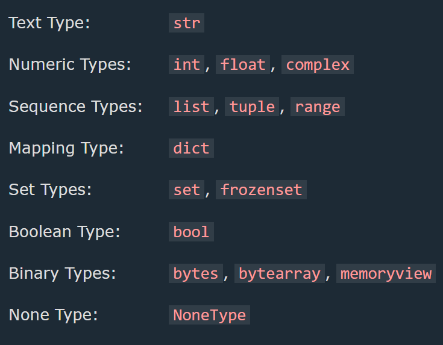
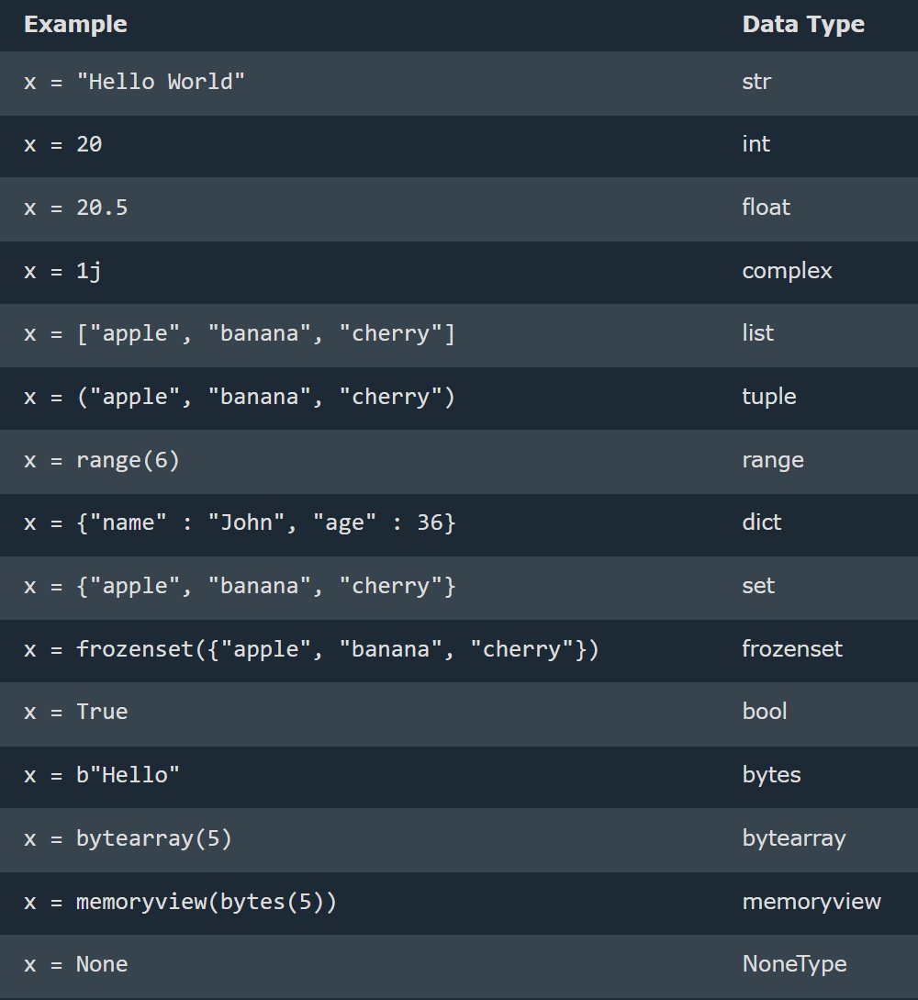
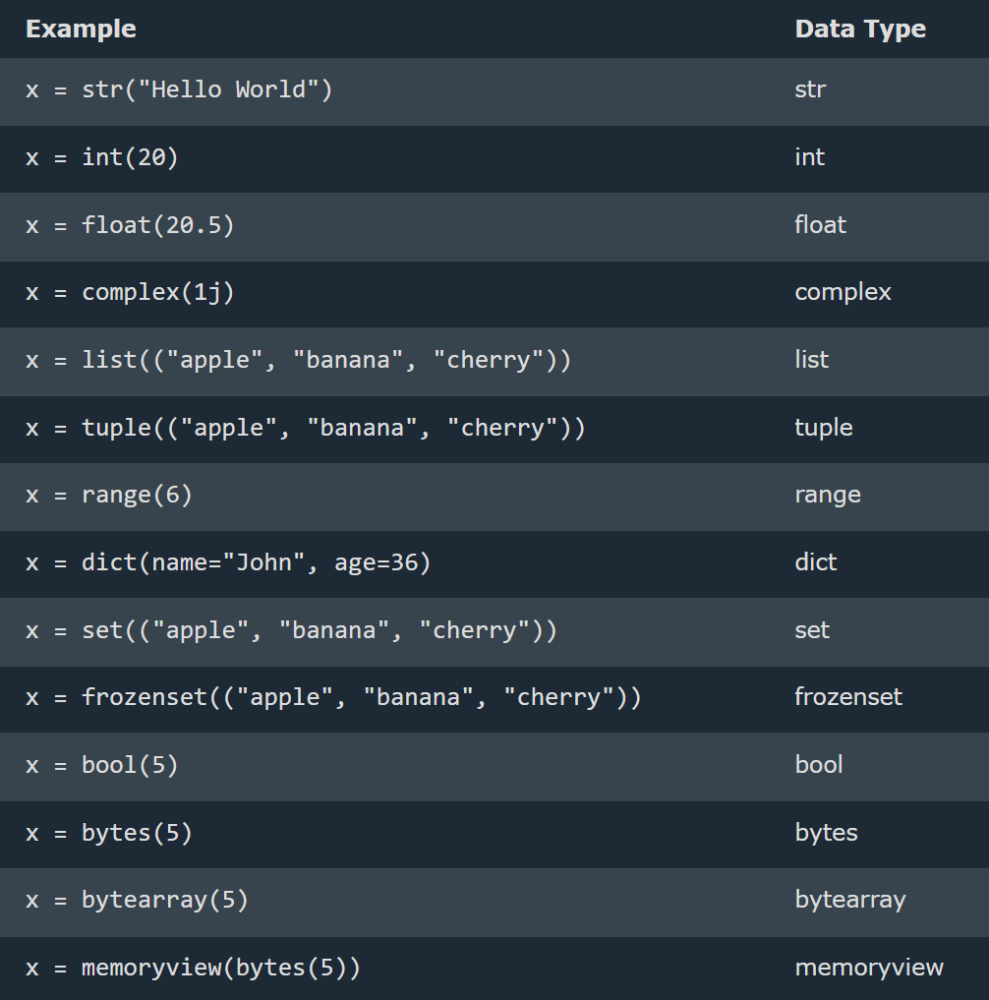
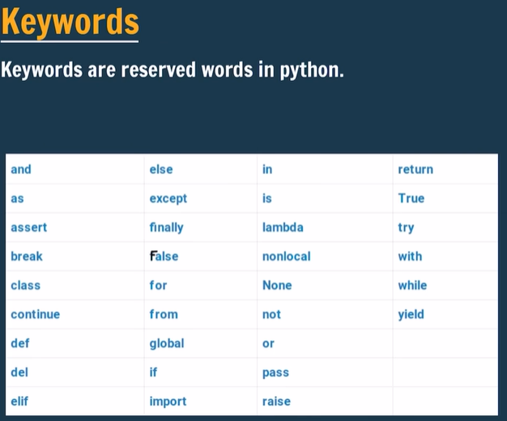

## Built-in Data Types

--> In programming, data type is an important concept.
--> Variables can store data of different types, and different types can do different things.
--> Python has the following data types built-in by default, in these categories:
--> Can get the data type of any object by using the type() function:

# Data Type

1. List is a collection which is ordered and changeable. Allows duplicate members.
2. Tuple is a collection which is ordered and unchangeable. Allows duplicate members.
3. Set is a collection which is unordered, unchangeable\*, and unindexed. No duplicate members.
4. Dictionary is a collection which is ordered\*\* and changeable. No duplicate members.
   Python version 3.7, dictionaries are ordered. In Python 3.6 and earlier, dictionaries are unordered.

--> List and dictionary are mutable(changable) and tuple, set, string, number are not mutable(unchangeable)
--> List and tuple and dictionary are ordered and set is unordered
--> List and tuple allow duplicate and set and dictionary are not allowed for duplicate

## Type Conversion(automatically) & type casting(manual)

Type Conversion is the automatic or manual process of changing a variable's data type, while Type Casting is the explicit (manual) conversion using functions like int(), float(), and str().
--> In mixed arithmetic (int + float), Python automatically promotes the result to float, since float can represent a wider range of values (including decimals) than int.
--> lst = [1, 2, 3, 4, 5] -- List  
--> tpl = (1, 2, 3, 4, 5) -- Tuple  
--> strg = "Hello" -- String  
--> dct = {"a": 1, "b": 2} -- Dictionary  
--> st = {1, 2, 3, 4, 5} -- Set  
--> rng = range(10) -- Range  
--> byt = b"Hello" -- Bytes
==> Get the Type
--> Get the data type of a variable with the type() function

# Rules for identifier (any name)

--> A name used to identify a variable, function, class, module, or other object

1. It can be combination of uppercase and lowercase letters,digits or an underscore(\_)
   --> ex:- myVariable , variable_1, variable_for_print all aare valid python identifier
2. An identifier can not start with digit .So while variable1 is valid 1Variable is not valid
3. An identifier can not start with symbols like !,@,#,%,$ ,etc in our identifier
4. Identifier can be of any length

## Numbers

--> Python supports two types of numbers - integers(whole numbers) and floating point numbers(decimals), also supports complex numbers
--> Float can also be scientific numbers with an "e" to indicate the power of 10.
--> Complex numbers are written with a "j" as the imaginary part:
--> Cannot convert complex numbers into another number type.

==> Random Number
--> Python does not have a random() function to make a random number, but Python has a built-in module called random that can be used to make random numbers:
--> ex:-
import random
print(random.randrange(1, 10))

