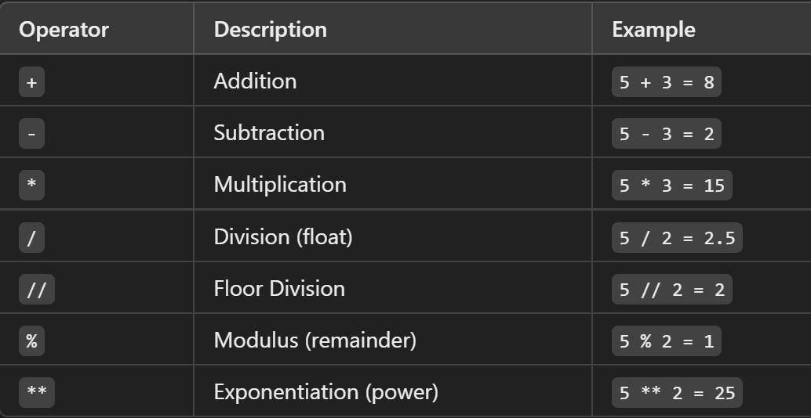
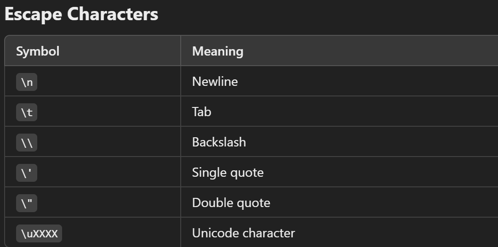
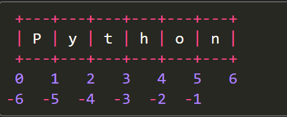
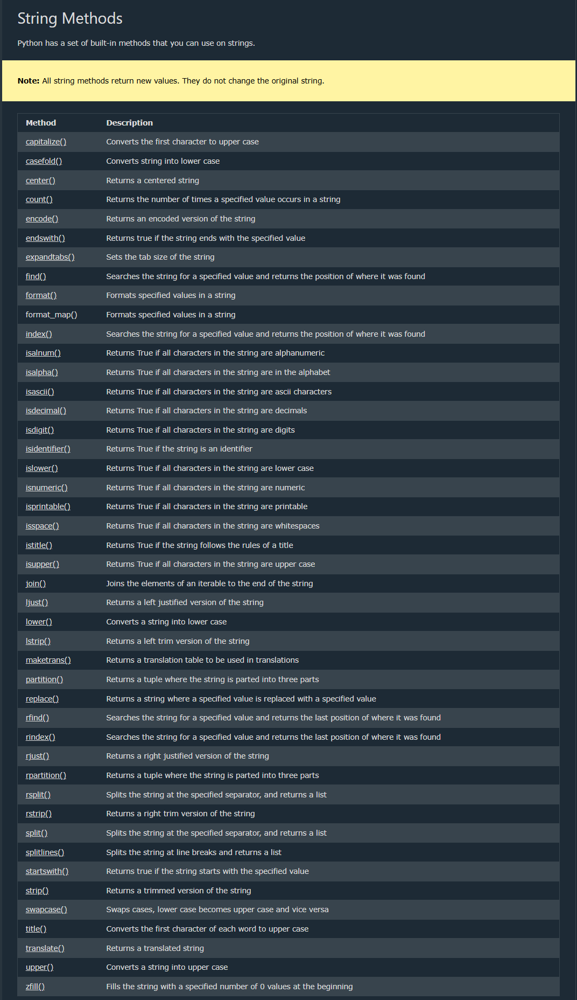
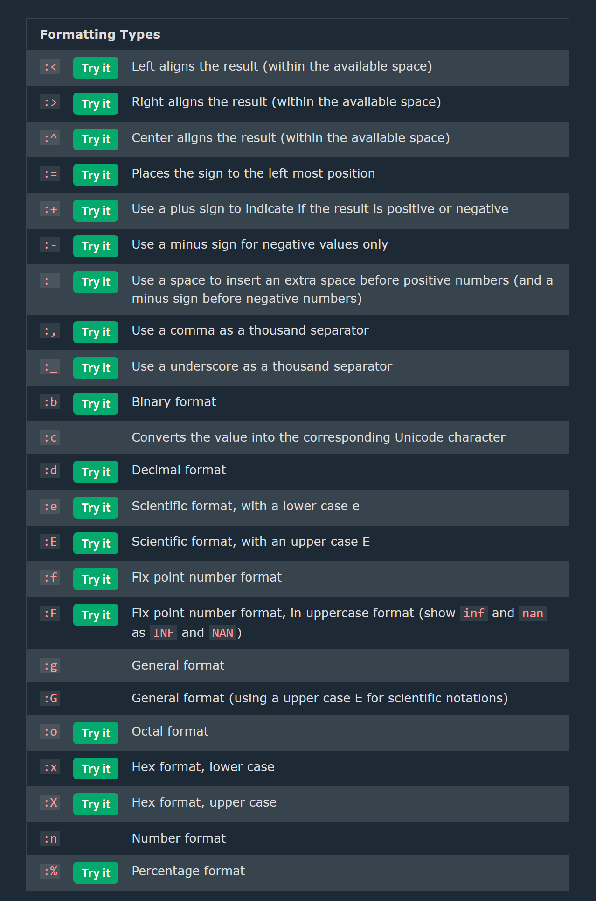

## Strings

--> Strings are defined either with a single quote or a double quotes.
--> Triple-Quoted Strings -- For multi-line strings to a variable or embedded quotes.
--> The difference between the two is that using double quotes makes it easy to include apostrophes (whereas these would terminate the string if using single quotes)

# Raw Strings (r"" or R"" in Python)

Raw strings treat backslashes (\) as literal characters, useful for file paths and regex.can use raw strings by adding an r before the first quote:
--> Mixing operators between numbers and strings is not supported:




# Strings are Arrays

--> Strings in Python are arrays of bytes representing unicode characters.
--> Square brackets can be used to access elements of the string.
--> Python does not have a character data type, a single character is simply a string with a length of 1.

# Looping Through a String

--> Since strings are arrays, we can loop through the characters in a string, with a for loop.

--> Loop through the letters in the word "Shanu":
for x in "Shanu":
print(x)

# Using Operators with Strings in Python

1.  String Creation
    --> Strings can be created using **single (`'`), double (`"`)**, or **triple quotes (`''' """`)**.

2.  String Concatenation (`+`)
    --> Strings can be **combined** using the `+` operator.
    --> It does **not** add spaces automatically, so must include them manually if needed.
    --> Example: `"Hello" + " World"` → `"Hello World"`
    --> To add a space between them, add a " ":
    a + " " + b

3.  String Length
    --> Use `len(string)` to find the length of a string.

4.  Accessing Characters
    --> Strings are **indexed** starting from `0`.
    --> Example: `"Python"[0]` → `'P'`, `"Python"[-1]` → `'n'`

5.  String Slicing(Accessing parts of a strings)
    --> Extract a portion of a string using `[start:end]` notation.
    --> sequence[start:stop:step]
    start: index to begin the slice (inclusive)
    stop: index to end the slice (exclusive)
    step: how many indices to jump (default is 1)
    --> Example: `"Python"[0:3]` → `'Pyt'` (Characters from index 0 to 2)
    --> By leaving out the start index, the range will start at the first character: (print(b[:5]))
    --> By leaving out the end index, the range will go to the end:(print(b[2:]))
    --> Use negative indexes to start the slice from the end of the string: print(b[-5:-2])

6.  String Case Operations
    --> `.upper()` → Converts string to uppercase.
    --> `.lower()` → Converts string to lowercase.
    --> `.title()` → Converts first letter of each word to uppercase.
    --> `.capitalize()` → Capitalizes 1st char

7.  String Strip Operations
    --> `.strip()` → Removes spaces from both ends.
    --> `.lstrip()` → Removes spaces from the left.
    --> `.rstrip()` → Removes spaces from the right.

8.  String Find and Replace
    --> `.find(substring)` → Returns index of first occurrence.
    --> `.replace(old, new)` → Replaces occurrences of a substring.
    --> `.endswith("substr")` → returns true if string ends with substr
    --> `.count("word")` → counts the occurrence of substr in string

9.  String Splitting and Joining
    --> `.split(delimiter)` → Splits a string into a list.
    --> `.join(iterable)` → Joins elements of an iterable into a string.

10. Membership Operators (`in`, `not in`)
    --> The `in` operator checks if a substring exists within a string.
    --> The `not in` operator checks if a substring does **not** exist in a string.
    --> Example: `"Py" in "Python"` → `True`

11. String Repetition (`*`)
    --> The `*` operator repeats a string multiple times.
    --> Example: `"Hi" * 3` → `"HiHiHi"`

12. Using Comparison Operators with Strings
    --> Python allows using `==`, `!=`, `<`, `>`, `<=`, `>=` with strings.
    --> Strings are compared lexicographically (alphabetical order based on ASCII values).



# String Formatting in Python

1.  Using `%` Operator (Old Style Formatting)
    --> The `%` operator is used like C-style string formatting.
    --> `%s` for strings, `%d` for integers, `%f` for floating-point numbers.
    --> Example: `"Hello %s" % name`
2.  Using `format()` Method (Modern Style)
    --> The `format()` method allows inserting variables inside curly `{}` braces.
    --> Supports positional and keyword arguments.
    --> Example: `"Hello, {}!".format(name)`
3.  Using f-strings (Python 3.6+)
    --> Introduced in Python 3.6, f-strings are prefixed with `f` and allow embedding expressions directly inside `{}`.
    --> Example: `f"Hello, {name}!"`

## Python String Formatting

--> F-String was introduced in Python 3.6, and is now the preferred way of formatting strings.
--> Before Python 3.6 we had to use the format() method.

# F-Strings

--> F-string allows you to format selected parts of a string.

==> Perform Operations in F-Strings
--> can do math operations
f"The price is {20 * 59} dollars"
--> can perform math operations on variables:
f"The price is {price + (price * tax)} dollars"
--> can perform if...else statements inside the placeholders:
f"It is very {'Expensive' if price>50 else 'Cheap'}"

--> To specify a string as an f-string, simply put an f in front of the string literal, like this:

```Python
name = "Alice"
age = 30

print(f"My name is {name} and I am {age} years old.")
```

# Placeholders and Modifiers

--> A placeholder can contain variables, operations, functions, and modifiers to format the value.
--> To format values in an f-string, add placeholders {}, a placeholder can contain variables, operations, functions, and modifiers to format the value.
--> A placeholder can also include a modifier to format the value.
--> A modifier is included by adding a colon : followed by a legal formatting type, like .2f which means fixed point number with 2 decimals
--> eg : Add a placeholder for the price variable:

```python
price = 59
txt = f"The price is {price} dollars"
print(txt)
```

4.  Using Template Strings (`string.Template`)(Best to use in before Python 3.6+)
    --> The `Template` class from the `string` module allows placeholder-based string formatting using `$`.
5.  Formatting Numbers
    --> `{:.2f}` → Rounds to 2 decimal places.
    --> `{:,}` → Adds a thousands separator.
    --> `{:<10}` → Left-align, `{:>10}` → Right-align, `{:^10}` → Center-align.
6.  Formatting Dates
    --> The `strftime()` method from the `datetime` module is used to format dates.


