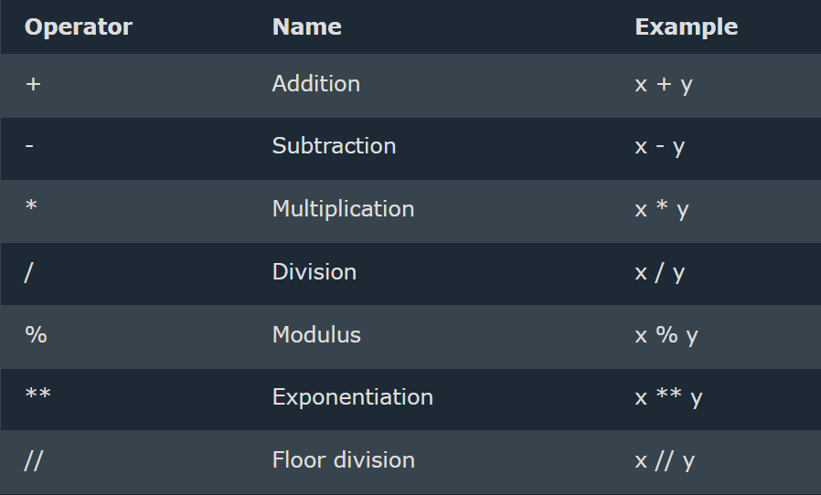
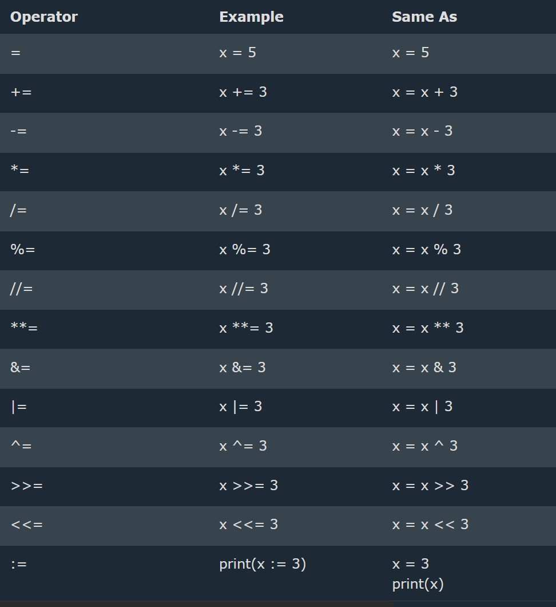
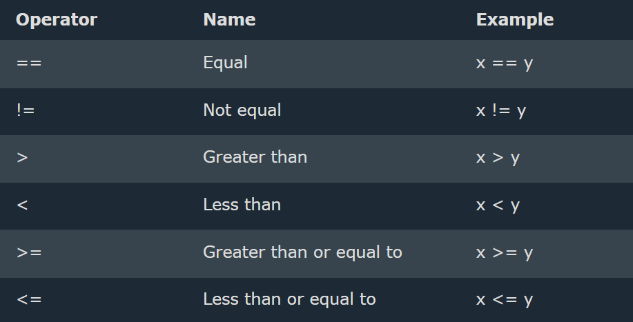
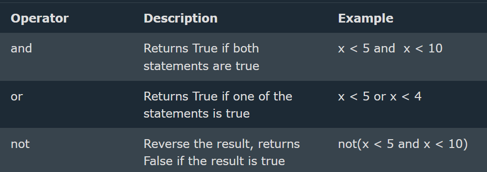
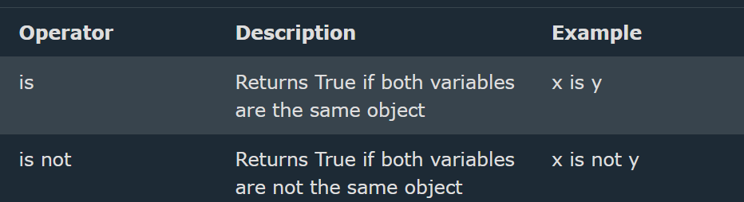
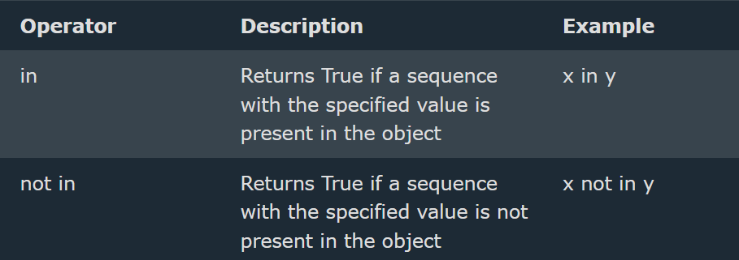
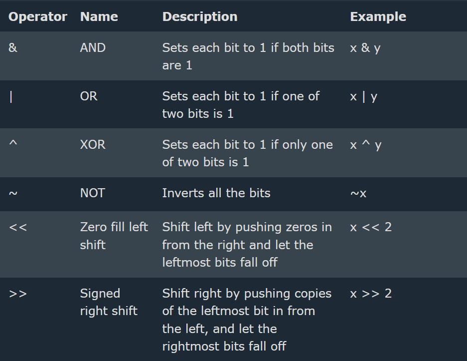
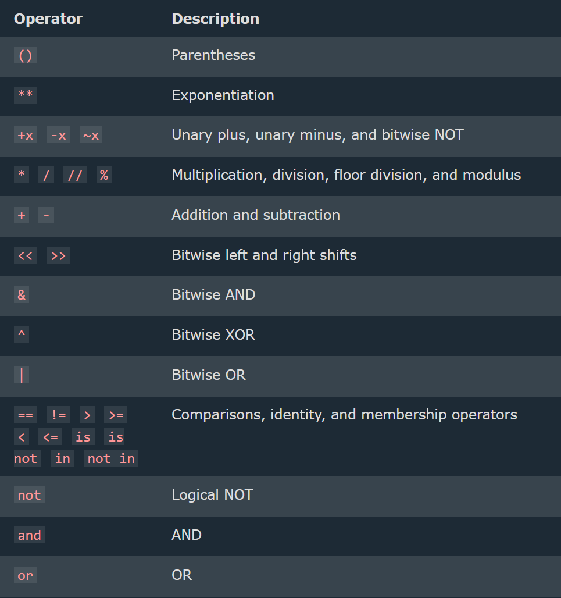

==> **Variable Assignment vs. Comparison**
--> Variable assignment is done using a single equals operator (`=`).
--> Comparison between two variables is done using the double equals operator (`==`).
--> The "not equals" operator is marked as (`!=`).

==> **The "is" Operator**
--> Unlike the double equals operator (`==`), the **`is`** operator checks whether two variables refer to the **same object in memory**.

## Boolean Operators

--> Booleans represent one of two values: True or False.
--> Python has three boolean operators to evaluate conditions:

1. `and` – Returns `True` if both conditions are `True`.
2. `or` – Returns `True` if at least one condition is `True`.
3. `not` – Negates a condition (`True` becomes `False`, and vice versa).

==> **Truthy and Falsy Values**
A statement is evaluated as `True` if one of the following is correct:

1. The **`True`** boolean variable is given, or calculated using an expression.
2. An object that is **not considered empty** is passed.

Falsy values include:

--> `None`
--> `False`
--> `0` (integer or float)
--> `0.0` (float zero)
--> `""` (empty string)
--> `[]` (empty list)
--> `{}` (empty dictionary)
--> `set()` (empty set)
--> `()` (empty tuple)
--> object that is made from a class with a **len** function that returns 0 or False

==> Functions can Return a Boolean
--> can create functions that returns a Boolean Value
--> Eg :-

```python
def myFunction() :
   return True
   print(myFunction())
```

--> Python also has many built-in functions that return a boolean value, like the isinstance() function, which can be used to determine if an object is of a certain data type:
--> EG:
x = 200
print(isinstance(x, int))

# Python Operators

--> Python divides the operators in the following groups:

--> Arithmetic operators
--> Assignment operators
--> Comparison operators
--> Logical operators
--> Identity operators
--> Membership operators
--> Bitwise operators

1. Arithmetic Operators
   --> Arithmetic operators are used with numeric values to perform common mathematical operations
   --> 
2. Assignment Operators
   --> Assignment operators are used to assign values to variables
   --> 
3. Comparison Operators\*\*
   --> Comparison operators are used to compare two values:
   --> 
4. Logical Operators
   -->Logical operators are used to combine conditional statements:
   --> 
5. Identity Operators
   --> Identity operators are used to compare the objects, not if they are equal, but if they are actually the same object, with the same memory location:
   --> 
6. Membership Operators
   --> Membership operators are used to test if a sequence is presented in an object:
   --> 
7. Bitwise Operators
   --> Bitwise operators are used to compare (binary) numbers:
   --> 

# Operator Precedence

--> Operator precedence describes the order in which operations are performed.
--> Addition + and subtraction - has the same precedence, and therefore we evaluate the expression from left to right:
--> 

## Walrus Operator (:=)

--> The walrus operator (:=), officially called the "assignment expression", was introduced in Python 3.8.
--> It allows you to assign a value to a variable as part of an expression, instead of needing a separate statement.
--> Syntax :- (variable := expression)
--> Useful for avoiding duplicate function calls, and for assigning inside while loops, list comprehensions, or if conditions.

==> Example : Without Walrus Operator
--> Requires calling len() twice or using an extra line:

```python
n = len([1, 2, 3, 4, 5])
if n > 3:
    print(f"List is too long ({n} elements)")
```

==> Example : With Walrus Operator
--> Assigns and checks the condition in a single line:

```python
if (n := len([1, 2, 3, 4, 5])) > 3:
    print(f"List is too long ({n} elements)")
```

==> Example : Using Walrus in a while loop

```python
while (data := input("Enter something (or 'quit' to stop): ")) != "quit":
    print(f"You entered: {data}")
```

==> Example : Using Walrus in a list comprehension

```python
results = [y for x in range(10) if (y := x * 2) > 5]
print(results)
```
