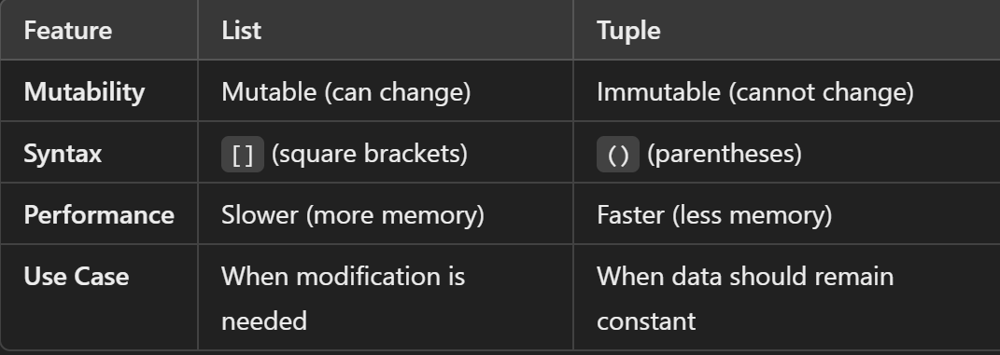
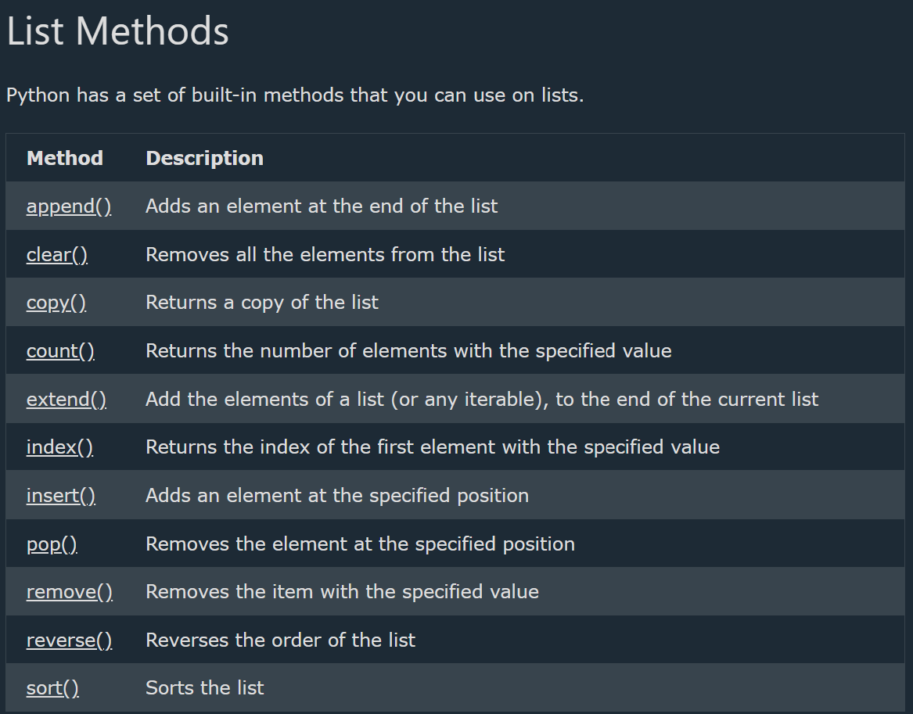
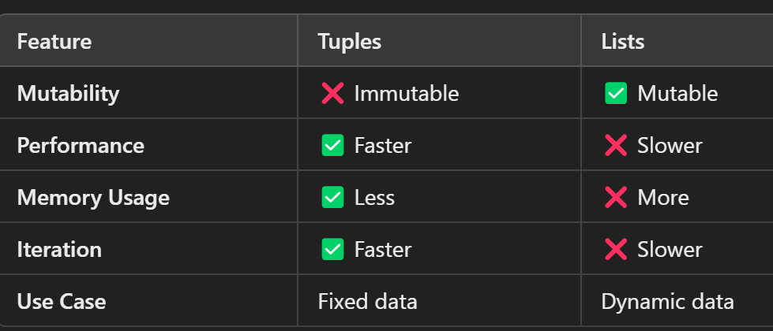

## List

--> Lists are very similar to arrays.
--> can create a list using square brackets []
--> They can contain any type of variable, and they can contain as many variables as needed
--> A built-in data structure that allows you to store multiple items in a single variable.

# List Items

--> Lists are ordered, mutable (changeable), and allow duplicate values.
--> List items are indexed, the first item has index [0], the second item has index [1] etc.

==> Ordered
--> Lists are ordered, it means that the items have a defined order, and that order will not change.
--> If add new items to a list, the new items will be placed at the end of the list.

==> Changeable
--> The list is changeable, meaning that we can change, add, and remove items in a list after it has been created.

==> Allow Duplicates
--> lists are indexed, lists can have items with the same value:

# Accessing Elements

--> Use indexing (starting from 0) to access elements:
--> Negative Indexing
Negative indexing means start from the end
-1 refers to the last item, -2 refers to the second last item

==> Range of Indexes
--> specify a range of indexes by specifying where to start and where to end the range
--> the search will includes start index but not includes the end index
--> Range of Negative Indexes
negative indexes if want to start the search from the end of the list

==> Adding Elements
--> append(): Adds an element at the end of the list.
--> extend(): Adds multiple elements to the end of the list.
--> insert(): Adds an element at a specific position.

==> Removing Elements
--> remove(value) → Removes the first occurrence of a value.
--> pop(index) → Removes and returns an element at a specific index (default: last).
--> clear() → Removes all elements.

==> Looping Through a List
--> for fruit in fruits:
print(fruit)

# List Operations

--> Concatenation: new_list = list1 + list2
--> Repetition: list3 = list1 \* 2
--> Check if an item exists: "apple" in fruits

==> Sorting and Reversing
--> fruits.sort() # Sorts the list in ascending order
--> fruits.reverse() # Reverses the list

==> The list() Constructor
--> use the list() constructor when creating a new list.

==> Nested Lists (Lists inside lists)
--> Shallow vs. Deep Copy (copy() and deepcopy())
--> List vs. Tuple (Differences and when to use each)
--> Performance Considerations (Time complexity of list operations)


==> Using Operators with Lists in Python

1. Concatenation (`+`)
   --> The `+` operator is used to combine two or more lists into a new list.
   --> It **does not** modify the original lists but creates a new one.

2. Repetition (`*`)
   --> The `*` operator repeats a list multiple times.

3. Membership Operators (`in`, `not in`)
   --> The `in` operator checks if an element exists in a list.
   --> The `not in` operator checks if an element does **not** exist in a list.

4. Comparison Operators (`==`, `!=`, `<`, `>`, `<=`, `>=`)
   --> Lists are compared **element by element**.
   --> The comparison is **lexicographical** (similar to string comparison based on ASCII values).

5. Assignment Operators (`+=`, `*=`)
   --> The `+=` operator appends elements from another list to the existing list.
   --> The `*=` operator repeats and updates the list in place.

6. Identity Operators (`is`, `is not`)
   --> The `is` operator checks if two lists refer to the **same memory location**.
   --> The `is not` operator checks if they refer to **different objects**.

7. Logical Operators (`and`, `or`, `not`)
   --> `and` returns the second list if the first list is non-empty, otherwise returns the first list.
   --> `or` returns the first non-empty list.
   --> `not` returns `True` if the list is empty, otherwise `False`.

# List Methods

--> print(len()) # determine how many items a list has
--> list.append(4) # adds one element at the end [2, 1, 3, 4]
--> list.sort() # sorts in ascending order [1, 2, 3]
--> list.sort(reverse=True) # sorts in descending order [3, 2, 1]
--> list.reverse() # reverses list [3, 1, 2]
--> list.insert(idx, el) # insert element at index
--> list.remove() # removes first occurrence if elements
--> list.pop(idx) # removeelements at idx
--> Shallow Copy (copy()) → Copies references, not actual objects.
--> Deep Copy (deepcopy()) → Creates an independent copy.

# Change List Items

--> To change the value of a specific item, refer to the index number:
--> Example : Change the second item:

thislist = ["apple", "banana", "cherry"]
thislist[1] = "blackcurrant"
print(thislist)

==> Change a Range of Item Values
--> To change the value of items within a specific range, define a list with the new values, and refer to the range of index numbers where you want to insert the new values:
--> If you insert more items than you replace, the new items will be inserted where you specified, and the remaining items will move accordingly:
--> The length of the list will change when the number of items inserted does not match the number of items replaced.
--> If you insert less items than you replace, the new items will be inserted where you specified, and the remaining items will move accordingly
--> Example Change the values "banana" and "cherry" with the values "blackcurrant" and "watermelon":

thislist = ["apple", "banana", "cherry", "orange", "kiwi", "mango"]
thislist[1:3] = ["blackcurrant", "watermelon"]
print(thislist)

==> Insert Items
--> To insert a new list item, without replacing any of the existing values, we can use the insert() method.
--> The insert() method inserts an item at the specified index

==> Extend List
To append elements from another list to the current list, use the extend() method.
--> Example Add the elements of tropical to thislist:
thislist = ["apple", "banana", "cherry"]
tropical = ["mango", "pineapple", "papaya"]
thislist.extend(tropical)
print(thislist)

==> Add Any Iterable
--> The extend() method does not have to append lists, you can add any iterable object (tuples, sets, dictionaries etc.).
--> Example
Add elements of a tuple to a list:

thislist = ["apple", "banana", "cherry"]
thistuple = ("kiwi", "orange")
thislist.extend(thistuple)
print(thislist)

# Remove List Items

--> Remove Specified Item
--> The remove() method removes the specified item.
--> If there are more than one item with the specified value, the remove() method removes the first occurrence:

==> Remove Specified Index
--> The pop() method removes the specified index.
--> If you do not specify the index, the pop() method removes the last item.
--> The del keyword also removes the specified index:The del keyword can also delete the list completely.

==> Clear the List
--> The clear() method empties the list.
--> The list still remains, but it has no content.

# Loop Through a List

--> You can loop through the list items by using a for loop:
--> Example - Print all items in the list, one by one:

thislist = ["apple", "banana", "cherry"]
for x in thislist:
print(x)

==> Loop Through the Index Numbers
--> You can also loop through the list items by referring to their index number.
--> Use the range() and len() functions to create a suitable iterable.
--> Example - Print all items by referring to their index number:

```python
thislist = ["apple", "banana", "cherry"]
for i in range(len(thislist)):
print(thislist[i])
```

==> Using a While Loop
--> Can loop through the list items by using a while loop.
--> the len() function to determine the length of the list, then start at 0 and loop your way through the list items by referring to their indexes.

# Looping Using List Comprehension

--> List Comprehension offers the shortest syntax for looping through lists:
--> Without list comprehension you will have to write a for statement with a conditional test
--> Syntax :- newlist = [expression for item in iterable if condition == True]
--> Eg : -
thislist = ["apple", "banana", "cherry"]
** [print(x) for x in thislist] **
--> The return value is a new list, leaving the old list unchanged.

==> Condition
--> The condition is like a filter that only accepts the items that evaluate to True.

==> Expression
--> The expression is the current item in the iteration, but it is also the outcome, which you can manipulate before it ends up like a list item in the new list:

# Sort Lists

--> List objects have a sort() method that will sort the list alphanumerically, ascending, by default:

==> Sort Descending
To sort descending, use the keyword argument reverse = True:
--> variable_name.sort(reverse = True)

==> Customize Sort Function
--> can also customize own function by using the keyword argument -- key = function

==> Case Insensitive Sort
--> By default the sort() method is case sensitive, resulting in all capital letters being sorted before lower case letters:
--> want a case-insensitive sort function, use str.lower as a key function:
--> variable_name.sort(key = str.lower)

==> Reverse Order
--> if you want to reverse the order of a list, regardless of the alphabet. The reverse() method reverses the current sorting order of the elements.

# Copy Lists

--> Use the copy() method
variable_name2 = variable_name1.copy()
--> Use the list() method
variable_name2 = list(variable_name1)
--> Use the slice Operator -- using the : (slice) operator.
variable_name2 = variable_name1[:]

# Join Lists

==> Join Two Lists
--> One of the easiest ways are by using the + operator.
list3 = list1 + list2
--> Another way to join two lists is by appending all the items from list2 into list1, one by one:
--> eg :-

```python
for x in list2:
list1.append(x)
print(list1)
```

--> can use the extend() method, where the purpose is to add elements from one list to another list:
list1.extend(list2)
--> 

## Tuples in Python

--> A tuple is a built-in immutable data structure in Python that allows you to store multiple items in a single variable.
--> Tuples are ordered, indexed, and can contain mixed data types like lists, but unchangeable(cannot be modified after creation) .
--> Tuples are useful for storing fixed data, returning multiple values from functions, and using as dictionary keys.
--> Tuples are more memory-efficient and faster than lists due to their immutability.
--> When creating a tuple with only one item, remember to include a comma after the item, otherwise it will not be identified as a tuple.

==> Ordered
--> When we say that tuples are ordered, it means that the items have a defined order, and that order will not change.

==> Unchangeable
--> Tuples are unchangeable, meaning that we cannot change, add or remove items after the tuple has been created.

==> Creating a Tuple
--> Tuples are defined using parentheses ()

--> x = ("hello")
print(type(x)) # <class 'str'> ❗️not a tuple

--> y = ("hello",)
print(type(y)) # <class 'tuple'> ✅ tuple (note the comma)

==> The tuple() Constructor
--> It is also possible to use the tuple() constructor to make a tuple.
--> Using the tuple() method to make a tuple:
thistuple = tuple(("apple", "banana", "cherry")) # note the double round-brackets
print(thistuple)

# Tuple Items

--> Tuple items are ordered, unchangeable, and allow duplicate values.
-->Tuple items are indexed, the first item has index [0], the second item has index [1] etc.
--> A tuple can contain different data types:
A tuple with strings, integers and boolean values:
tuple1 = ("abc", 34, True, 40, "male")

==> Allow Duplicates
--> Since tuples are indexed, they can have items with the same value:

==> Accessing Tuple Elements
--> Like lists, tuples are indexed, meaning each element has a position starting from 0
==> Tuple Immutability
Tuples cannot be modified after creation.
==> Slicing a Tuple
--> Tuples support slicing (start:end:step).
--> Negative Indexing
--> Negative indexing means start from the end.
--> -1 refers to the last item, -2 refers to the second last item etc.
==> Range of Indexes
--> Can specify a range of indexes by specifying where to start and where to end the range.
--> When specifying a range, the return value will be a new tuple with the specified items.
--> By leaving out the start value, the range will start at the first item:
--> By leaving out the end value, the range will go on to the end of the tuple:
==> Range of Negative Indexes
negative indexes if you want to start the search from the end of the tuple
--> thistuple = ("apple", "banana", "cherry")
if "apple" in thistuple:
print("Yes, 'apple' is in the fruits tuple")
==> Check if Item Exists
To determine if a specified item is present in a tuple use the in keyword:

# Update Tuples

--> Tuples are unchangeable, meaning that you cannot change, add, or remove items once the tuple is created.
==> Change Tuple Values
--> convert the tuple into a list, change the list, and convert the list back into a tuple.
--> x = ("apple", "banana", "cherry")
y = list(x)
y[1] = "kiwi"
x = tuple(y)

print(x)

==> Add Items
--> Since tuples are immutable, they do not have a built-in append() method, but there are other ways to add items to a tuple.
--> convert it into a list, add your item(s), and convert it back into a tuple.
--> Add tuple to a tuple. You are allowed to add tuples to tuples, so if you want to add one item, (or many), create a new tuple with the item(s), and add it to the existing tuple:

==> Remove Items
--> use the same used for changing and adding tuple items Or you can delete the tuple completely:

# Unpack Tuples

--> When we create a tuple, we normally assign values to it. This is called **packing** a tuple:
--> Packing a tuple:
fruits = ("apple", "banana", "cherry")
--> to extract the values back into variables. This is called **unpacking**:
--> Unpacking a tuple:
fruits = ("apple", "banana", "cherry")
(green, yellow, red) = fruits
print(green)
print(yellow)
print(red)
--> Note: The number of variables must match the number of values in the tuple, if not, you must use an asterisk to collect the remaining values as a list.
==> Using Asterisk*
--> If the number of variables is less than the number of values, you can add an * to the variable name and the values will be assigned to the variable as a list:
--> If the asterisk is added to another variable name than the last, Python will assign values to the variable until the number of values left matches the number of variables left.

# Loop Tuples

--> loop through the tuple items by using a for loop.
thistuple = ("apple", "banana", "cherry")
for x in thistuple:
print(x)
==> Loop Through the Index Numbers
--> Use the range() and len() functions to create a suitable iterable.
thistuple = ("apple", "banana", "cherry")
for i in range(len(thistuple)):
print(thistuple[i])
==> Using a While Loop
--> loop through the tuple items by using a while loop.
--> Use the len() function to determine the length of the tuple, then start at 0 and loop your way through the tuple items by referring to their indexes.

# Join Tuples

--> To join two or more tuples you can use the + operator:
tuple3 = tuple1 + tuple2
--> want to multiply the content of a tuple a given number of times, you can use the * operator
variable_name2 = variable_name1 * 2

==> Tuple Methods
--> tup.index(element) #returns index of first occurrence.
--> tup.count(element) #return total count occurrences.

==> Tuple Functions
print(len(Variable_name)) # Length of tuple: 5
print(max(nums)) # Max value: 9
print(min(nums)) # Min value: 1

==> Converting Between Lists and Tuples
--> tuples are immutable, can convert them into lists to modify them.


## Deep Dive -- Time Complexity of Common List Operations

--> Directly connecting to the Algorithms and Big-O Complexity Analysis file in the Full Stack track -- Python lists are implemented as dynamic arrays, so their performance characteristics match what that file describes for arrays generally.

```
list[i]              -- O(1)   Indexing is instant regardless of list size
list.append(x)         -- O(1)   Amortized -- occasionally resizes the underlying array, but rare enough to average out
list.pop()               -- O(1)   Removing from the END is instant
list.pop(0)                -- O(n)   Removing from the START requires shifting every remaining element over
list.insert(0, x)             -- O(n)   Same reason -- inserting at the front shifts everything
x in list                      -- O(n)   Must scan linearly until found (or not)
list.sort()                       -- O(n log n)
```

--> This is exactly why a `list` is a poor choice for frequently removing/inserting at the FRONT (use `collections.deque` instead, which is O(1) at both ends), and why checking membership (`in`) against a large list repeatedly is a common, fixable performance bottleneck -- converting to a `set` (O(1) average-case membership check, covered in the Sets and Dictionaries file) is the standard fix when that pattern shows up in a hot code path.

## Deep Dive -- Why Tuples Can Be Dictionary Keys But Lists Cannot

--> Dictionary keys (and set members) must be HASHABLE -- Python needs to compute a consistent hash value for a key to place it in the underlying hash table (directly connecting to the hash map concepts in the Data Structures Deep Dive file). A tuple's hash is computed from its CONTENTS, and since a tuple is immutable, that hash never changes -- making it safely hashable. A list's contents CAN change after creation, so its hash would become unreliable (an item could be added, changing what the hash "should" be) -- Python's designers simply made lists unhashable entirely to prevent this class of bug.

```python
cache = {}
cache[(1, 2)] = "cached result"   # Works -- a tuple is a valid, hashable dictionary key
# cache[[1, 2]] = "cached result"   # TypeError: unhashable type: 'list'
```

--> This is precisely why tuples are the standard choice for a composite cache key (e.g. memoizing a function of multiple arguments, directly connecting to the Memoization pattern covered in the Full Stack JavaScript Higher-Order Functions file, and to the `functools.lru_cache` decorator, which relies on exactly this tuple-hashability to key its cache).
