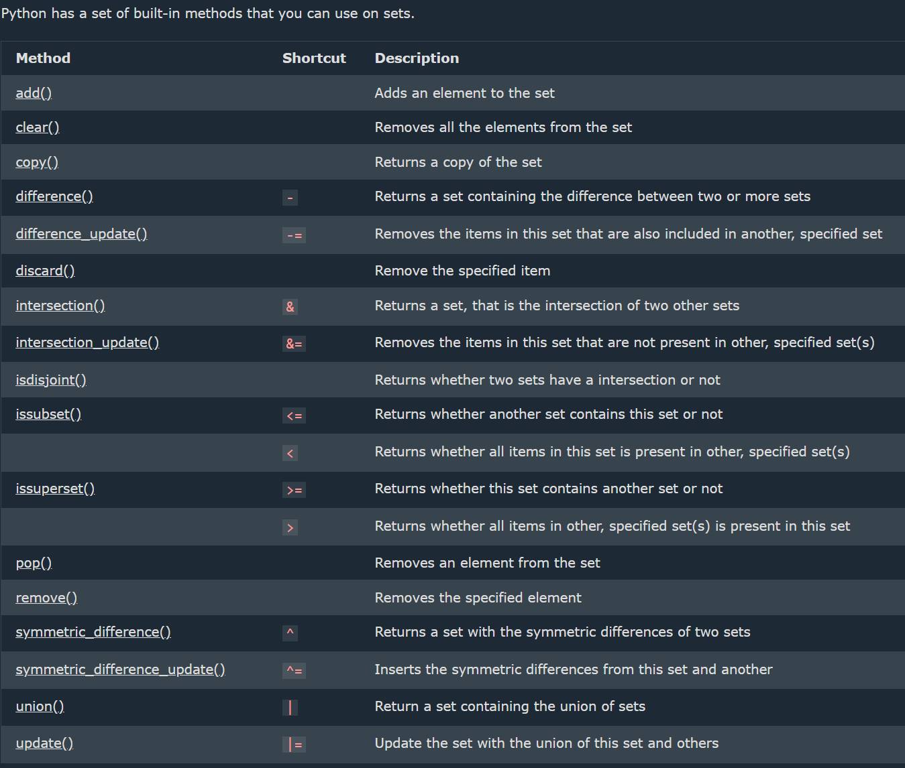
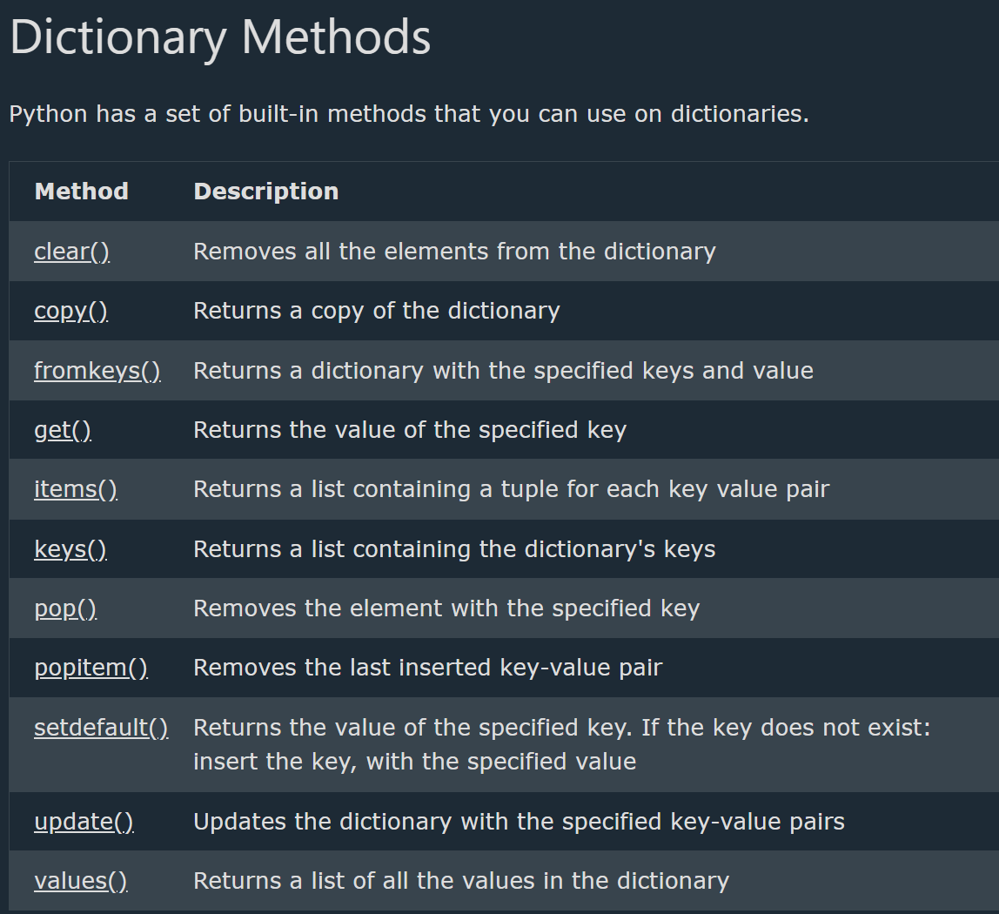

## Set

--> A set in Python is an unordered, mutable collection of unique elements -- the set itself can be changed (items added/removed), but the individual elements inside it must be immutable values.
--> It is used to store distinct items and supports various set operations such as union, intersection, and difference.
--> Duplicate value will be ignored
--> Used to store multiple items in a single variable.
--> The values True and 1 are considered the same value in sets, and are treated as duplicates
--> The values False and 0 are considered the same value in sets, and are treated as duplicates:

# To create new set

variable = set() # create empty set
--> The set() Constructor
It is also possible to use the set() constructor to make a set.

==> Access Set Items
--> cannot access items in a set by referring to an index or a key.
--> can loop through the set items using a for loop, or ask if a specified value is present in a set, by using the in keyword
--> Loop through the set, and print the values:
thisset = {"apple", "banana", "cherry"}
for x in thisset:
print(x)
--> Check if "banana" is present in the set:
thisset = {"apple", "banana", "cherry"}
print("banana" in thisset)
--> Check if "banana" is NOT present in the set:
thisset = {"apple", "banana", "cherry"}
print("banana" not in thisset)
==> Change Items
Once a set is created, you cannot change its items, but you can add new items.

# Add Set Items

==> Add Items
--> Once a set is created, you cannot change its items, but you can add new items.
--> To add one item to a set use the add() method.
==> Add Sets
--> To add items from another set into the current set, use the update() method.
==> Add Any Iterable
-->The object in the update() method does not have to be a set, it can be any iterable object (tuples, lists, dictionaries etc.).

Python - Remove Set Items
--> To remove an item in a set, use the remove(), or the discard() method.
--> If the item to remove does not exist, remove() will raise an error.
--> If the item to remove does not exist, discard() will NOT raise an error.
--> use the pop() method to remove an item, but this method will remove a random item, so you cannot be sure what item that gets removed.
--> The return value of the pop() method is the removed item
--> Sets are unordered, so when using the pop() method, you do not know which item that gets removed.

# Loop Sets

--> loop through the set items by using a for loop:

==> Characteristics of Sets
--> Unordered → Elements in a set do not maintain a specific order.
--> Mutable → Elements can be added or removed after creation.
--> Unique Elements → A set does not allow duplicate values
--> Unindexed → Does not support indexing or slicing.
--> Hashable Elements Only → Elements must be immutable (e.g., numbers, strings, tuples) because sets use a hash table for storage.

==> Operations on Sets
--> set.add(el) → Use methods to insert new elements.
--> set.remove(el) → Different methods allow deleting elements safely.
--> Set Operations → Includes union, intersection, difference, and symmetric difference.
--> Membership Testing → Checking whether an element exists in a set.
--> Set Comprehension → Create sets dynamically using expressions.
--> set.clear() -> empties the set.
--> set.pop() -> remove a random value.
--> print(len(variable_name)) -> how many items a set has, use the len() function

==> Set Methods
--> Creation → Can be defined using {} or set().
--> Adding Elements → Methods allow adding single or multiple elements.
--> Removing Elements → Provides ways to remove specific items or clear the set.
--> Mathematical Operations → Includes union, intersection, difference, and symmetric difference.
--> Copying a Set → Methods exist to create a duplicate of a set.
--> Frozen Set → An immutable version of a set that does not allow modification.

# Join Sets

# union

--> set.union(set2) # combine set values & returns new

--> The union() and update() methods joins all items from both sets.
set3 = set1.union(set2)
--> use the | operator instead of the union() method, and you will get the same result.
set3 = set1 | set2
==> Join Multiple Sets
--> All the joining methods and operators can be used to join multiple sets.
--> When using a method, just add more sets in the parentheses, separated by commas:
myset = set1.union(set2, set3, set4)
--> When using the | operator, separate the sets with more | operators:
--> myset = set1 | set2 | set3 |set4
==> Join a Set and a Tuple
--> The union() method allows you to join a set with other data types, like lists or tuples.
--> The | operator only allows you to join sets with sets, and not with other data types like you can with the union() method.
==> Update
-->The update() method inserts all items from one set into another.
-->The update() changes the original set, and does not return a new set.
--> Both union() and update() will exclude any duplicate items.

# Intersection

--> set.intersection(set2) #combine common values & returns new
--> Keep ONLY the duplicates
--> The intersection() method will return a new set, that only contains the items that are present in both set
--> use the & operator instead of the intersection() method, and will get the same result.
set3 = set1 & set2
--> The intersection_update() method will also keep ONLY the duplicates, but it will change the original set instead of returning a new set.
--> The values True and 1 are considered the same value. The same goes for False and 0.

# Difference

--> The difference() method will return a new set that will contain only the items from the first set that are not present in the other set.
--> The difference() method keeps the items from the first set that are not in the other set(s).
--> use the - operator instead of the difference() method, and you will get the same result.
set3 = set1 - set2

# Symmetric Differences

--> The symmetric_difference() method keeps all items EXCEPT the duplicates.
--> The symmetric_difference() method will keep only the elements that are NOT present in both sets.
--> use the ^ operator instead of the symmetric_difference() method, and you will get the same result.
--> The symmetric_difference_update() method will also keep all but the duplicates, but it will change the original set instead of returning a new set

# Use Cases of Sets

--> Removing duplicates from a collection.
--> Efficient membership checks due to hashing.
--> Performing set operations in mathematical computations.
--> Storing unique values in a collection.


## Dictionaries

--> A dictionary is an unordered, mutable collection of key:value pairs.
--> Each key in a dictionary must be unique and immutable, while values can be of any data type.
--> A dictionary can be created using curly braces {} or the dict() constructor.
--> Each item in a dictionary consists of a key and its corresponding value, separated by a colon ":"
--> Dictionaries are mutable, meaning their contents can be modified after creation.
--> Keys in a dictionary must be unique. If a duplicate key is assigned a new value, it overwrites the previous value.
--> Values can be accessed using their corresponding keys inside square brackets [] or with the get() method.
--> Items can be removed using methods like pop(), popitem(), del, or clear().
--> A dictionary can contain another dictionary as a value, creating a nested structure.
--> data = {
"names": ["Alice", "Bob", "Charlie"], # List inside dictionary
"coordinates": (40.7128, -74.0060), # Tuple inside dictionary
"details": {
"age": 25,
"city": "New York"
}
}

print(data) # Printing the entire dictionary
print(data["names"]) # List inside dictionary  
print(data["details"]["age"]) # Nested dictionary value

variable_name["key1"],variable_name["key2"],variable_name["key3"]
variable_name["key1"]= "Value" # To assign or add new
--> To create new dict
dict = {} # create empty dict.

# Dictionary Methods

--> A dictionary is a collection which is ordered\*, changeable and do not allow duplicates.(Python version 3.7, dictionaries are ordered. In Python 3.6 and earlier, dictionaries are unordered.)
--> Dictionaries are used to store data values in key:value pairs.
--> Data Types -- The values in dictionary items can be of any data type
--> dict() Constructor-- It is also possible to use the dict() constructor to make a dictionary

# Accessing Items

You can access the items of a dictionary by referring to its key name, inside square brackets:
--> myDict.keys() -- Returns all the keys from the dictionary.
--> myDict.values() -- Returns all the values from the dictionary.
--> myDict.items() -- Returns all (key, value) pairs as tuples.
--> myDict.get("key") -- Returns the value associated with the specified key.
The list of the keys is a view of the dictionary, meaning that any changes done to the dictionary will be reflected in the keys list.
--> print(len(thisdict)) -- Print the number of items in the dictionary:
If the key does not exist, it returns None instead of an error.
--> myDict.update(newDict) --Inserts the specified items from newDict into myDict.
Updates existing keys or adds new keys if they don’t exist.
--> print(len(list(Variable_name.keys()))) -- counts and prints the number of keys in the given dictionary
--> Check if Key Exists
To determine if a specified key is present in a dictionary use the in keyword:

# Change Dictionary Items

change the value of a specific item by referring to its key name
==> Update Dictionary
The update() method will update the dictionary with the items from the given argument.

The argument must be a dictionary, or an iterable object with key:value pairs

==> Adding Items
--> Adding an item to the dictionary is done by using a new index key and assigning a value to it:
Variable_name["key"] = "value"

==> Update Dictionary
--> The update() method will update the dictionary with the items from a given argument. If the item does not exist, the item will be added.
--> The argument must be a dictionary, or an iterable object with key:value pairs.
Variable_name.update({"key": "value"})

==> Remove Dictionary Items
--> There are several methods to remove items from a dictionary:
--> The pop() method removes the item with the specified key name:
Variable_name.pop("key")
--> The popitem() method removes the last inserted item (in versions before 3.7, a random item is removed instead):
Variable_name.popitem()
--> The del keyword removes the item with the specified key name:
del Variable_name["key"]
--> The del keyword can also delete the dictionary completely:
del Variable_name
--> The clear() method empties the dictionary:
Variable_name.clear()

# Loop Dictionaries

==> Loop Through a Dictionary
--> loop through a dictionary by using a for loop.
--> When looping through a dictionary, the return value are the keys of the dictionary, but there are methods to return the values as well.
for x in Variable_name:
print(x)
--> use the keys() method to return the keys of a dictionary:
for x in thisdict.keys():
print(x)
--> can also use the values() method to return values of a dictionary:
for x in Variable_name.values():
print(x)
--> Loop through both keys and values, by using the items() method:
for x, y in thisdict.items():
print(x, y)

# Copy Dictionaries

==> Copy a Dictionary
--> use the built-in Dictionary method copy().
Variable_name2 = Variable_name1.copy()
--> Another way to make a copy is to use the built-in function dict().
Variable_name2 = dict(Variable_name1)

# Nested Dictionaries

--> A dictionary can contain dictionaries, this is called nested dictionaries.
myfamily = {
"child1" : {
"name" : "Emil",
"year" : 2004
},
"child2" : {
"name" : "Tobias",
"year" : 2007
},
"child3" : {
"name" : "Linus",
"year" : 2011
}
}

--> add three dictionaries into a new dictionary
child1 = {
"name" : "Emil",
"year" : 2004
}
child2 = {
"name" : "Tobias",
"year" : 2007
}
child3 = {
"name" : "Linus",
"year" : 2011
}

myfamily = {
"child1" : child1,
"child2" : child2,
"child3" : child3
}

==> Access Items in Nested Dictionaries
--> To access items from a nested dictionary, you use the name of the dictionaries, starting with the outer dictionary:
print(myfamily["child2"]["name"]) ----> Reference above exapmle

==> Loop Through Nested Dictionaries
--> can loop through a dictionary by using the items() method like this:
for x, obj in myfamily.items():
print(x)

for y in obj:
print(y + ':', obj[y])



## Dictionary and Set Comprehensions

--> Just like List Comprehension, Python also supports Dictionary Comprehension and Set Comprehension for creating dicts/sets in a single concise line.

# Dictionary Comprehension

--> Syntax :- newdict = {key_expression: value_expression for item in iterable if condition}
--> Eg :-

```python
squares = {x: x*x for x in range(1, 6)}
print(squares)   # {1: 1, 2: 4, 3: 9, 4: 16, 5: 25}
```

--> Eg : Filter with a condition

```python
even_squares = {x: x*x for x in range(1, 11) if x % 2 == 0}
print(even_squares)   # {2: 4, 4: 16, 6: 36, 8: 64, 10: 100}
```

--> Eg : Swap keys and values of an existing dictionary

```python
original = {"a": 1, "b": 2, "c": 3}
swapped = {v: k for k, v in original.items()}
print(swapped)   # {1: 'a', 2: 'b', 3: 'c'}
```

# Set Comprehension

--> Syntax :- newset = {expression for item in iterable if condition}
--> Eg :-

```python
nums = {x*x for x in range(-5, 6)}
print(nums)   # {0, 1, 4, 9, 16, 25} -- duplicates automatically removed
```

--> Eg : Filter with a condition

```python
odd_squares = {x*x for x in range(10) if x % 2 != 0}
print(odd_squares)
```

--> Note: Both dict and set comprehensions leave the original iterable unchanged, and (like list comprehension) always return a brand new object.

## Deep Dive -- Why Dictionaries Are Ordered (Since Python 3.7)

--> Before Python 3.7, dictionary order was NOT guaranteed -- iterating over a dict's keys could return them in a different order than they were inserted. As of 3.7, dictionaries officially guarantee INSERTION order -- iterating always returns keys in the exact order they were first added, which is now a language guarantee, not just an implementation detail.
--> This matters practically for things like preserving the order fields were defined when serializing to JSON (`json.dumps`, covered in the Math JSON and RegEx file), or building an ordered cache/history of recently-seen items.

## Deep Dive -- setdefault() and defaultdict

--> `dict.setdefault(key, default)` returns the value for `key` if it exists, or inserts `key` with `default` AND returns that default -- a concise way to avoid a manual "if key not in dict" check before adding to a nested structure.

```python
counts = {}
for word in ["apple", "banana", "apple", "cherry"]:
    counts[word] = counts.setdefault(word, 0) + 1
print(counts)   # {'apple': 2, 'banana': 1, 'cherry': 1}
```

--> `collections.defaultdict` takes this further -- it automatically creates a default value for ANY missing key the moment it's accessed, removing the need for `setdefault` entirely in the common case.

```python
from collections import defaultdict

word_groups = defaultdict(list)   # Any missing key automatically gets an empty list as its default
for word in ["apple", "banana", "avocado", "blueberry"]:
    word_groups[word[0]].append(word)

print(word_groups)   # {'a': ['apple', 'avocado'], 'b': ['banana', 'blueberry']}
# No need to check "if word[0] not in word_groups" first -- defaultdict handles it automatically
```

--> `collections.Counter` (a specialized dict subclass) is the direct, purpose-built tool for exactly the word-counting example above -- `Counter(["apple", "banana", "apple"])` produces `{'apple': 2, 'banana': 1}` in one line, with additional convenience methods like `.most_common(n)`.

## Deep Dive -- Time Complexity of Sets and Dictionaries

--> Both are implemented as hash tables (directly connecting to the Data Structures Deep Dive file's hash map coverage) -- membership checks (`in`), insertion, and deletion are all O(1) average case, dramatically faster than a list's O(n) linear scan for the same operations.

```python
big_list = list(range(1_000_000))
big_set = set(big_list)

999_999 in big_list   # O(n) -- scans up to a million elements in the worst case
999_999 in big_set     # O(1) average case -- effectively instant regardless of size
```

--> This is precisely why converting a list to a set BEFORE doing many repeated membership checks (e.g. checking whether each of 10,000 new items already exists in a list of a million existing items) is a common, high-value performance fix -- turning an O(n*m) nested-loop-equivalent operation into an O(n+m) one.
