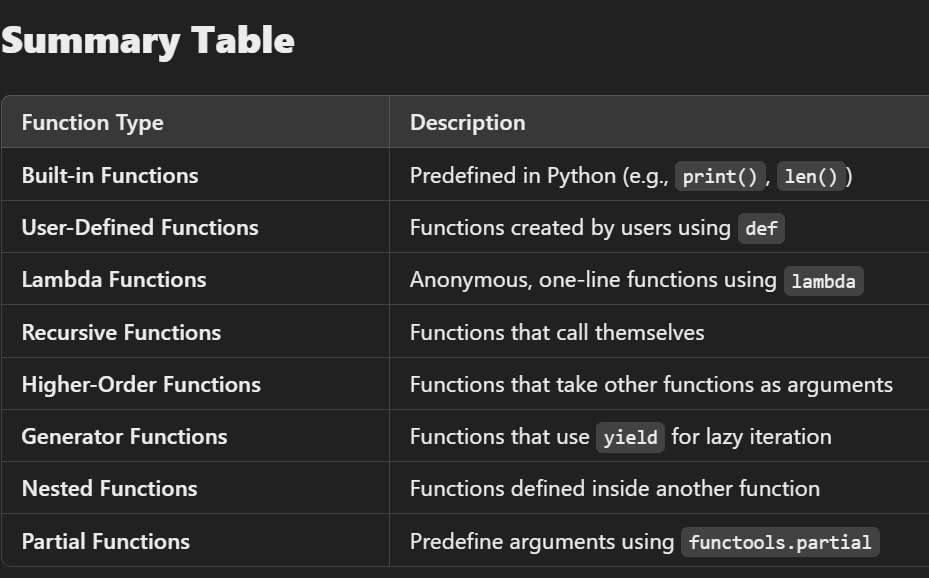
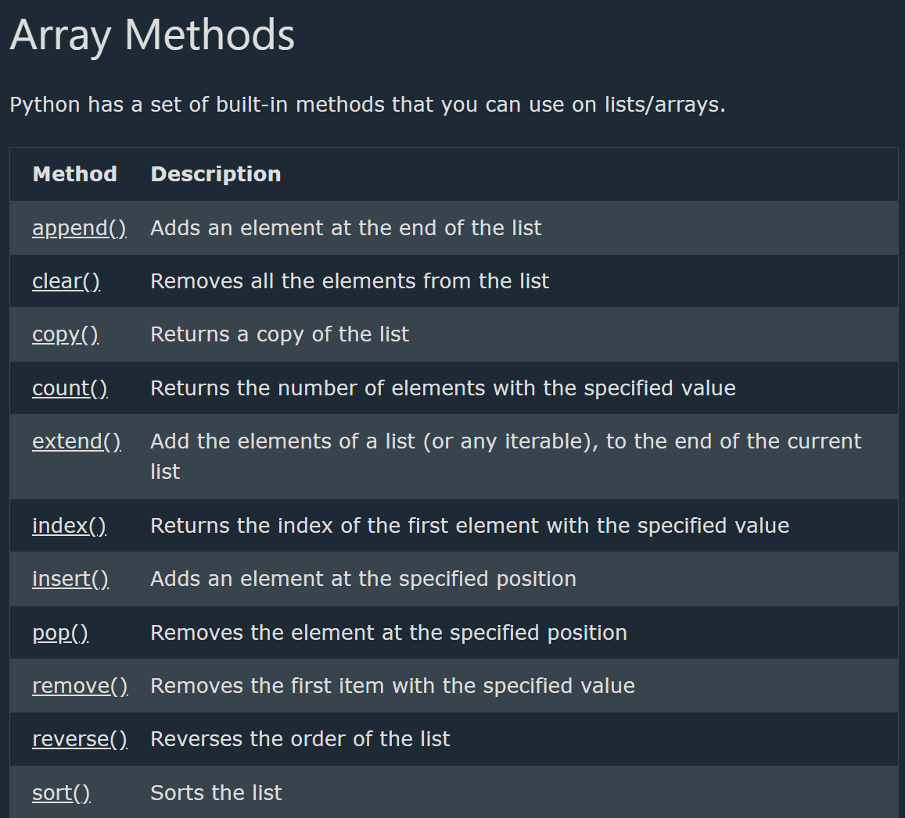
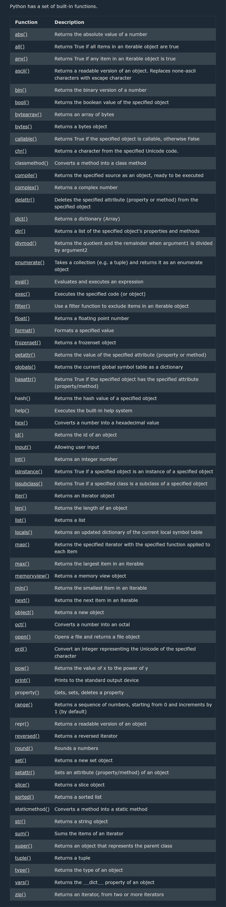

## Functions in Python

--> Block of statements that perform a specific task when it is called.
--> Can pass data, known as parameters, into a function
--> A function can return data as a result.

# Creating a Function

--> In Python a function is defined using the "def" keyword:
==> Calling a Function
--> To call a function, use the function name followed by parenthesis:

--> Syntax

```python
# Function Defination
def func_name( param1, param2..) : # some work
return val     # Logic

# Function Call
func_name(arg1, arg2..)
```

--> eg:-

```python
def sum(a,b):
s = a + b
return s
print(sum(2,3))
```

# Types of Functions in Python 🐍

1. Built-in Functions
   --> These are predefined functions in Python, available without importing any module.
   --> Examples: print(), len(), type(), sum(), max(), min(), etc.
2. User-Defined Functions
   These are functions created by the user to perform a specific task.
3. Anonymous (Lambda) Functions
   These are single-line functions without a name, defined using the lambda keyword.
4. Recursive Functions
   These functions call themselves repeatedly until a condition is met.
5. Higher-Order Functions
   These are functions that take other functions as arguments or return functions.
6. Generator Functions
   These use yield instead of return, allowing them to produce values lazily.
7. Nested Functions (Inner Functions)
   A function inside another function.



# Arguments

--> Information can be passed into functions as arguments.
--> Arguments are specified after the function name, inside the parentheses. You can add as many arguments as you want, just separate them with a comma.
--> Arguments are often shortened to "args" in Python documentations.
--> The following example has a function with one argument (fname). When the function is called, we pass along a first name, which is used inside the function to print the full name:
--> Eg :-

```python
def my_function(fname):
  print(fname + " Refsnes")

my_function("Emil")
my_function("Tobias")
my_function("Linus")
```

==> Parameters or Arguments?
--> The terms parameter and argument can be used for the same thing: information that are passed into a function.
==> From a function's perspective:
--> A parameter is the variable listed inside the parentheses in the function definition.
--> An argument is the value that is sent to the function when it is called.

==> Number of Arguments
--> By default, a function must be called with the correct number of arguments. Meaning that if your function expects 2 arguments, you have to call the function with 2 arguments, not more, and not less.
--> function expects 2 arguments, and gets 2 arguments: Correct method

```python
def my_function(fname, lname):
  print(fname + " " + lname)

my_function("Emil", "Refsnes")
```

--> function expects 2 arguments, but gets only 1: Wrong method

```python
def my_function(fname, lname):
  print(fname + " " + lname)

my_function("Emil")
```

==> Arbitrary Arguments, \*args
--> If you do not know how many arguments that will be passed into your function, add a (\*) before the parameter name in the function definition.
--> This way the function will receive a tuple of arguments, and can access the items accordingly:
--> Arbitrary Arguments are often shortened to \*args in Python documentations.
--> Example
If the number of arguments is unknown, add a \* before the parameter name:

```python
def my_function(*kids):
  print("The youngest child is " + kids[2])

my_function("Emil", "Tobias", "Linus")
```

# Keyword Arguments

--> Send arguments with the key = value syntax.
--> This way the order of the arguments does not matter.
--> The phrase Keyword Arguments are often shortened to kwargs in Python documentations.
--> Example

```python
def my_function(child3, child2, child1):
  print("The youngest child is " + child3)

my_function(child1 = "Emil", child2 = "Tobias", child3 = "Linus")
```

# Arbitrary Keyword Arguments, \*\*kwargs

--> If you do not know how many keyword arguments that will be passed into your function, add two asterisk: \*\* before the parameter name in the function definition.
--> This way the function will receive a dictionary of arguments, and can access the items accordingly:
--> Example
If the number of keyword arguments is unknown, add a double \*\* before the parameter name:

```python
def my_function(\*\*kid):
print("His last name is " + kid["lname"])

my_function(fname = "Tobias", lname = "Refsnes")
```

# Default Parameters

--> Assigning a default value to parameter , which is used when no argument is passed
--> If call the function without argument, it uses the default value:
--> Non default argument follow default argument
--> Eg :

```python
def my_function(country = "Norway"):
  print("I am from " + country)

my_function("Sweden")
my_function("India")
my_function()
my_function("Brazil")
```

==> Passing a List as an Argument
--> Send any data types of argument to a function (string, number, list, dictionary etc.), and it will be treated as the same data type inside the function.
-->if send a List as an argument, it will still be a List when it reaches the function:
-->

```python
def my_function(food):
  for x in food:
    print(x)
fruits = ["apple", "banana", "cherry"]
my_function(fruits)
```

==> Return Values
To let a function return a value, use the return statement:

```python
def my_function(x):
  return 5 * x

print(my_function(3))
print(my_function(5))
print(my_function(9))
```

==> The pass Statement
--> function definitions cannot be empty, but if you for some reason have a function definition with no content, put in the pass statement to avoid getting an error.

Example

```python
def myfunction():
  pass
```

==> Positional-Only Arguments
--> You can specify that a function can have ONLY positional arguments, or ONLY keyword arguments.
--> To specify that a function can have only positional arguments, add , / after the arguments:
--> Example
def my_function(x, /):
print(x)
my_function(3)

--> Without the , / you are actually allowed to use keyword arguments even if the function expects positional arguments:
--> Example
def my_function(x):
print(x)
my_function(x = 3)

--> But when adding the , / you will get an error if you try to send a keyword argument:
--> Example
def my_function(x, /):
print(x)

my_function(x = 3)

==> Keyword-Only Arguments
--> To specify that a function can have only keyword arguments, add \*, before the arguments:
--> Example
def my_function(\*, x):
print(x)
my_function(x = 3)

--> Without the \*, you are allowed to use positionale arguments even if the function expects keyword arguments:
--> Example
def my_function(x):
print(x)
my_function(3)
--> But with the \*, you will get an error if you try to send a positional argument:
--> Example
def my_function(\*, x):
print(x)
my_function(3)

# Combine Positional-Only and Keyword-Only

--> You can combine the two argument types in the same function.
--> Any argument before the / , are positional-only, and any argument after the \*, are keyword-only.
--> Example
def my_function(a, b, /, \*, c, d):
print(a + b + c + d)
my_function(5, 6, c = 7, d = 8)

## Recursion

--> Python also accepts function recursion, which means a defined function can call itself.
--> A process where a function calls itself to solve a smaller subproblem of the original problem.
--> It continues calling itself until it reaches a base case, which is a condition where the recursion stops.
--> The function keeps calling itself, reducing the problem step by step.
--> Recursion is a common mathematical and programming concept. It means that a function calls itself. This has the benefit of meaning that you can loop through data to reach a result.

==> Key Components of Recursion

1. Base Case:
   --> This stops the recursion when a certain condition is met.
   --> Without a base case, the function will call itself infinitely, leading to a stack overflow.
2. Recursive Case:
   --> This is where the function calls itself with a smaller or simpler input to gradually reach the base case.

--> Example

```python
def tri_recursion(k):
  if(k > 0):
    result = k + tri_recursion(k - 1)
    print(result)
  else:
    result = 0
  return result

print("Recursion Example Results:")
tri_recursion(6)
```

## \*\*Python Decorators

==> A decorator is a function that takes another function as argument and returns a new function.
==> Decorators let us add extra behavior to a function, without changing the function's code.

# Basic Decorator

==> Define the decorator first, then apply it with @decorator_name above the function.

==> Example 1.

```Python
def multiple(func):
    def whatever(a, b):
        return func (a,b) * 10
    return whatever

@multiple
def add(a,b):
    return a + b

print(add(1,2))
```

```Python
def changecase(func):
  def myinner():
    return func().lower()
  return myinner

@changecase
def myfunction():
  return "Hello Sally"

print(myfunction())

```

--> By placing @changecase directly above the function definition, the function myfunction is being "decorated" with the changecase function.

--> The function changecase is the decorator.

--> The function myfunction is the function that gets decorated.

# Multiple Decorator Calls

==> A decorator can be called multiple times. Just place the decorator above the function you want to decorate.

```Python
def changecase(func):
  def myinner():
    return func().upper()
  return myinner

@changecase
def myfunction():
  return "Hello Sally"

@changecase
def otherfunction():
  return "I am speed!"

print(myfunction())
print(otherfunction())
```

# Arguments in the Decorated Function

==> Functions that requires arguments can also be decorated, just make sure you pass the arguments to the wrapper function:

```python
def changecase(func):
  def myinner(x):
    return func(x).upper()
  return myinner

@changecase
def myfunction(nam):
  return "Hello " + nam

print(myfunction("John"))
```

# \*args and \*\*kwargs

Sometimes the decorator function has no control over the arguments passed from decorated function, to solve this problem, add (\*args, \*\*kwargs) to the wrapper function, this way the wrapper function can accept any number, and any type of arguments, and pass them to the decorated function.

==> Example :- Secure the function with \*args and \*\*kwargs arguments:

```Python
def changecase(func):
  def myinner(*args, **kwargs):
    return func(*args, **kwargs).upper()
  return myinner

@changecase
def myfunction(nam):
  return "Hello " + nam

print(myfunction("John"))
```

# Decorator With Arguments

==> Decorators can accept their own arguments by adding another wrapper level.
==> A decorator factory that takes an argument and transforms the casing based on the argument value.

```Python
def changecase(n):
  def changecase(func):
    def myinner():
      if n == 1:
        a = func().lower()
      else:
        a = func().upper()
      return a
    return myinner
  return changecase

@changecase(1)
def myfunction():
  return "Hello Linus"

print(myfunction())
```

# Multiple Decorators

--> You can use multiple decorators on one function.
--> This is done by placing the decorator calls on top of each other.
--> The decorators are called in the order they are specified.

```python
def changecase(func):
  def myinner():
    return func().upper()
  return myinner

def addgreeting(func):
  def myinner():
    return "Hello " + func() + " Have a good day!"
  return myinner

@changecase
@addgreeting
def myfunction():
  return "Tobias"

print(myfunction())
```

# Preserving Function Metadata

==> Functions in Python has metadata that can be accessed using the **name** and **doc** attributes.

==> Example : a function's name can be returned with the **name** attribute:

```Python
def myfunction():
  return "Have a great day!"

print(myfunction.__name__)
```

==> But, when a function is decorated, the metadata of the original function is lost.

```Python
def changecase(func):
  def myinner():
    return func().upper()
  return myinner

@changecase
def myfunction():
  return "Have a great day!"

print(myfunction.__name__)
```

==> To fix this, Python has a built-in function called functools.wraps that can be used to preserve the original function's name and docstring.

## Python Lambda

--> A lambda function is a small anonymous function.
--> A lambda function can take any number of arguments, but can only have one expression.
--> Use lambda functions when an anonymous function is required for a short period of time.

==> Syntax
lambda arguments : expression
--> The expression is executed and the result is returned:

==> Why Use Lambda Functions?
--> The power of lambda is better shown when you use them as an anonymous function inside another function.

## Python Arrays

--> Python does not have built-in support for Arrays, but Python Lists can be used instead.
--> to work with arrays in Python you will have to import a library, like the NumPy library.
--> Arrays are used to store multiple values in one single variable:
--> Create an array containing car names:
cars = ["Ford", "Volvo", "BMW"]

==> What is an Array?
--> An array is a special variable, which can hold more than one value at a time.
--> If you have a list of items (a list of car names, for example), storing the cars in single variables could look like this:
car1 = "Ford"
car2 = "Volvo"
car3 = "BMW"
--> An array can hold many values under a single name, and you can access the values by referring to an index number.

==> Access the Elements of an Array
--> Refer to an array element by referring to the index number.
--> Get the value of the first array item:
x = cars[0]
--> Modify the value of the first array item:
cars[0] = "Toyota"

==> The Length of an Array
--> Use the len() method to return the length of an array (the number of elements in an array).
x = len(cars)
--> The length of an array is always one more than the highest array index.

==> Looping Array Elements
--> You can use the for in loop to loop through all the elements of an array.
--> Ex:- Print each item in the cars array:
for x in cars:
print(x)

==> Adding Array Elements
--> You can use the append() method to add an element to an array.
cars.append("Honda")

==> Removing Array Elements
--> You can use the pop() method to remove an element from the array
cars.pop(1) # Delete the second element of the cars array:
--> use the remove() method to remove an element from the array.
cars.remove("Volvo") # Delete the element that has the value "Volvo":
--> The list's remove() method only removes the first occurrence of the specified value.



## Generators

--> A generator is a special type of function that returns an iterator using the yield keyword instead of return.
--> Unlike a normal function which computes and returns a value once, a generator "pauses" its state at each yield and resumes exactly where it left off the next time it's called.
--> Generators are memory-efficient because they produce values lazily (one at a time, on demand) instead of building and storing an entire sequence in memory.

==> Creating a Generator Function
--> Any function that contains at least one yield statement automatically becomes a generator function.
--> Calling a generator function does NOT execute the function body immediately -- it returns a generator object.

```python
def my_generator():
    yield 1
    yield 2
    yield 3

gen = my_generator()
print(gen)          # <generator object my_generator at 0x...>
print(next(gen))     # 1
print(next(gen))     # 2
print(next(gen))     # 3
# print(next(gen))   # Raises StopIteration -- no more values
```

==> Looping Through a Generator
--> Just like any iterable, generators can be looped through using a for loop, which automatically handles the StopIteration for you.

```python
def countdown(n):
    while n > 0:
        yield n
        n -= 1

for num in countdown(5):
    print(num)   # 5 4 3 2 1
```

==> Generator Expressions
--> Similar to list comprehensions, but use parentheses () instead of square brackets [].
--> Generator expressions are memory-efficient because they generate values on the fly instead of storing them all in memory at once.

```python
squares = (x*x for x in range(5))
print(squares)          # <generator object <genexpr> at 0x...>
print(list(squares))    # [0, 1, 4, 9, 16]
```

==> Why Use Generators?
--> Memory efficient -- values are generated one at a time, not stored all at once.
--> Useful for working with large or infinite sequences.
--> Automatically maintains state between calls (no need to manage index variables manually).

==> Generators vs Normal Functions
--> A normal function runs to completion and returns a single value using return.
--> A generator function pauses execution at yield and can produce multiple values over time, resuming from exactly where it left off on each call.

## Type Hints (typing module)

--> Type hints (introduced in Python 3.5, PEP 484) let you indicate the expected data type of variables, function parameters, and return values.
--> Python remains dynamically typed -- type hints are NOT enforced at runtime, they are mainly used by IDEs, linters, and tools like mypy for static type checking.

==> Basic Syntax
--> variable: type = value
--> def function_name(param: type) -> return_type:

```python
age: int = 25
name: str = "Shanu"
price: float = 99.99
is_active: bool = True

def greet(name: str) -> str:
    return "Hello, " + name

def add(a: int, b: int) -> int:
    return a + b
```

==> Type Hints for Collections
--> Use the typing module (or built-in generics directly in Python 3.9+) for lists, dicts, tuples, etc.

```python
from typing import List, Dict, Tuple, Optional

names: List[str] = ["Alice", "Bob"]
scores: Dict[str, int] = {"Alice": 90, "Bob": 85}
coordinates: Tuple[float, float] = (12.9, 77.6)

# Optional means the value can be the given type OR None
def find_user(user_id: int) -> Optional[str]:
    return None
```

==> Note
--> Type hints are optional and do not stop the code from running even if the wrong type is passed -- they are purely documentation/tooling aids unless checked by an external tool.
