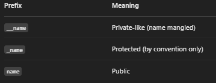

### OOPS in Python

--> Python is an object oriented programming language.
--> To map with real world scenarios we started using objects in code.
--> Solving a problem by creating object is one of the most popular approaches in programming. It is called object oriented programming.
--> Object-Oriented Programming (OOP) in Python is based on four fundamental principles:

1. Encapsulation – Wrapping data and methods into a single unit (class) and restricting direct access to some components.
2. Abstraction – Hiding complex implementation details and showing only the essential features.
3. Inheritance – Acquiring properties and behaviors of a parent class in a child class.
4. Polymorphism – Performing the same operation in different ways based on the object or context.

--> There are several other related concepts, such as class, objects, constructors, and method overriding.

## Class and Objects

Classes and objects are the two core concepts in object-oriented programming.
A class defines what an object should look like, and an object is created based on that class.

Class Objects
Fruit --> Apple, Banana, Mango
Car --> Volvo, Audi, Toyota

==> Class
--> A class is like an object constructor, or a blueprint for creating objects. It defines attributes (variables) and methods (functions) that describe the behavior of objects.

# Create a Class

--> To create a class, use the keyword "class":
--> Class name always start with capital letter.
--> eg: creating class
class Student:
name = "karan kumar"

# Create Object

--> An object is an instance of a class that holds data and can perform actions defined by the class.
eg : Creating object (instance)
s1 = Student()
print(s1.name)

obj attr >> class attr

==> A class has two main parts:

==> Data (Attributes)
--> These are the variables that hold information about the object.
For example, in a Car class, attributes could be color, make, and speed.
The term "attributes" is another word for these data variables.

==> Methods(Function)
--> These are the functions defined inside a class that describe the behaviors or actions the object can perform.
For the Car class, methods could be drive(), brake(), or honk().

# Method

A method in Python is a function that is defined inside a class and operates on instances (objects) of that class. It is used to perform operations related to the object’s data.

==> Types of Methods in Python

1. Instance Methods
   --> These methods work on instance variables (attributes) and require an instance of the class.
   --> The first parameter of an instance method is always self, which refers to the current object.
   --> These methods can access and modify instance attributes.
2. Class Methods
   --> Defined using @classmethod decorator.
   --> The first parameter is cls, which refers to the class itself.
   --> Can modify class attributes but not instance attributes directly.
3. Static Methods
   --> Defined using @staticmethod decorator.
   --> Convert a function to be a static method
   --> Do not require self or cls as the first parameter.
   --> Act as regular functions inside the class but are logically related to the class.
   --> eg :
   class Student:
   @staticmethod # decorator
   def college():
   print("ABC College")

--> Decorators -- It allow us to wrap another function in order to extend the behavior of the wrapped function ,without permanently modifying it

==> Special Methods (Dunder Methods)
**init**() → Constructor method, initializes object attributes.
**str**() → Returns a string representation of the object.
**repr**() → Used for debugging, returns an official string representation.

==> Method Calling
--> Methods are called using the dot (.) operator with an object (object.method()).
--> Class methods and static methods can be called using the class name (Class.method()).

# The **init**() Function Constructors

--> A constructor (**init** method) is a special method that initializes an object's attributes when it is created.
--> All classes have a function called **init**(), which is always executed when the class is being initiated.
--> It is automatically called when a new instance of a class is created.
--> Use the **init**() function to assign values to object properties, or other operations that are necessary to do when the object is being created:

# Creating class

--> To create a class, use the keyword class:
class Student :
def **init**(self,fullname):
self.name = fullname
--> The self parameter is a reference to the current instance of the class , and is used to access variable that belong to the class

# creating object

s1 = Student("karan")
print(s1.name)
--> different types of constructors based on how they are used:

1. Default Constructor
   --> A constructor that does not take any arguments except self.
   --> It initializes the object with default values.
2. Parameterized Constructor
   --> A constructor that takes arguments in addition to self.
   --> It allows object properties to be initialized with specific values at the time of object creation.
3. Constructor with Default Arguments
   --> A constructor that has default values for some or all parameters.
   --> If arguments are not provided during object creation, the default values are used.
4. "Private" Initialization Pattern
   --> Python's constructor is always named `__init__` -- there's no way to make the constructor itself private/double-underscore-prefixed.
   --> To discourage direct instantiation from outside the class, the convention instead is to prefix a helper attribute/method with `_` (single underscore, "internal use") or `__` (double underscore, triggers name mangling) and expose a factory classmethod/function for creating instances instead.
5. Static Constructor
   --> Python does not have a built-in static constructor like some other languages.
   --> However, class methods or the \*\*new\_\_ method can be used to mimic static initialization before the object is created.

==> The **str**() Function
--> The **str**() function controls what should be returned when the class object is represented as a string.
--> If the **str**() function is not set, the string representation of the object is returned:
--> Ex - The string representation of an object WITHOUT the **str**() function:

```python
class Person:
 def __init__(self, name, age):
    self.name = name
    self.age = age
p1 = Person("John", 36)

print(p1)      # <__main__.Person object at 0x15039e602100>
```

--> Ex - The string representation of an object WITH the **str**() function:

```python
class Person:
  def __init__(self, name, age):
    self.name = name
    self.age = age

  def __str__(self):
    return f"{self.name}({self.age})"

p1 = Person("John", 36)

print(p1)   #John(36)
```

==> Object Methods
--> Objects can also contain methods. Methods in objects are functions that belong to the object.
-->

```python
class Person:
  def __init__(self, name, age):
    self.name = name
    self.age = age

  def myfunc(self):
    print("Hello my name is " + self.name)

p1 = Person("John", 36)
p1.myfunc()
```

--> The self parameter is a reference to the current instance of the class, and is used to access variables that belong to the class.

==> The self Parameter
--> The self parameter is a reference to the current instance of the class, and is used to access variables that belong to the class.
--> It does not have to be named self, you can call it whatever you like, but it has to be the first parameter of any function in the class:
--> Eg:- words mysillyobject and abc instead of self:

```python
class Person:
  def __init__(mysillyobject, name, age):
    mysillyobject.name = name
    mysillyobject.age = age

  def myfunc(abc):
    print("Hello my name is " + abc.name)

p1 = Person("John", 36)
p1.myfunc()
```

==> Modify Object Properties
You can modify properties on objects like this:

==> Delete Object Properties
You can delete properties on objects by using the del keyword:

==> Delete Objects
You can delete objects by using the del keyword:

==> The pass Statement
--> class definitions cannot be empty, but if you for some reason have a class definition with no content, put in the pass statement to avoid getting an error.

# Inheritance

--> Inheritance is the mechanism that allows a class (child class) to inherit attributes and methods from another class (parent class).
--> Parent class is the class being inherited from, also called base class.
--> Child class is the class that inherits from another class, also called derived class.
-->It helps in code reusability and hierarchical classification.

==> Types of Inheritance in Python:

1. Single Inheritance: A child class inherits from a single parent class.
2. Multiple Inheritance: A child class inherits from more than one parent class.
3. Multilevel Inheritance: A class inherits from another class, which in turn inherits from another class, forming a chain.
4. Hierarchical Inheritance: Multiple child classes inherit from a single parent class.
5. Hybrid Inheritance: A combination of multiple inheritance types.

==>Create a Parent Class
--> Any class can be a parent class, so the syntax is the same as creating any other class:
--> Example
Create a class named Person, with firstname and lastname properties, and a printname method:

```python
class Person:
  def __init__(self, fname, lname):
    self.firstname = fname
    self.lastname = lname

  def printname(self):
    print(self.firstname, self.lastname)

#Use the Person class to create an object, and then execute the printname method:

x = Person("John", "Doe")
x.printname()
```

==> Create a Child Class
--> To create a class that inherits the functionality from another class, send the parent class as a parameter when creating the child class:
--> Example
Create a class named Student, which will inherit the properties and methods from the Person class:

```python
class Student(Person):
  pass
```

--> Use the pass keyword when you do not want to add any other properties or methods to the class.

--> The Student class has the same properties and methods as the Person class.
--> Example
Use the Student class to create an object, and then execute the printname method:

```python
x = Student("Mike", "Olsen")
x.printname()
```

==> Add the **init**() Function
--> Add the **init**() function to the child class (instead of the pass keyword).
Note: The **init**() function is called automatically every time the class is being used to create a new object.

--> When you add the **init**() function, the child class will no longer inherit the parent's **init**() function.
--> To keep the inheritance of the parent's **init**() function, add a call to the parent's **init**() function:
--> Example

```python
class Student(Person):
  def __init__(self, fname, lname):
    Person.__init__(self, fname, lname)
```

==> Use the super() Function
--> By using the super() function, do not have to use the name of the parent element, it will automatically inherit the methods and properties from its parent.

==> Add Properties
--> Example: Add a property called graduationyear to the Student class:

```python
class Student(Person):
  def __init__(self, fname, lname):
    super().__init__(fname, lname)
    self.graduationyear = 2019
```

==> Add Methods
--> Eg: Add a method called welcome to the Student class:

```python
class Student(Person):
  def __init__(self, fname, lname, year):
    super().__init__(fname, lname)
    self.graduationyear = year

  def welcome(self):
    print("Welcome", self.firstname, self.lastname, "to the class of", self.graduationyear)
```

# Polymorphism

--> Polymorphism allows a single interface to be used for different types.
--> The word "polymorphism" means "many forms", and in programming it refers to methods/functions/operators with the same name that can be executed on many objects or classes.
--> It enables the same function or method to have different behaviors based on the object it is acting upon.
==> Types of Polymorphism:

1. Method Overriding: A child class provides a specific implementation of a method that is already defined in its parent class.
2. Method Overloading (not directly supported in Python): Achieved through default arguments or variable-length arguments (\*args, \*\*kwargs).
3. Operator Overloading: The ability to define the behavior of operators (+, -, \*, etc.) for user-defined objects.

==> Method Overriding
--> Method overriding occurs when a subclass provides a specific implementation of a method that is already defined in its parent class.
--> The overridden method in the child class must have the same name and parameters as the method in the parent class.

==> Function Polymorphism
--> Python function that can be used on different objects is the len() function.
--> String
For strings len() returns the number of characters
--> Tuple
For tuples len() returns the number of items in the tuple:
--> Dictionary
For dictionaries len() returns the number of key/value pairs in the dictionary

==> Class Polymorphism
--> Often used in Class methods, where we can have multiple classes with the same method name.

==> Inheritance Class Polymorphism
--> Child classes inherits the properties and methods from the parent class.

==> Del Keyword
--> Used to delete objects, such as variables, list items, or dictionary entries.
--> Once deleted, the object or item is no longer accessible.
--> eg :-
class Student:
def **init**(self, name):
self.name = name

s1 = Student("shradha")

del s1
print(s1)

# Abstraction

--> Abstraction is the concept of hiding the internal implementation details of an object and exposing only the necessary functionalities.
--> It allows users to interact with an object through a well-defined interface without knowing the underlying complexity.
--> Abstraction is typically achieved using abstract classes and methods, which define a structure but leave implementation details to subclasses.

# Encapsulation

--> Encapsulation is the process of(Wrapping Data and function into a single unit(object))
--> It restricts direct access to certain details of an object and can be achieved using access modifiers:

1. Public: Accessible from anywhere.
2. Protected: Indicated with a single underscore (\_), meant to be used within the class and subclasses.
3. Private: Indicated with double underscores (\_\_), intended for internal use within the class.

--> Encapsulation helps in data hiding and ensures controlled access to an object's attributes.

# Private(like) attribute & methods

--> Private attribute & methods are meant to be used only within the class and are not accessible from outside the class
--> Python doesn’t have strict access modifiers like private, protected, or public as in other languages like Java or C++. But we can simulate privacy using naming conventions.


## Class Variables vs Instance Variables

--> Class Variables are variables that are shared by ALL objects/instances of a class. They are defined directly inside the class, but outside any method.
--> Instance Variables are variables that are unique to EACH object. They are usually defined inside the __init__() method using self.
--> Changing a class variable through the class name affects all instances; changing it through one instance only creates/overrides a variable for that instance.

```python
class Student:
    school_name = "ABC College"   # Class variable -- shared by all students

    def __init__(self, name):
        self.name = name          # Instance variable -- unique to each object

s1 = Student("Karan")
s2 = Student("Rahul")

print(s1.school_name, s2.school_name)   # ABC College ABC College

Student.school_name = "XYZ College"     # Changing via the class updates it for all
print(s1.school_name, s2.school_name)   # XYZ College XYZ College

s1.school_name = "Private School"       # Changing via an instance only affects that instance
print(s1.school_name, s2.school_name)   # Private School XYZ College
```

## The @property Decorator

--> The @property decorator lets you define a method that can be accessed like an attribute (without parentheses), commonly used to create "getters" and "setters" for controlled attribute access.
--> Useful for adding validation logic, or computing a value on the fly, while still keeping a simple attribute-style syntax for the caller.

==> Getter Example

```python
class Circle:
    def __init__(self, radius):
        self._radius = radius

    @property
    def area(self):
        return 3.14159 * self._radius ** 2

c = Circle(5)
print(c.area)   # 78.53975 -- called like an attribute, not c.area()
```

==> Getter + Setter Example (with validation)

```python
class Person:
    def __init__(self, age):
        self._age = age

    @property
    def age(self):          # Getter
        return self._age

    @age.setter
    def age(self, value):   # Setter
        if value < 0:
            raise ValueError("Age cannot be negative")
        self._age = value

p = Person(25)
print(p.age)     # 25
p.age = 30       # Calls the setter
print(p.age)     # 30
# p.age = -5     # Raises ValueError
```

## Operator Overloading

--> Operator Overloading allows you to define custom behavior for built-in operators (+, -, ==, <, len(), str(), etc.) when used on objects of your own class.
--> Achieved by implementing special "dunder" (double underscore) methods inside the class.

==> Common Dunder Methods for Operator Overloading
--> __add__(self, other) --> defines behavior for the + operator
--> __sub__(self, other) --> defines behavior for the - operator
--> __eq__(self, other) --> defines behavior for the == operator
--> __lt__(self, other) --> defines behavior for the < operator
--> __len__(self) --> defines behavior for len(object)
--> __str__(self) --> defines the string shown by print(object)

==> Example : Overloading + and == for a custom Vector class

```python
class Vector:
    def __init__(self, x, y):
        self.x = x
        self.y = y

    def __add__(self, other):
        return Vector(self.x + other.x, self.y + other.y)

    def __eq__(self, other):
        return self.x == other.x and self.y == other.y

    def __str__(self):
        return f"Vector({self.x}, {self.y})"

v1 = Vector(2, 3)
v2 = Vector(4, 1)

print(v1 + v2)        # Vector(6, 4) -- uses __add__
print(v1 == v2)       # False -- uses __eq__
print(v1)             # Vector(2, 3) -- uses __str__
```

## Abstraction with the abc Module

--> While Abstraction can be described conceptually, Python provides the built-in abc (Abstract Base Class) module to actually enforce it in code.
--> An abstract class cannot be instantiated directly, and any method decorated with @abstractmethod MUST be implemented by any child (subclass), otherwise Python raises a TypeError.

```python
from abc import ABC, abstractmethod

class Shape(ABC):
    @abstractmethod
    def area(self):
        pass          # No implementation here -- forces child classes to define it

class Rectangle(Shape):
    def __init__(self, width, height):
        self.width = width
        self.height = height

    def area(self):
        return self.width * self.height

# shape = Shape()          # TypeError: Can't instantiate abstract class Shape
r = Rectangle(4, 5)
print(r.area())            # 20
```

## Multiple Inheritance and MRO (Method Resolution Order)

--> Multiple Inheritance lets a child class inherit from more than one parent class at the same time.
--> When multiple parent classes define the same method/attribute name, Python decides which one to use based on the Method Resolution Order (MRO) -- the order in which Python looks up methods across a class hierarchy.
--> Use ClassName.__mro__ or ClassName.mro() to see the exact lookup order.

```python
class Father:
    def skills(self):
        print("Gardening, Programming")

class Mother:
    def skills(self):
        print("Cooking, Painting")

class Child(Father, Mother):   # Multiple Inheritance -- Father is listed first
    pass

c = Child()
c.skills()                     # Gardening, Programming -- Father's method wins (left-to-right order)

print(Child.__mro__)
# (<class 'Child'>, <class 'Father'>, <class 'Mother'>, <class 'object'>)
```

--> super() in multiple inheritance follows the MRO chain, calling the next class in line rather than jumping straight to a specific parent -- this is what allows cooperative multiple inheritance to work correctly.

## __slots__

--> By default, every Python object stores its instance attributes in a dynamic dictionary (__dict__), which uses extra memory and allows adding new attributes at any time.
--> __slots__ lets you explicitly declare a fixed set of allowed attribute names for a class, which saves memory and prevents accidentally creating new attributes.

```python
class Point:
    __slots__ = ("x", "y")   # Only these two attributes are allowed

    def __init__(self, x, y):
        self.x = x
        self.y = y

p = Point(2, 3)
print(p.x, p.y)      # 2 3
# p.z = 10           # AttributeError: 'Point' object has no attribute 'z'
```

## Dataclasses

--> The @dataclass decorator (from the dataclasses module, Python 3.7+) automatically generates common boilerplate methods like __init__(), __repr__(), and __eq__() for classes that are mainly used to store data.
--> Greatly reduces repetitive code for simple "data holder" classes.

```python
from dataclasses import dataclass

@dataclass
class Employee:
    name: str
    age: int
    salary: float = 0.0     # Default value

e1 = Employee("Shanu", 23, 50000)
e2 = Employee("Shanu", 23, 50000)

print(e1)            # Employee(name='Shanu', age=23, salary=50000) -- auto-generated __repr__
print(e1 == e2)       # True -- auto-generated __eq__ (compares field values)
```

## Custom Context Managers (__enter__ / __exit__)

--> The with statement (already seen with file handling) works with any object that implements the __enter__() and __exit__() dunder methods -- this pair is called a Context Manager.
--> __enter__() runs when entering the with block (setup), and __exit__() runs when leaving it (cleanup), even if an exception occurred inside the block.

```python
class ManagedFile:
    def __init__(self, filename):
        self.filename = filename

    def __enter__(self):
        self.file = open(self.filename, "w")
        return self.file

    def __exit__(self, exc_type, exc_value, traceback):
        self.file.close()
        print("File closed automatically")

with ManagedFile("demo.txt") as f:
    f.write("Hello, custom context manager!")
# File closed automatically -- __exit__ ran even without calling close() manually
```

## Enum (Enumerations)

--> The enum module lets you define a set of named, related constant values as a single type, making the code more readable than using plain strings or numbers.
--> An Enum class is created by subclassing Enum, with each member assigned a constant value.

```python
from enum import Enum

class Color(Enum):
    RED = 1
    GREEN = 2
    BLUE = 3

print(Color.RED)          # Color.RED
print(Color.RED.name)     # RED
print(Color.RED.value)    # 1

for c in Color:
    print(c)

if Color.RED == Color.RED:
    print("Same color!")

## Deep Dive -- Metaclasses (Advanced OOP)

--> Just as a class is a blueprint for creating OBJECTS, a metaclass is a blueprint for creating CLASSES -- every class in Python is itself an instance of a metaclass, by default `type`. This is genuinely advanced, rarely-needed territory, but understanding it demystifies some "magic" that frameworks (like Django's ORM) rely on internally.

```python
print(type(5))              # <class 'int'>          -- 5 is an instance of int
print(type(int))             # <class 'type'>          -- int itself is an instance of type
print(type(str))              # <class 'type'>          -- so is str
```

--> A custom metaclass intercepts CLASS CREATION itself, letting you modify/validate a class's structure before it's even fully defined -- done by inheriting from `type` and overriding `__new__` or `__init__`.

```python
class UpperAttrMeta(type):
    def __new__(mcs, name, bases, namespace):
        # Automatically uppercase all non-dunder attribute names when the class is created
        uppercase_attrs = {
            (key.upper() if not key.startswith("__") else key): value
            for key, value in namespace.items()
        }
        return super().__new__(mcs, name, bases, uppercase_attrs)

class Config(metaclass=UpperAttrMeta):
    debug = True
    version = "1.0"

print(Config.DEBUG)   # True -- "debug" was automatically renamed to "DEBUG" at class-creation time
```

--> **Real-world relevance** -- Django's ORM uses a metaclass (`ModelBase`) behind the scenes to automatically turn a `models.Model` subclass's simple field declarations (`title = models.CharField(...)`, shown in the Web Frameworks file) into a fully-functional database-backed class with query methods -- the metaclass intercepts class creation to inject all of that machinery. `abc.ABCMeta` (underlying the `ABC` class used for Abstraction earlier in this file) is likewise a metaclass, enforcing that abstract methods are actually implemented before a subclass can be instantiated.
--> In everyday application code, reaching for a metaclass is rare -- class decorators or `__init_subclass__` (a simpler hook for customizing subclass creation without the full complexity of a metaclass) usually solve the same problem with less conceptual overhead.
```

## Deep Dive Addendum -- Metaclasses (Corrected)

--> Note: the "Deep Dive -- Metaclasses (Advanced OOP)" section above got swallowed into one broken code block, because the ```python fence opened earlier (at the Enum example) was never closed before that section started. This addendum reproduces that same content with correct, properly-closed fences, so it renders as intended. Nothing above has been changed or removed.

--> Just as a class is a blueprint for creating OBJECTS, a metaclass is a blueprint for creating CLASSES -- every class in Python is itself an instance of a metaclass, by default `type`. This is genuinely advanced, rarely-needed territory, but understanding it demystifies some "magic" that frameworks (like Django's ORM) rely on internally.

```python
print(type(5))              # <class 'int'>          -- 5 is an instance of int
print(type(int))             # <class 'type'>          -- int itself is an instance of type
print(type(str))              # <class 'type'>          -- so is str
```

--> A custom metaclass intercepts CLASS CREATION itself, letting you modify/validate a class's structure before it's even fully defined -- done by inheriting from `type` and overriding `__new__` or `__init__`.

```python
class UpperAttrMeta(type):
    def __new__(mcs, name, bases, namespace):
        # Automatically uppercase all non-dunder attribute names when the class is created
        uppercase_attrs = {
            (key.upper() if not key.startswith("__") else key): value
            for key, value in namespace.items()
        }
        return super().__new__(mcs, name, bases, uppercase_attrs)

class Config(metaclass=UpperAttrMeta):
    debug = True
    version = "1.0"

print(Config.DEBUG)   # True -- "debug" was automatically renamed to "DEBUG" at class-creation time
```

--> **Real-world relevance** -- Django's ORM uses a metaclass (`ModelBase`) behind the scenes to automatically turn a `models.Model` subclass's simple field declarations (`title = models.CharField(...)`, shown in the Web Frameworks file) into a fully-functional database-backed class with query methods -- the metaclass intercepts class creation to inject all of that machinery. `abc.ABCMeta` (underlying the `ABC` class used for Abstraction earlier in this file) is likewise a metaclass, enforcing that abstract methods are actually implemented before a subclass can be instantiated.
--> In everyday application code, reaching for a metaclass is rare -- class decorators or `__init_subclass__` (a simpler hook for customizing subclass creation without the full complexity of a metaclass) usually solve the same problem with less conceptual overhead.
