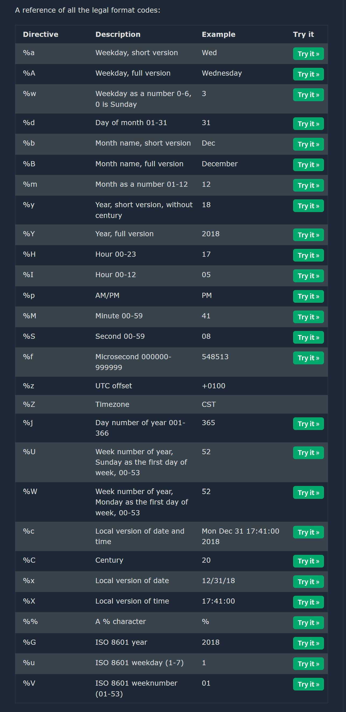
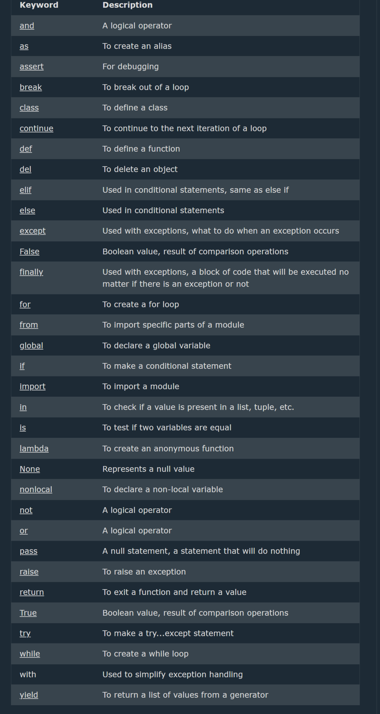

## Python Scope

--> A variable is only available from inside the region it is created. This is called scope.

# Local Scope

--> A variable created inside a function belongs to the local scope of that function, and can only be used inside that function.

```python
def myfunc():
  x = 300
  print(x)

myfunc()
```

==> Function Inside Function
--> The variable x is not available outside the function, but it is available for any function inside the function
--> Eg:

```python
def myfunc():
  x = 300
  def myinnerfunc():
    print(x)
  myinnerfunc()

myfunc()
```

# Global Scope

--> A variable created in the main body of the Python code is a global variable and belongs to the global scope.
--> Global variables are available from within any scope, global and local.

==> Naming Variables
--> If you operate with the same variable name inside and outside of a function, Python will treat them as two separate variables, one available in the global scope (outside the function) and one available in the local scope (inside the function)

# Global Keyword

--> If need to create a global variable, but are stuck in the local scope, you can use the global keyword.
--> The global keyword makes the variable global
--> Use the global keyword if you want to make a change to a global variable inside a function.
--> Eg:- use the global keyword, the variable belongs to the global scope:

```python
def myfunc():
  global x
  x = 300

myfunc()

print(x)
```

==> Nonlocal Keyword
--> The nonlocal keyword is used to work with variables inside nested functions.
--> The nonlocal keyword makes the variable belong to the outer function.

```Python
 def myfunc1():
  x = "Jane"
  def myfunc2():
    nonlocal x
    x = "hello"
  myfunc2()
  return x

print(myfunc1())
```

## Python Modules

==> Module
--> It is a file written by another programmer that generally has a function we can use
--> A module to be the same as a code library.
--> A file containing a set of functions you want to include in your application.

==> Create a Module
--> To create a module just save the code you want in a file with the file extension .py

==> Use a Module
--> can use the module just created, by using the import statement:

# When using a function from a module, use the syntax: module_name.function_name.

==> Variables in Module
The module can contain functions, but also variables of all types (arrays, dictionaries, objects etc)

Example:- Save this code in the file mymodule.py

```Python
person1 = {
  "name": "John",
  "age": 36,
  "country": "Norway"
}
# Import the module named mymodule, and access the person1 dictionary:

import mymodule

a = mymodule.person1["age"]
print(a)
```

==> Naming a Module
--> can name the module file whatever like, but it must have the file extension .py
==> Re-naming a Module
--> can create an alias when you import a module, by using the as keyword:

==> Built-in Modules
--> There are several built-in modules in Python, which can import whenever uses.
--> Ex:-
import platform

x = platform.system()
print(x)

==> Using the dir() Function
--> There is a built-in function to list all the function names (or variable names) in a module. The dir() function:
--> The dir() function can be used on all modules, also the ones you create yourself.
-->
import platform
x = dir(platform)
print(x)

==> Import From Module
--> can choose to import only parts from a module, by using the from keyword.
--> Note: When importing using the from keyword, do not use the module name when referring to elements in the module. Example: person1["age"], not mymodule.person1["age"]
--> from mymodule import person1

print (person1["age"])

## Python Datetime

==> Python Dates
--> A date in Python is not a data type of its own, but we can import a module named datetime to work with dates as date objects
import datetime

x = datetime.datetime.now()
print(x)

==> Date Output
--> The date contains year, month, day, hour, minute, second, and microsecond.
--> The datetime module has many methods to return information about the date object.

==> Creating Date Objects
--> To create a date, we can use the datetime() class (constructor) of the datetime module.
--> The datetime() class requires three parameters to create a date: year, month, day.
--> The datetime() class also takes parameters for time and timezone (hour, minute, second, microsecond, tzone), but they are optional, and has a default value of 0, (None for timezone).

==> The strftime() Method
--> The datetime object has a method for formatting date objects into readable strings.
--> The method is called strftime(), and takes one parameter, format, to specify the format of the returned string



## The collections Module

--> collections is a built-in module that provides specialized, high-performance alternatives to Python's general purpose containers (dict, list, set, tuple).

==> Counter
--> A dict subclass for counting hashable objects -- returns each element's count.

```python
from collections import Counter

words = ["apple", "banana", "apple", "orange", "banana", "apple"]
count = Counter(words)
print(count)                 # Counter({'apple': 3, 'banana': 2, 'orange': 1})
print(count.most_common(1))   # [('apple', 3)]
```

==> defaultdict
--> Like a normal dict, but provides a default value automatically for missing keys instead of raising a KeyError.

```python
from collections import defaultdict

fruit_count = defaultdict(int)   # default value for missing keys is 0
fruit_count["apple"] += 1
print(fruit_count["banana"])      # 0 -- no KeyError, auto-created with default int() = 0
```

==> namedtuple
--> Creates simple, immutable classes with named fields, so tuple items can be accessed by name instead of just index.

```python
from collections import namedtuple

Point = namedtuple("Point", ["x", "y"])
p = Point(2, 3)
print(p.x, p.y)    # 2 3
print(p)           # Point(x=2, y=3)
```

==> OrderedDict
--> A dict subclass that remembers insertion order (regular dicts have kept insertion order since Python 3.7, but OrderedDict has extra order-related methods like move_to_end()).

```python
from collections import OrderedDict

od = OrderedDict()
od["a"] = 1
od["b"] = 2
od["c"] = 3
print(od)   # OrderedDict([('a', 1), ('b', 2), ('c', 3)])
```

## The itertools Module

--> itertools provides fast, memory-efficient tools for working with iterators, useful for looping/combining data without building large intermediate lists.

```python
import itertools

# count() -- infinite counter
for i in itertools.count(5, 2):   # start=5, step=2
    print(i)
    if i > 10:
        break

# cycle() -- infinitely repeats a sequence
counter = 0
for item in itertools.cycle(["A", "B", "C"]):
    print(item)
    counter += 1
    if counter == 6:
        break

# permutations() -- all possible orderings
print(list(itertools.permutations([1, 2, 3])))

# combinations() -- all possible unique groupings (order doesn't matter)
print(list(itertools.combinations([1, 2, 3], 2)))

# chain() -- combine multiple iterables into one
print(list(itertools.chain([1, 2], [3, 4], [5])))   # [1, 2, 3, 4, 5]
```

## The functools Module

--> functools provides higher-order functions that act on or return other functions.

==> functools.reduce()
--> Applies a function cumulatively to the items of an iterable, reducing it to a single value.

```python
from functools import reduce

numbers = [1, 2, 3, 4, 5]
total = reduce(lambda x, y: x + y, numbers)
print(total)   # 15
```

==> functools.partial()
--> Creates a new function with some arguments of the original function already fixed ("frozen").

```python
from functools import partial

def power(base, exponent):
    return base ** exponent

square = partial(power, exponent=2)
print(square(5))   # 25
```

==> functools.lru_cache()
--> A decorator that caches a function's return values, so repeated calls with the same arguments return instantly from the cache instead of recomputing.

```python
from functools import lru_cache

@lru_cache(maxsize=None)
def fib(n):
    if n <= 1:
        return n
    return fib(n - 1) + fib(n - 2)

print(fib(30))   # Computed fast thanks to caching
```

## Command-Line Arguments (sys.argv)

--> sys.argv is a list in the sys module that holds the command-line arguments passed to a Python script when it is run.
--> sys.argv[0] is always the script name itself; sys.argv[1:] contains the actual arguments passed by the user.

```python
import sys

print("Script name:", sys.argv[0])
print("Arguments:", sys.argv[1:])

# Running: python script.py hello world
# Output:
# Script name: script.py
# Arguments: ['hello', 'world']
```

--> Useful for writing simple CLI tools where inputs are passed directly on the command line instead of via input().
