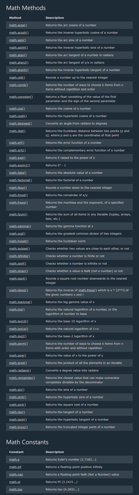
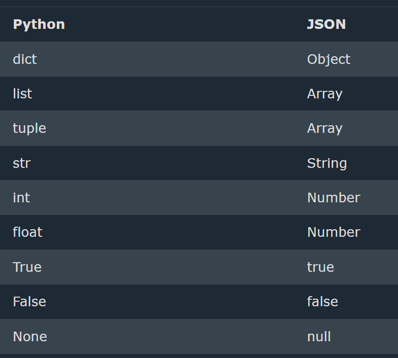
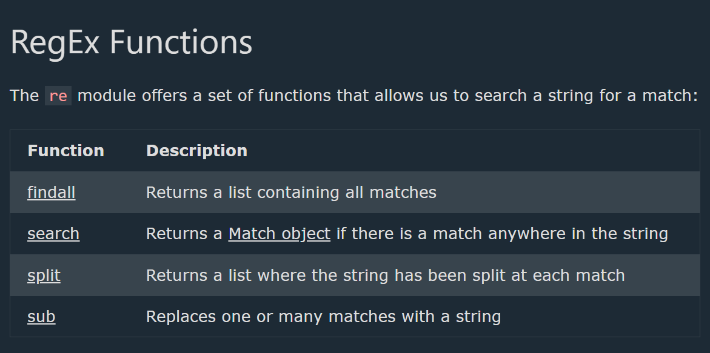
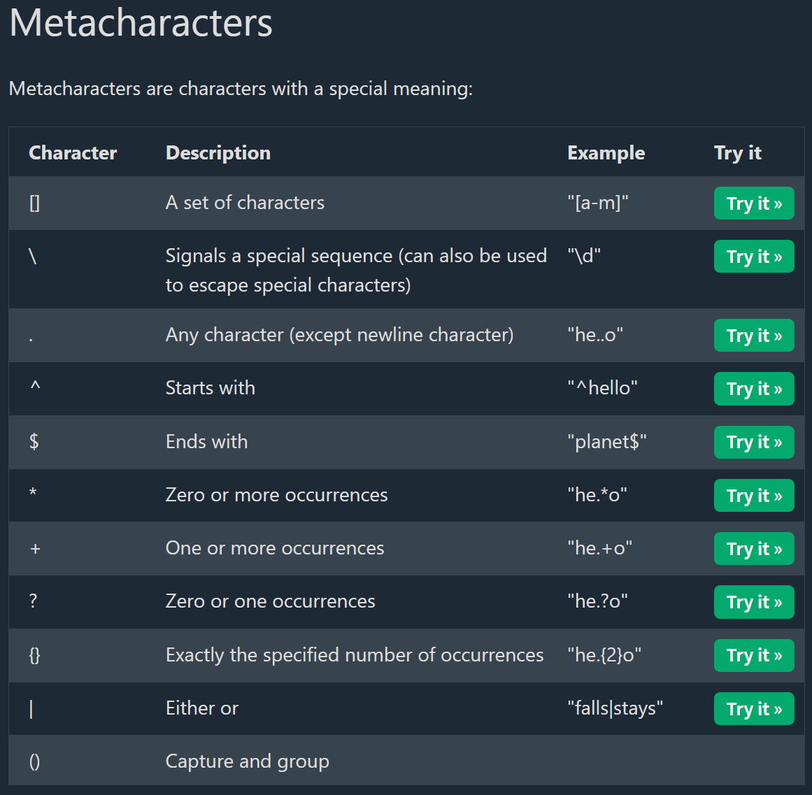
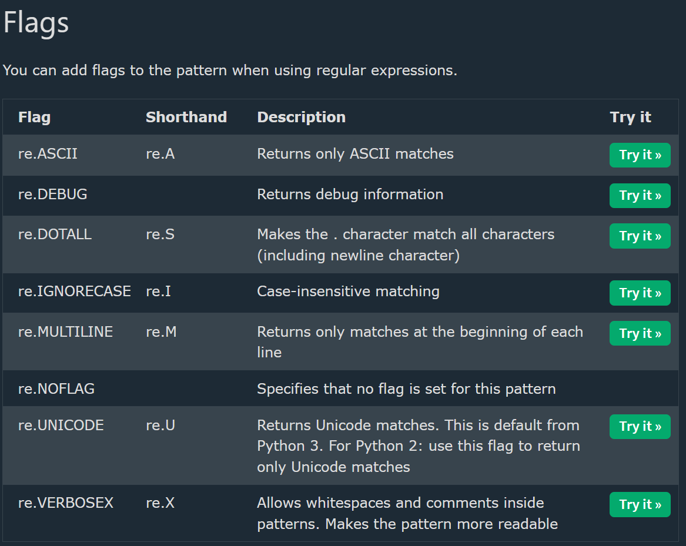
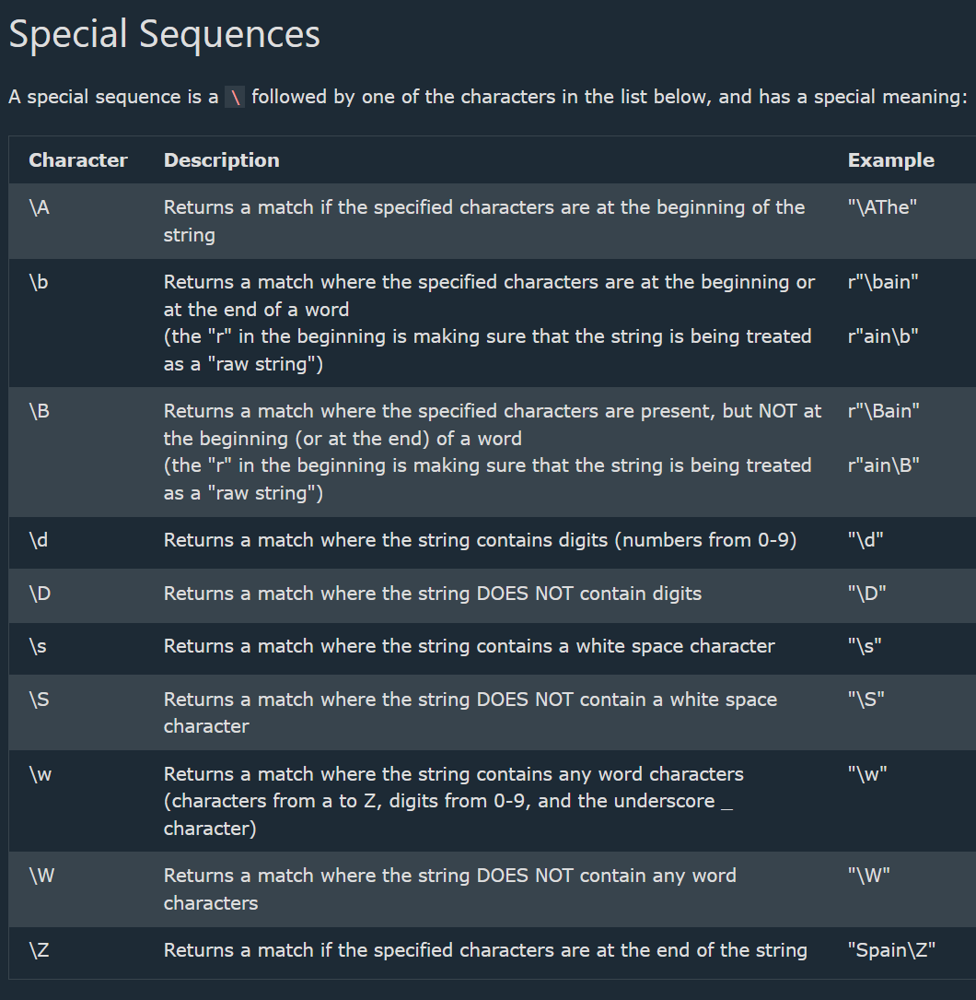
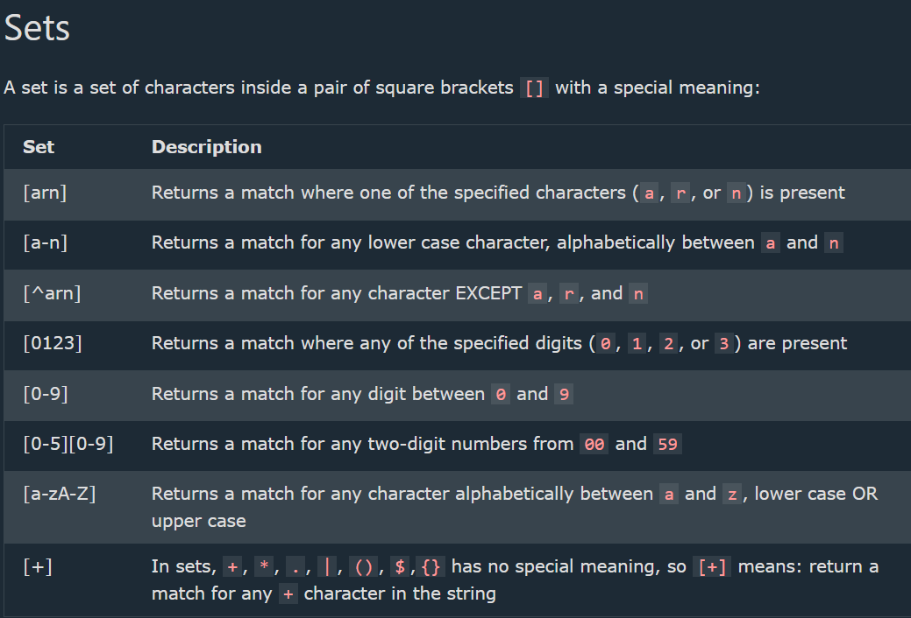

## Python Maths

--> Python has a set of built-in math functions, including an extensive math module, that allows you to perform mathematical tasks on numbers.
==> Built-in Math Functions
--> The min() and max() functions can be used to find the lowest or highest value in an iterable:
--> The abs() function returns the absolute (positive) value of the specified number:
--> The pow(x, y) function returns the value of x to the power of y (xy).
==> The Math Module
--> Python has also a built-in module called math, which extends the list of mathematical functions.
--> To use it,must import the math module:

--> When imported the math module, start using methods and constants of the module.
--> The math.sqrt() method for example, returns the square root of a number:
--> The math.ceil() method rounds a number upwards to its nearest integer,
--> the math.floor() method rounds a number downwards to its nearest integer, and returns the result:
--> The math.pi constant, returns the value of PI (3.14...):



## Python JSON

--> JSON is a syntax for storing and exchanging data.
--> JSON is text, written with JavaScript object notation.
==> JSON in Python
--> Python has a built-in package called json, which can be used to work with JSON data.

# Parse JSON - Convert from JSON to Python

--> If you have a JSON string, you can parse it by using the json.loads() method.
--> The result will be a Python dictionary.
--> Example
Convert from JSON to Python:

```python
import json

# some JSON:
x =  '{ "name":"John", "age":30, "city":"New York"}'

# parse x:
y = json.loads(x)

# the result is a Python dictionary:
print(y["age"])
```

# Convert from Python to JSON

--> If you have a Python object, convert it into a JSON string by using the json.dumps() method.
--> Can convert Python objects of the following types, into JSON strings:
dict, list, tuple, string, int, float, True, False, None
--->

```python
import json

print(json.dumps({"name": "John", "age": 30}))
print(json.dumps(["apple", "bananas"]))
print(json.dumps(("apple", "bananas")))
print(json.dumps("hello"))
print(json.dumps(42))
print(json.dumps(31.76))
print(json.dumps(True))
print(json.dumps(False))
print(json.dumps(None))
```



==> Format the Result
--> A JSON string, is not very easy to read, with no indentations and line breaks.
--> The json.dumps() method has parameters to make it easier to read the result:
--> json.dumps(x, indent=4)
--> You can also define the separators, default value is (", ", ": "), which means using a comma and a space to separate each object, and a colon and a space to separate keys from values:
json.dumps(x, indent=4, separators=(". ", " = "))

==> Order the Result
--> The json.dumps() method has parameters to order the keys in the result:
--> Example Use the sort_keys parameter to specify if the result should be sorted or not:

json.dumps(x, indent=4, sort_keys=True)

## Python RegEx

--> A RegEx, or Regular Expression, is a sequence of characters that forms a search pattern.
--> RegEx can be used to check if a string contains the specified search pattern.
==> RegEx Module
--> Python has a built-in package called re, which can be used to work with Regular Expressions.
--> Import the re module:
import re
==> RegEx in Python
When you have imported the re module, can start using regular expressions:






==> The findall() Function
--> The findall() function returns a list containing all matches.
--> The list contains the matches in the order they are found.
--> If no matches are found, an empty list is returned:

==> The search() Function
--> The search() function searches the string for a match, and returns a Match object if there is a match.
--> If there is more than one match, only the first occurrence of the match will be returned:
--> If no matches are found, the value None is returned:

==> The split() Function
--> The split() function returns a list where the string has been split at each match:
--> can control the number of occurrences by specifying the maxsplit parameter

==> The sub() Function
--> The sub() function replaces the matches with the text of your choice:
--> control the number of replacements by specifying the count parameter

==> Match Object
--> A Match Object is an object containing information about the search and the result.
--> Note: If there is no match, the value None will be returned, instead of the Match Object.
-->The Match object has properties and methods used to retrieve information about the search, and the result:

1. .span() returns a tuple containing the start-, and end positions of the match.
2. .string returns the string passed into the function
3. .group() returns the part of the string where there was a match

--> Note: If there is no match, the value None will be returned, instead of the Match Object.
