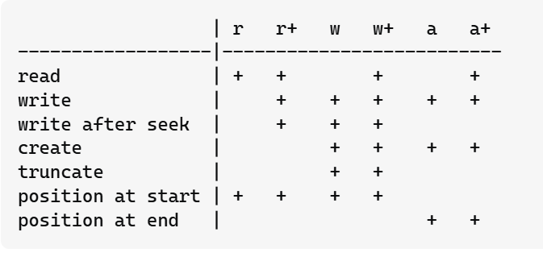
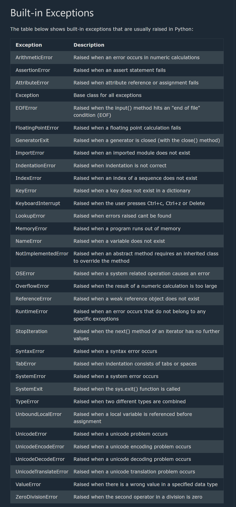
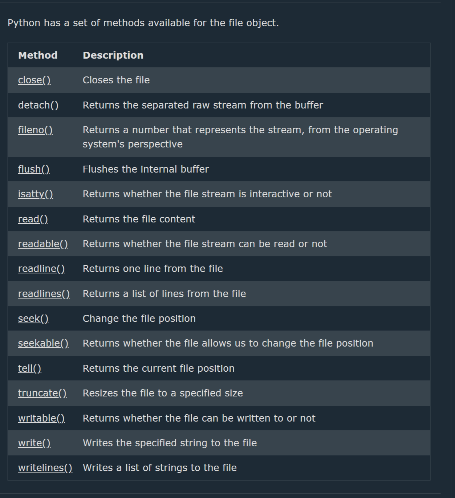

## Python PIP

==> PIP
--> PIP is a package manager for Python packages, or modules if you like.
==> Package
--> A package contains all the files you need for a module.
--> Modules are Python code libraries you can include in your project.
==> Check if PIP is Installed
--> Navigate your command line to the location of Python's script directory, and type the following:
pip --version

==> Using a Package
--> Import the "camelcase" package into your project.
import camelcase
c = camelcase.CamelCase()
txt = "hello world"
print(c.hump(txt))
==> Remove a Package
pip uninstall camelcase
==> List Packages
pip list

## Python Try Except

-->The try block lets you test a block of code for errors.
-->The except block lets you handle the error.
-->The else block lets you execute code when there is no error.
-->The finally block lets you execute code, regardless of the result of the try- and except blocks.

==> Exception Handling
--> When an error occurs, or exception as we call it, Python will normally stop and generate an error message.
--> These exceptions can be handled using the try statement:
try:
print(x)
except:
print("An exception occurred")

==> Many Exceptions
--> define as many exception blocks as want, e.g. if want to execute a special block of code for a special kind of error:

## The finally Block

--> The finally block, if specified, will be executed regardless of whether the try block raises an error or not.
--> Useful for cleanup actions (closing files, releasing resources) that must always run.

```python
try:
    print(x)   # x is not defined -- raises NameError
except:
    print("Something went wrong")
finally:
    print("The 'try except' is finished")
```

## The raise Keyword

--> As a Python developer you can choose to throw an exception on your own, using the raise keyword, if a certain condition occurs.

```python
x = -1
if x < 0:
    raise Exception("Sorry, no numbers below zero")
```

==> Raising a Specific Exception Type
--> You can raise any built-in exception type that best matches the error, instead of a generic Exception.

```python
x = "hello"
if not type(x) is int:
    raise TypeError("Only integers are allowed")
```

## Custom Exceptions

--> You can create your own exception types by defining a new class that inherits from the built-in Exception class (or one of its subclasses).
--> This lets you raise and catch application-specific errors with meaningful names.

```python
class InsufficientBalanceError(Exception):
    """Raised when a withdrawal amount exceeds the available balance."""
    pass

def withdraw(balance, amount):
    if amount > balance:
        raise InsufficientBalanceError(f"Cannot withdraw {amount}, balance is only {balance}")
    return balance - amount

try:
    withdraw(1000, 5000)
except InsufficientBalanceError as e:
    print("Error:", e)
```

==> Custom Exception with Extra Data
--> A custom exception class can override __init__() to store additional information about the error.

```python
class ValidationError(Exception):
    def __init__(self, message, field_name):
        super().__init__(message)
        self.field_name = field_name

try:
    raise ValidationError("Age cannot be negative", "age")
except ValidationError as e:
    print(f"Validation failed on '{e.field_name}': {e}")
```

## Exception Chaining (raise ... from ...)

--> Exception chaining lets you raise a new exception while preserving the original exception that caused it, using the from keyword.
--> This keeps the full error context visible (both the original cause and the new, higher-level error) instead of hiding the root cause.

```python
try:
    try:
        1 / 0
    except ZeroDivisionError as e:
        raise ValueError("Calculation failed") from e
except ValueError as e:
    print("Caught:", e)
    print("Original cause:", e.__cause__)
```

## Built-in Exception Hierarchy

--> All built-in exceptions in Python inherit from the base BaseException class, with Exception being the parent of almost all exceptions you will actually handle in normal code.
--> Common built-in exceptions and when they occur:

--> ValueError -- a function receives an argument of the right type but an inappropriate value (e.g. int("abc"))
--> TypeError -- an operation/function is applied to an object of an inappropriate type
--> KeyError -- a dictionary key is not found
--> IndexError -- a sequence index is out of range
--> ZeroDivisionError -- division or modulo by zero
--> FileNotFoundError -- trying to open a file that does not exist
--> AttributeError -- an attribute reference or assignment fails
--> NameError -- a local or global name is not found
--> ImportError / ModuleNotFoundError -- an import statement fails to find the module/name

--> Simplified hierarchy:
BaseException
 └── Exception
      ├── ValueError
      ├── TypeError
      ├── LookupError
      │     ├── KeyError
      │     └── IndexError
      ├── ArithmeticError
      │     └── ZeroDivisionError
      ├── OSError
      │     └── FileNotFoundError
      ├── AttributeError
      ├── NameError
      └── ImportError
            └── ModuleNotFoundError

--> Catching a parent class (e.g. except LookupError) will also catch its child exceptions (KeyError, IndexError).

## The assert Statement

--> The assert keyword lets you test if a condition is True. If the condition evaluates to False, Python raises an AssertionError, optionally with a custom message.
--> Commonly used for debugging and sanity-checking assumptions during development (not meant to replace proper error handling/validation in production code).

```python
x = 10
assert x > 0, "x must be positive"   # Passes silently since condition is True

y = -5
assert y > 0, "y must be positive"   # Raises: AssertionError: y must be positive
```

--> Note: Assertions can be globally disabled by running Python with the -O (optimize) flag, so they should never be used for validating user input or enforcing critical business logic.

## Python None

==> None is a special constant in Python that represents the absence of a value.
==> Its data type is NoneType, and None is the only instance of a NoneType object.

==> Comparing to None
To compare a value to None, use the identity operator is or is not

==> True or False
None evaluates to False in a boolean context.

==> Functions returning None
Functions that do not explicitly return a value return None by default.

## Python Virtual Environment

==> What is a Virtual Environment?

--> A virtual environment in Python is an isolated environment on your computer, where you can run and test your Python projects.
--> It allows you to manage project-specific dependencies without interfering with other projects or the original Python installation.
--> Think of a virtual environment as a separate container for each Python project. Each container:

1. Has its own Python interpreter
2. Has its own set of installed packages
3. Is isolated from other virtual environments
4. Can have different versions of the same package

==> Using virtual environments is important because:

1. It prevents package version conflicts between projects
2. Makes projects more portable and reproducible
3. Keeps your system Python installation clean
4. Allows testing with different Python versions

# Creating a Virtual Environment

==> Python has the built-in venv module for creating virtual environments.
==> To create a virtual environment on your computer, open the command prompt, and navigate to the folder where you want to create your project, then type this command:
C:\Users\Your Name> python -m venv myfirstproject

--> This will set up a virtual environment, and create a folder named "myfirstproject" with subfolders and files, like this:
myfirstproject
Include
Lib
Scripts
.gitignore
pyvenv.cfg

# Activate Virtual Environment

==> To use the virtual environment, you have to activate it with this command:
C:\Users\Your Name> myfirstproject\Scripts\activate

After activation, your prompt will change to show that you are now working in the active environment:

==> Result
The command line will look like this when the virtual environment is active:
(myfirstproject) C:\Users\Your Name>

# Install Packages

==> Once your virtual environment is activated, can install packages in it, using pip.

--> We will install a package called 'cowsay':
(myfirstproject) C:\Users\Your Name> pip install cowsay

# Using Package

--> Now that the 'cowsay' module is installed in your virtual environment, lets use it to display a talking cow.
--> Create a file called test.py on your computer. You can place it wherever you want, but I will place it in the same location as the myfirstproject folder -not in the folder, but in the same location.
--> Open the file and insert these three lines in it:

```python
import cowsay
cowsay.cow("Good Mooooorning!")
```

# Deactivate Virtual Environment

==> To deactivate the virtual environment use this command:
(myfirstproject) C:\Users\Your Name> deactivate

# Delete Virtual Environment

==> To delete a virtual environment, you can simply delete its folder with all its content. Either directly in the file system, or use the command line interface like this:

Example
--> Delete myfirstproject from the command line interface:
C:\Users\Your Name> rmdir /s /q myfirstproject

## File I/O in Python

# Python File Open

--> File handling is an important part of any web application.
--> File I/O (Input/Output) in Python allows reading from and writing to files.
--> Python has several functions for creating, reading, updating, and deleting files.
--> Python provides built-in functions to handle file operations efficiently.
==> File Handling

1. File Handling Modes
   When working with files, you need to specify the mode:
   --> "r" Read (default mode). Opens file for reading; error if file doesn't exist.
   --> "w" Write. Creates a new file or overwrites an existing one.
   --> "a" Append. Opens file for writing but preserves existing content.will create a file if the specified file does not exists
   --> "r+" Read and Write. File must exist.
   --> "w+" Write and Read. Creates a new file or overwrites an existing one.Note: the "w" method will overwrite the entire file.
   --> "a+" Append and Read. Creates file if it doesn’t exist.
   --> 'x' create a new file and open it for writing returns an error if the file exists
   --> 'b' binary mode -- x = open('demofile.txt', 'b')
   --> 't' Default Value. Text mode (default)
   --> '+' open a disk file for updating (reading and writing)
   
2. Opening and Closing a File (open,read & Close File)
   --> Use open("filename", "mode") to open a file.
   --> Always close the file using close() to free system resources.
   --> Default value is read
   --> Example
   f = open("example.txt", "r") # Open file in read mode
   f.close() # Close file
3. Reading a File
   --> read() → Reads entire file.
   --> readline() → Reads one line at a time.
   --> readlines() → Reads all lines as a list.
   --> Example
   f = open("example.txt", "r")
   content = f.read() # Reads the entire file
   f.close()
4. Writing to a File
   write() → Writes a string to the file.
   writelines() → Writes a list of strings.
   --> Example
   f = open("example.txt", "w")
   f.write("Hello, World!") # Overwrites the file with this text
   f.close()
5. ** Using with Statement (Best Practice) **
   The with statement automatically closes the file after execution.
   --> Example
   with open("example.txt", "r") as f:
   content = f.read() # No need to explicitly close the file
6. File Handling Exceptions
   Always handle errors using try-except to prevent crashes.
   --> Example
   try:
   f = open("nonexistent.txt", "r")
   except FileNotFoundError:
   print("File not found!")
7. Working with Binary Files
   Use "rb" or "wb" modes for non-text files (e.g., images, PDFs).
8. Deleting a File
   using the os module
   --> import os
   os.remove(filename)
   ==> Check if File exist:
   ```python
   import os
   if os.path.exists("demofile.txt"):
   os.remove("demofile.txt")
   else:
   print("The file does not exist")
   ```
   ==> Delete Folder
   To delete an entire folder, use the os.rmdir() method:
   import os
   os.rmdir("myfolder")
   You can only remove empty folders.

==> Syntax
--> To open a file for reading it is enough to specify the name of the file:
f = open("demofile.txt")
--> The code above is the same as:
f = open("demofile.txt", "rt")
Because "r" for read, and "t" for text are the default values, you do not need to specify them.
--> Make sure the file exists, or else will get an error.

# Open a File on the Server

--> To open the file, use the built-in open() function.
--> The open() function returns a file object, which has a read() method for reading the content of the file:
f = open("demofile.txt")
print(f.read())
--> If the file is located in a different location, will have to specify the file path, like this:
f = open("D:\\myfiles\welcome.txt", "r")
print(f.read())
==> Read Only Parts of the File
--> By default the read() method returns the whole text, but can also specify how many characters want to return:
f = open("demofile.txt", "r")
print(f.read(5))
==> Using the with statement
==> can also use the with statement when opening a file:
--> Using the with keyword:
with open("demofile.txt") as f:
print(f.read())
--> Then not have to worry about closing your files, the with statement takes care of that.

# Close Files

--> It is a good practice to always close the file when you are done with it.
--> If you are not using the with statement, you must write a close statement in order to close the file:

==> Example
Close the file when you are finished with it:

```python
f = open("demofile.txt")
print(f.readline())
f.close()
```

Always close your files. In some cases, due to buffering, changes made to a file may not show until you close the file.

# Read Only Parts of the File

==> By default the read() method returns the whole text, but you can also specify how many characters you want to return:
==> Example
Return the 5 first characters of the file:

with open("demofile.txt") as f:
print(f.read(5))

# Read Lines

==> Can return one line by using the readline() method:
==> Example
Read one line of the file:

```python
with open("demofile.txt") as f:
  print(f.readline())
```

==> By calling readline() two times, you can read the two first lines:
Example
Read two lines of the file:

```python
with open("demofile.txt") as f:
  print(f.readline())
  print(f.readline())
```

==> By looping through the lines of the file, you can read the whole file, line by line:
Example
Loop through the file line by line:

```python
with open("demofile.txt") as f:
  for x in f:
    print(x)
```

# Python File Write

==> Write to an Existing File
--> To write to an existing file, you must add a parameter to the open() function:
"a" - Append - will append to the end of the file
"w" - Write - will overwrite any existing content

--> Example
Open the file "demofile.txt" and append content to the file:

```python
with open("demofile.txt", "a") as f:
  f.write("Now the file has more content!")

#open and read the file after the appending:
with open("demofile.txt") as f:
  print(f.read())
```

# Overwrite Existing Content

==> To overwrite the existing content to the file, use the w parameter:
Example
Open the file "demofile.txt" and overwrite the content:

```python
with open("demofile.txt", "w") as f:
  f.write("Woops! I have deleted the content!")

#open and read the file after the overwriting:
with open("demofile.txt") as f:
  print(f.read())
```

\*\*\* Note: the "w" method will overwrite the entire file.

==> Create a New File
To create a new file in Python, use the open() method, with one of the following parameters:

"x" - Create - will create a file, returns an error if the file exists
"a" - Append - will create a file if the specified file does not exists
"w" - Write - will create a file if the specified file does not exists

--> Example
Create a new file called "myfile.txt":

```python
f = open("myfile.txt", "x")
Result: a new empty file is created.
```

Note: If the file already exist, an error will be raised.

# Python Delete File

==> Delete a File
To delete a file, you must import the OS module, and run its os.remove() function:
==> Example
Remove the file "demofile.txt":

```python
import os
os.remove("demofile.txt")
```

==> Check if File exist:
--> To avoid getting an error, you might want to check if the file exists before you try to delete it:
--> Example
Check if file exists, then delete it:

```python
import os
if os.path.exists("demofile.txt"):
  os.remove("demofile.txt")
else:
  print("The file does not exist")
```

==> Delete Folder
--> To delete an entire folder, use the os.rmdir() method:
--> Example
Remove the folder "myfolder":

```python
import os
os.rmdir("myfolder")
```

Note: You can only remove empty folders.

## Reference Images




## Deep Dive -- pathlib as the Modern Alternative to os.path

--> The `os`/`os.path` functions shown above (`os.path.exists`, `os.remove`, `os.rmdir`) work with plain strings representing paths -- `pathlib` (built into Python 3.4+) instead represents a filesystem path as a proper OBJECT with its own methods, generally considered the more modern, readable approach for new code.

```python
from pathlib import Path

file_path = Path("data") / "reports" / "2026.txt"   # The / operator joins path segments -- reads naturally
print(file_path)                                       # data/reports/2026.txt (or data\reports\2026.txt on Windows -- handled automatically)

file_path.exists()          # True/False -- replaces os.path.exists()
file_path.is_file()          # True/False
file_path.parent             # Path("data/reports") -- the containing directory
file_path.suffix              # ".txt" -- the file extension
file_path.stem                 # "2026" -- the filename without extension

file_path.write_text("Hello!")   # Writes content -- no need to manually open/close
content = file_path.read_text()    # Reads content in one call

for txt_file in Path("data").glob("*.txt"):   # Iterate over matching files -- built-in glob pattern support
    print(txt_file)
```

--> `pathlib`'s `/` operator overloading (directly connecting to the Operator Overloading concept covered in the OOP Concepts file) is what makes path-joining read so naturally -- and because paths are objects, methods like `.exists()`/`.is_file()` are directly available without needing separate `os.path.*` function calls scattered through the code.

## Deep Dive -- contextlib -- Simpler Context Managers Without a Class

--> The OOP Concepts file covers writing a custom Context Manager as a full class with `__enter__`/`__exit__`. For simpler cases, `contextlib.contextmanager` lets you write a context manager as a single GENERATOR function instead, with far less boilerplate.

```python
from contextlib import contextmanager
import time

@contextmanager
def timer(label):
    start = time.time()
    yield                        # Code inside the "with" block runs here, at the yield point
    elapsed = time.time() - start
    print(f"{label} took {elapsed:.2f}s")

with timer("Data processing"):
    time.sleep(1)   # Simulated work
# Prints: "Data processing took 1.00s"
```

--> Everything BEFORE `yield` runs as the setup (`__enter__` equivalent); everything AFTER `yield` runs as the cleanup (`__exit__` equivalent) -- and it runs even if an exception occurs inside the `with` block, as long as the exception-handling is wrapped in a `try/finally` around the `yield` for cases where cleanup must happen unconditionally.

```python
@contextmanager
def managed_resource():
    print("Acquiring resource")
    try:
        yield "resource"
    finally:
        print("Releasing resource")   # Always runs, even if the with-block raises an exception
```

--> `contextlib.suppress(SomeException)` is another handy shortcut -- suppresses a specific exception type entirely within a `with` block, a cleaner alternative to a `try/except: pass` for cases where you genuinely want to ignore a specific, expected error.

```python
from contextlib import suppress

with suppress(FileNotFoundError):
    os.remove("maybe_doesnt_exist.txt")   # No error if the file simply isn't there
```
