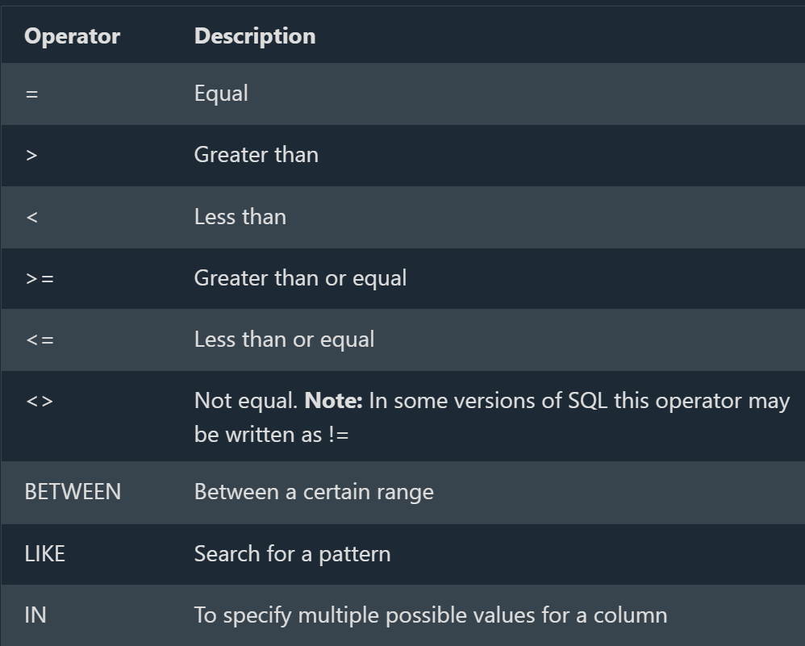

### SQL

==> SQL is a standard language for storing,  accessing, manipulating and retrieving data in databases.
--> SQL keywords are NOT case sensitive: select is the same as SELECT
--> Some database systems require a semicolon at the end of each SQL statement.
Semicolon is the standard way to separate each SQL statement in database systems that allow more than one SQL statement to be executed in the same call to the server.

# What is SQL?

--> SQL stands for Structured Query Language
--> SQL lets us access and manipulate databases
--> SQL became a standard of the American National Standards Institute (ANSI) in 1986, and of the International Organization for Standardization (ISO) in 1987
==> Example
SELECT * FROM Customers;

# What Can SQL do?

--> SQL can execute queries against a database
--> SQL can retrieve data from a database
--> SQL can insert records in a database
--> SQL can update records in a database
--> SQL can delete records from a database
--> SQL can create new databases
--> SQL can create new tables in a database
--> SQL can create stored procedures in a database
--> SQL can create views in a database
--> SQL can set permissions on tables, procedures, and views

# SQL is a Standard - BUT

--> SQL is an ANSI/ISO standard, there are different versions of the SQL language.
--> However, to be compliant with the ANSI standard, they all support at least the major commands (such as SELECT, UPDATE, DELETE, INSERT, WHERE) in a similar manner.

## SQL Syntax

# Database Tables

--> A database most often contains one or more tables.
--> Each table is identified by a name (e.g. "Customers" or "Orders"), and contain records (rows) with data.

# Some of The Most Important SQL Commands

--> SELECT - extracts data from a database
--> UPDATE - updates data in a database
--> DELETE - deletes data from a database
--> INSERT INTO - inserts new data into a database
--> CREATE DATABASE - creates a new database
--> ALTER DATABASE - modifies a database
--> CREATE TABLE - creates a new table
--> ALTER TABLE - modifies a table
--> DROP TABLE - deletes a table
--> CREATE INDEX - creates an index (search key)
--> DROP INDEX - deletes an index

## SQL SELECT Statement

# The SQL SELECT Statement

--> The SELECT statement is used to select data from a database.
Example --> SELECT CustomerName, City FROM Customers;

==> Syntax:
SELECT column1, column2, ...
FROM table_name;

--> Here, column1, column2, ... are the field names of the table which we want to select data from.

The table_name represents the name of the table we want to select data from.

# Select ALL columns

If we want to return all columns, without specifying every column name, we can use the SELECT * syntax:

Example --> SELECT * FROM Customers;

## SQL SELECT DISTINCT Statement

# The SQL SELECT DISTINCT Statement

--> The SELECT DISTINCT statement is used to return only distinct (different) values.

Example --> SELECT DISTINCT Country FROM Customers;

Syntax
SELECT DISTINCT column1, column2, ...
FROM table_name;

# SELECT Example Without DISTINCT

--> If we omit the DISTINCT keyword, the SQL statement returns the "Country" value from all the records of the "Customers" table:

==> Example
SELECT Country FROM Customers;

# Count Distinct

By using the DISTINCT keyword in a function called COUNT, we can return the number of different countries.

==> Example
SELECT COUNT(DISTINCT Country) FROM Customers;

**Note**: The COUNT(DISTINCT column_name) is not supported in Microsoft Access databases.

Example
SELECT Count(*) AS DistinctCountries
FROM (SELECT DISTINCT Country FROM Customers);

## SQL WHERE Clause

# The SQL WHERE Clause

--> The WHERE clause is used to filter records.
--> It is used to extract only those records that fulfill a specified condition.

==> Example:
SELECT * FROM Customers
WHERE Country='Mexico';

==> Syntax
SELECT column1, column2, ...
FROM table_name
WHERE condition;

**Note**: The WHERE clause is not only used in SELECT statements, it is also used in UPDATE, DELETE, etc.!

# Text Fields vs. Numeric Fields

--> SQL requires single quotes around text values (most database systems will also allow double quotes).
--> However, numeric fields should not be enclosed in quotes:

==> Example
SELECT * FROM Customers
WHERE CustomerID=1;

# Operators in The WHERE Clause

--> can use other operators than the = operator to filter the search.

==> Example
SELECT * FROM Customers
WHERE CustomerID > 80;


## Deep Dive -- Why SELECT * Is Usually a Bad Habit

--> `SELECT *` retrieves EVERY column, even ones the application never uses -- wasting network bandwidth and memory transferring data nobody needs, and making a query silently break (or behave unexpectedly) if the table's columns are later reordered or a new column is added that the application code doesn't expect.
--> It also prevents certain database optimizations -- if a table has a "covering index" (an index containing all the columns a query needs), the database can answer the query using ONLY the index, never touching the actual table data at all -- `SELECT *` almost always defeats this, since it's unlikely every single column happens to be in that index. Explicitly naming only the needed columns (`SELECT CustomerName, City`) is the standard production practice, reserving `SELECT *` for quick, ad hoc exploration only.

## Deep Dive -- NULL Comparisons -- Why WHERE column = NULL Never Works

--> `NULL` represents "unknown/absent," not a specific comparable value -- in SQL's three-valued logic (TRUE, FALSE, and UNKNOWN), comparing anything to `NULL` with `=` or `!=` always evaluates to UNKNOWN, which is treated as not matching, EVEN when comparing `NULL = NULL`.

```sql
SELECT * FROM Customers WHERE Country = NULL;      -- Returns ZERO rows, always, even if some rows genuinely have a NULL Country
SELECT * FROM Customers WHERE Country IS NULL;       -- The CORRECT way to check for NULL
SELECT * FROM Customers WHERE Country IS NOT NULL;    -- The correct way to check for NOT NULL
```

--> This trips up nearly every SQL beginner at least once -- the fix is always `IS NULL`/`IS NOT NULL`, dedicated syntax that exists specifically because `=`/`!=` structurally cannot express "is unknown."

## Deep Dive -- How WHERE Actually Uses an Index

--> Directly connecting to the Indexing and Performance Tuning file and the Query Execution Plans file -- a `WHERE` clause filtering on an INDEXED column lets the database jump directly to matching rows (an "index seek") instead of scanning the entire table row by row (a "table scan"). A `WHERE` clause that applies a FUNCTION to the column (`WHERE YEAR(OrderDate) = 2026`) typically prevents the index from being used at all, since the database would need to compute that function for every single row before it could compare -- rewriting as a range check (`WHERE OrderDate >= '2026-01-01' AND OrderDate < '2027-01-01'`) instead lets the index be used normally.
