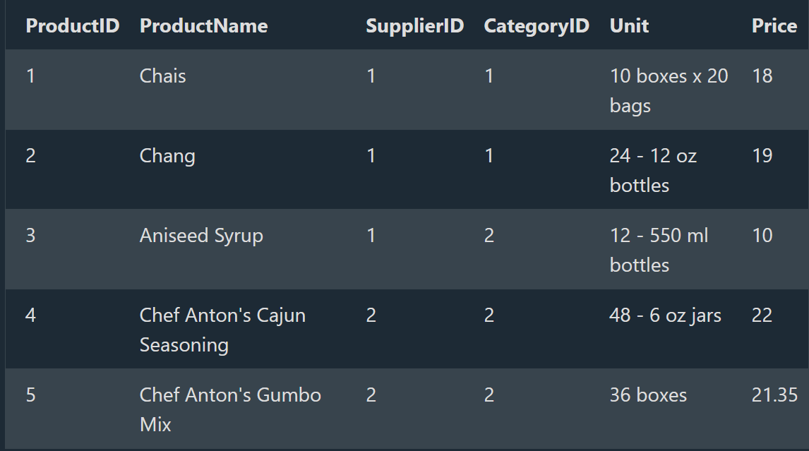

## SQL ORDER BY Keyword

In the SQL ORDER BY clause, what is the default sorting order if ASC or DESC is not specified -->  Ascending

# The SQL ORDER BY

The ORDER BY keyword is used to sort the result-set in ascending or descending order.

==> Example:

SELECT * FROM Products
ORDER BY Price;

==> Syntax
SELECT column1, column2, ...
FROM table_name
ORDER BY column1, column2, ... ASC|DESC;



# DESC

==> The ORDER BY keyword sorts the records in ascending order by default. To sort the records in descending order, use the DESC keyword.

==> Example
--> Sort the products from highest to lowest price:

SELECT * FROM Products
ORDER BY Price DESC;

# Order Alphabetically

==> For string values the ORDER BY keyword will order alphabetically:

==> Example
--> Sort the products alphabetically by ProductName:

SELECT * FROM Products
ORDER BY ProductName;

# Alphabetically DESC

--> To sort the table reverse alphabetically, use the DESC keyword:

==> Example
--> Sort the products by ProductName in reverse order:

SELECT * FROM Products
ORDER BY ProductName DESC;

# ORDER BY Several Columns

==> Example

SELECT * FROM Customers
ORDER BY Country, CustomerName;

# Using Both ASC and DESC

==> Example
SELECT * FROM Customers
ORDER BY Country ASC, CustomerName DESC;

## SQL AND Operator

# The SQL AND Operator

The WHERE clause can contain one or many AND operators.

The AND operator is used to filter records based on more than one condition, like if you want to return all customers from Spain that starts with the letter 'G':

==> Example
--> Select all customers from Spain that starts with the letter 'G':
SELECT *
FROM Customers
WHERE Country = 'Spain' AND CustomerName LIKE 'G%';

==> Syntax
SELECT column1, column2, ...
FROM table_name
WHERE condition1 AND condition2 AND condition3 ...;

# AND vs OR

--> The AND operator displays a record if all the conditions are TRUE.
--> The OR operator displays a record if any of the conditions are TRUE.

# All Conditions Must Be True

--> The following SQL statement selects all fields from Customers where Country is "Brazil" AND City is "Rio de Janeiro" AND CustomerID is higher than 50:

==> Example
SELECT * FROM Customers
WHERE Country = 'Brazil'
AND City = 'Rio de Janeiro'
AND CustomerID > 50;

# Combining AND and OR

--> We can combine the AND and OR operators.

--> The following SQL statement selects all customers from Spain that starts with a "G" or an "R".

==> Make sure too use parenthesis to get the correct result.

==> Example
--> Select all Spanish customers that starts with either "G" or "R":

SELECT * FROM Customers
WHERE Country = 'Spain' AND (CustomerName LIKE 'G%' OR CustomerName LIKE 'R%');

==> Without parenthesis, the select statement will return all customers from Spain that starts with a "G", plus all customers that starts with an "R", regardless of the country value:

==> Example
--> Select all customers that either:
are from Spain and starts with either "G", or starts with the letter "R":

SELECT * FROM Customers
WHERE Country = 'Spain' AND CustomerName LIKE 'G%' OR CustomerName LIKE 'R%';

## SQL OR Operator

# The SQL OR Operator

The WHERE clause can contain one or more OR operators.

The OR operator is used to filter records based on more than one condition, like if you want to return all customers from Germany but also those from Spain:

==> Example
--> Select all customers from Germany or Spain:

SELECT * FROM Customers
WHERE Country = 'Germany' OR Country = 'Spain';

==> Syntax

SELECT column1, column2, ...
FROM table_name
WHERE condition1 OR condition2 OR condition3 ...;

## Note: - OR vs AND

i) The OR operator displays a record if any of the conditions are TRUE.

ii) The AND operator displays a record if all the conditions are TRUE.

# At Least One Condition Must Be True

--> The following SQL statement selects all fields from Customers where either City is "Berlin", CustomerName starts with the letter "G" or Country is "Norway":

==> Example
SELECT * FROM Customers
WHERE City = 'Berlin' OR CustomerName LIKE 'G%' OR Country = 'Norway';

# Combining AND and OR

--> We can combine the AND and OR operators.

--> The following SQL statement selects all customers from Spain that starts with a "G" or an "R".

--> Make sure to use parenthesis to get the correct result.

==>  Example
--> Select all Spanish customers that starts with either "G" or "R":

SELECT * FROM Customers
WHERE Country = 'Spain' AND (CustomerName LIKE 'G%' OR CustomerName LIKE 'R%');

==> Without parenthesis, the select statement will return all customers from Spain that starts with a "G", plus all customers that starts with an "R", regardless of the country value:

==> Example
--> Select all customers that either:
are from Spain and starts with either "G", or starts with the letter "R":

SELECT * FROM Customers
WHERE Country = 'Spain' AND CustomerName LIKE 'G%' OR CustomerName LIKE 'R%';

## SQL Not

# The NOT Operator

--> The NOT operator is used in combination with other operators to give the opposite result, also called the negative result.
--> In the select statement below we want to return all customers that are NOT from Spain:

==> Example
--> Select only the customers that are NOT from Spain:

SELECT * FROM Customers
WHERE NOT Country = 'Spain';

==> In the example above, the NOT operator is used in combination with the = operator, but it can be used in combination with other comparison and/or logical operators.

==> Syntax
SELECT column1, column2, ...
FROM table_name
WHERE NOT condition;

# NOT LIKE

==> Example
--> Select customers that does not start with the letter 'A':

SELECT * FROM Customers
WHERE CustomerName NOT LIKE 'A%';

# NOT BETWEEN

==> Example
--> Select customers with a customerID not between 10 and 60:

SELECT * FROM Customers
WHERE CustomerID NOT BETWEEN 10 AND 60;

# NOT IN

==> Example
--> Select customers that are not from Paris or London:

SELECT * FROM Customers
WHERE City NOT IN ('Paris', 'London');

# NOT Greater Than

==> Example
--> Select customers with a CustomerId not greater than 50:

SELECT * FROM Customers
WHERE NOT CustomerID > 50;

# NOT Less Than

==> Example
--> Select customers with a CustomerID not less than 50:

SELECT * FROM Customers
WHERE NOT CustomerId < 50;

## Deep Dive -- Operator Precedence -- Why the Missing-Parentheses Example Above Actually Happens

--> SQL evaluates `AND` BEFORE `OR`, exactly like multiplication is evaluated before addition in normal arithmetic (`2 + 3 * 4` is 14, not 20) -- this precedence rule is precisely why the "without parenthesis" example earlier in this file produces a different, often unintended result.

```sql
-- Without parentheses, this is actually evaluated as:
-- (Country = 'Spain' AND CustomerName LIKE 'G%') OR CustomerName LIKE 'R%'
SELECT * FROM Customers
WHERE Country = 'Spain' AND CustomerName LIKE 'G%' OR CustomerName LIKE 'R%';
-- Returns Spanish customers starting with G, PLUS every "R" customer regardless of country --
-- almost certainly not what was intended
```

--> **The practical rule** -- whenever `AND` and `OR` appear together in the same `WHERE` clause, use explicit parentheses to state your intended grouping, even in cases where you've worked out the default precedence would happen to produce the right answer anyway. Relying on implicit precedence in mixed AND/OR conditions is a common, quietly wrong pattern found in real production code, and explicit parentheses cost nothing while eliminating any ambiguity for whoever reads the query later.

## Deep Dive -- NULLS FIRST / NULLS LAST in ORDER BY

--> `NULL` values need special handling when sorting, since `NULL` isn't actually "small" or "large" -- it's unknown. Different databases have different DEFAULT behavior (PostgreSQL sorts `NULL` as the largest value by default in ascending order; MySQL sorts it as the smallest) -- relying on the default can produce inconsistent behavior across database systems.

```sql
SELECT * FROM Customers
ORDER BY Region NULLS LAST;    -- Explicitly put NULL region values at the end, regardless of ASC/DESC (PostgreSQL/Oracle syntax)

-- MySQL doesn't support NULLS FIRST/LAST directly -- a common workaround:
SELECT * FROM Customers
ORDER BY (Region IS NULL), Region;    -- Sorts non-NULL Region values first, since FALSE (0) sorts before TRUE (1)
```

--> Being explicit about NULL ordering matters specifically for user-facing sorted lists (e.g. a product listing sorted by rating, where products with no ratings yet shouldn't unpredictably appear mixed in among 5-star products depending on which specific database happens to be running underneath).
