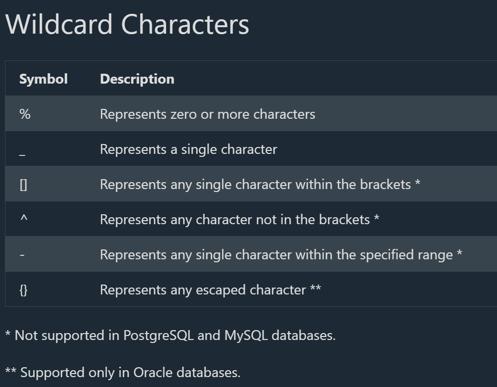
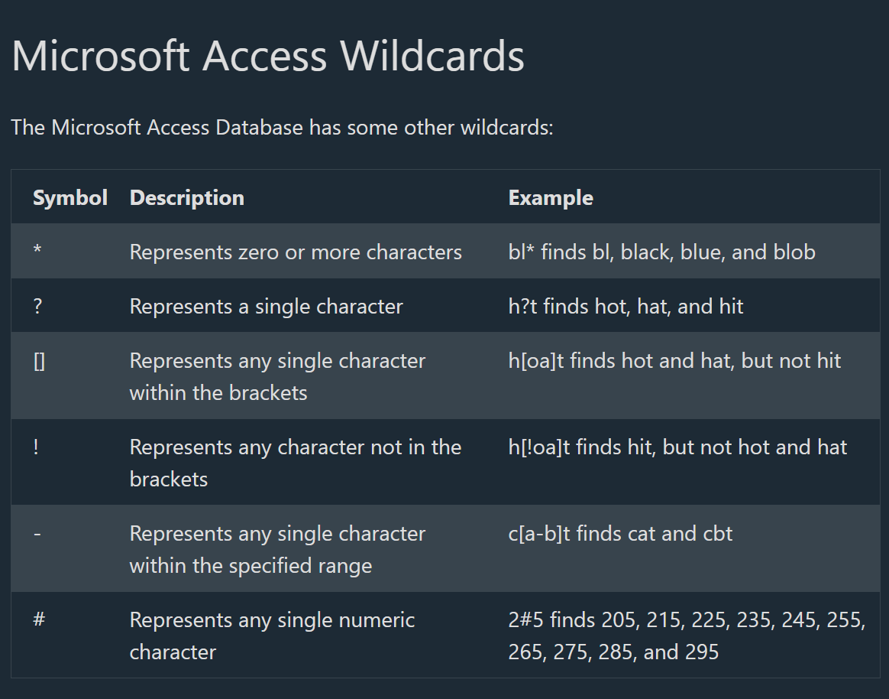

## SQL LIKE Operator

# The SQL LIKE Operator

--> The LIKE operator is used in a WHERE clause to search for a specified pattern in a column.

--> There are two wildcards often used in conjunction with the LIKE operator:

i) The percent sign % represents zero, one, or multiple characters
ii) The underscore sign _ represents one, single character

==> Example
--> Select all customers that starts with the letter "a":

SELECT * FROM Customers
WHERE CustomerName LIKE 'a%';

==> Syntax
SELECT column1, column2, ...
FROM table_name
WHERE columnN LIKE pattern;

# The _ Wildcard

--> The *wildcard represents a single character.
--> It can be any character or number, but each* represents one, and only one, character.

==> Example
--> Return all customers from a city that starts with 'L' followed by one wildcard character, then 'nd' and then two wildcard characters:

SELECT * FROM Customers
WHERE city LIKE 'L_nd__';

# The % Wildcard

--> The % wildcard represents any number of characters, even zero characters.

==> Example
--> Return all customers from a city that contains the letter 'L':

SELECT * FROM Customers
WHERE city LIKE '%L%';

# Starts With

--> To return records that starts with a specific letter or phrase, add the % at the end of the letter or phrase.

==> Example
--> Return all customers that starts with 'La':

SELECT * FROM Customers
WHERE CustomerName LIKE 'La%';

**Notes**: You can also combine any number of conditions using AND or OR operators.

==> Example
Return all customers that starts with 'a' or starts with 'b':

SELECT * FROM Customers
WHERE CustomerName LIKE 'a%' OR CustomerName LIKE 'b%';

# Ends With

--> To return records that ends with a specific letter or phrase, add the % at the beginning of the letter or phrase.

==> Example
--> Return all customers that ends with 'a':

SELECT * FROM Customers
WHERE CustomerName LIKE '%a';

**Notes** : You can also combine "starts with" and "ends with":

==> Example
--> Return all customers that starts with "b" and ends with "s":

SELECT * FROM Customers
WHERE CustomerName LIKE 'b%s';

# Contains

--> To return records that contains a specific letter or phrase, add the % both before and after the letter or phrase.

==> Example
--> Return all customers that contains the phrase 'or'

SELECT * FROM Customers
WHERE CustomerName LIKE '%or%';

# Combine Wildcards

--> Any wildcard, like % and _ , can be used in combination with other wildcards.

==> Example
--> Return all customers that starts with "a" and are at least 3 characters in length:

SELECT * FROM Customers
WHERE CustomerName LIKE 'a__%';

==>Example
--> Return all customers that have "r" in the second position:

SELECT * FROM Customers
WHERE CustomerName LIKE '_r%';

# Without Wildcard

--> If no wildcard is specified, the phrase has to have an exact match to return a result.

==> Example
--> Return all customers from Spain:

SELECT * FROM Customers
WHERE Country LIKE 'Spain';

## SQL Wildcards

# SQL Wildcard Characters

--> A wildcard character is used to substitute one or more characters in a string.

--> Wildcard characters are used with the LIKE operator. The LIKE operator is used in a WHERE clause to search for a specified pattern in a column.

==> Example
--> Return all customers that starts with the letter 'a':

SELECT * FROM Customers
WHERE CustomerName LIKE 'a%';



# Using the % Wildcard

--> The % wildcard represents any number of characters, even zero characters.

==> Example
--> Return all customers that ends with the pattern 'es':

SELECT * FROM Customers
WHERE CustomerName LIKE '%es';

==> Example
--> Return all customers that contains the pattern 'mer':

SELECT * FROM Customers
WHERE CustomerName LIKE '%mer%';

# Using the _ Wildcard

--> The _ wildcard represents a single character.

--> It can be any character or number, but each _ represents one, and only one, character.

==> Example
--> Return all customers with a City starting with any character, followed by "ondon":

SELECT * FROM Customers
WHERE City LIKE '_ondon';

==> Example
--> Return all customers with a City starting with "L", followed by any 3 characters, ending with "on":

SELECT * FROM Customers
WHERE City LIKE 'L___on';

# Using the [] Wildcard

--> The [] wildcard returns a result if any of the characters inside gets a match.

==> Example
--> Return all customers starting with either "b", "s", or "p":

SELECT * FROM Customers
WHERE CustomerName LIKE '[bsp]%';

==> Example
--> Return all customers not starting with either "b", "s", or "p":
i)
SELECT *FROM Customers
WHERE CustomerName NOT LIKE '[bsp]%';
Or using the ! negation inside the bracket:
ii)
SELECT* FROM Customers
WHERE City LIKE '[!acf]%';

==> If you are NOT using SQL Server
([] patterns do not work in MySQL, PostgreSQL, Oracle, etc.)
iii)
SELECT *
FROM Customers
WHERE City NOT LIKE 'a%'
  AND City NOT LIKE 'c%'
  AND City NOT LIKE 'f%';

✔ This will return all cities that do not start with A, C, or F

# Using the - Wildcard

--> The - wildcard allows you to specify a range of characters inside the [] wildcard.

==> Example
--> Return all customers starting with "a", "b", "c", "d", "e" or "f":

SELECT * FROM Customers
WHERE CustomerName LIKE '[a-f]%';

# Combine Wildcards

--> Any wildcard, like % and _ , can be used in combination with other wildcards.

==> Example
--> Return all customers that starts with "a" and are at least 3 characters in length:

SELECT * FROM Customers
WHERE CustomerName LIKE 'a__%';

==> Example
--> Return all customers that have "r" in the second position:

SELECT * FROM Customers
WHERE CustomerName LIKE '_r%';

# Without Wildcard

--> If no wildcard is specified, the phrase has to have an exact match to return a result.

==> Example
--> Return all customers from Spain:

SELECT * FROM Customers
WHERE Country LIKE 'Spain';



## Deep Dive -- Why a Leading Wildcard Kills Index Performance

--> Directly connecting to the Indexing and Performance Tuning file -- a standard B-Tree index stores values in sorted order, which lets the database efficiently jump to matching rows when searching from the BEGINNING of a string. A pattern starting with `%` (`'%mer%'`, `'%es'`) cannot use that sorted order at all, since a match could start anywhere in the string -- forcing a full table scan even on an indexed column.

```sql
WHERE CustomerName LIKE 'La%'    -- CAN use a standard index -- the database can jump straight to "La..." entries
WHERE CustomerName LIKE '%mer%'   -- CANNOT use a standard index -- must check every single row's full text
```

--> This is a genuinely common, easy-to-miss performance trap -- a "search box" feature that lets users search for a substring ANYWHERE in a name (`%searchterm%`) will perform poorly at scale, no matter how many indexes exist on that column, precisely because of this leading-wildcard limitation.

## Deep Dive -- Full-Text Search as the Real Fix

--> For genuine substring/keyword search at scale, the correct tool isn't `LIKE` at all -- it's a dedicated full-text search feature, which builds a specialized index (an "inverted index," conceptually similar to the Elasticsearch concepts covered in the Full Stack Extra notes) specifically designed for fast substring/keyword matching, unlike a standard B-Tree index.

```sql
-- PostgreSQL full-text search example
ALTER TABLE products ADD COLUMN search_vector tsvector;
UPDATE products SET search_vector = to_tsvector('english', name || ' ' || description);
CREATE INDEX idx_search ON products USING GIN(search_vector);

SELECT * FROM products WHERE search_vector @@ to_tsquery('english', 'wireless & headphones');
-- Dramatically faster than an equivalent %wireless%headphones% LIKE pattern on a large table,
-- and also supports relevance ranking, unlike LIKE
```

--> MySQL has its own `FULLTEXT` index type with similar goals. For search needs beyond what a database's built-in full-text feature offers (typo tolerance, relevance scoring across many fields, faceted filtering), a dedicated search engine like Elasticsearch (covered in its own file) becomes the standard next step -- exactly the escalation path referenced in that file's "why Elasticsearch" introduction.
