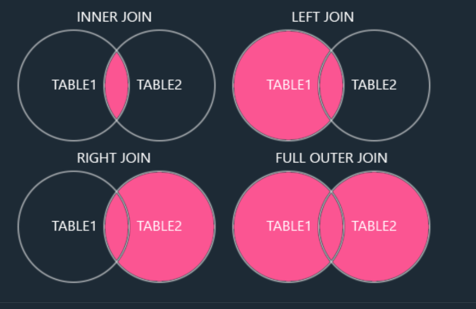
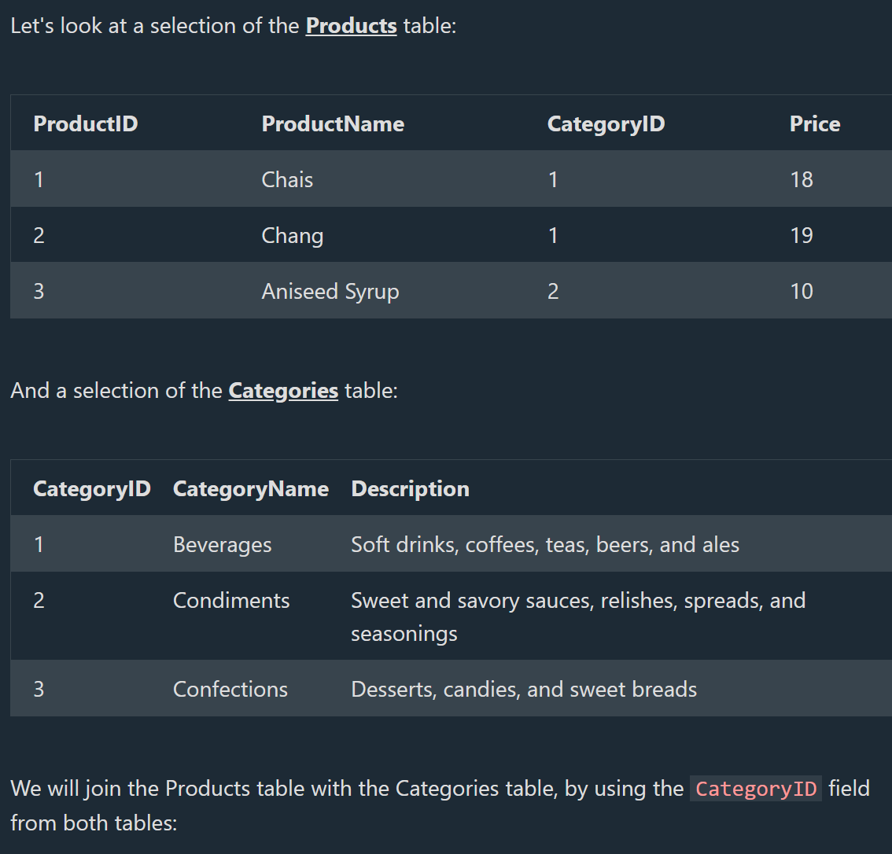
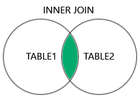
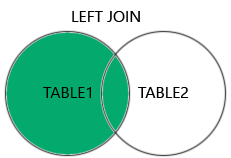
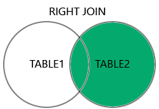

## SQL Joins

# SQL JOIN

--> A JOIN clause is used to combine rows from two or more tables, based on a related column between them.

Let's look at a selection from the "Orders" table:

OrderID CustomerID OrderDate
10308 2 1996-09-18
10309 37 1996-09-19
10310 77 1996-09-20

Then, look at a selection from the "Customers" table:

CustomerID CustomerName ContactName Country
1 Alfreds Futterkiste Maria Anders Germany
2 Ana Trujillo Emparedados y helados Ana Trujillo Mexico
3 Antonio Moreno Taquería Antonio Moreno Mexico

Notice that the "CustomerID" column in the "Orders" table refers to the "CustomerID" in the "Customers" table. The relationship between the two tables above is the "CustomerID" column.

Then, we can create the following SQL statement (that contains an INNER JOIN), that selects records that have matching values in both tables:

==> Example
SELECT Orders.OrderID, Customers.CustomerName, Orders.OrderDate
FROM Orders
INNER JOIN Customers ON Orders.CustomerID=Customers.CustomerID;

# Different Types of SQL JOINs

Here are the different types of the JOINs in SQL:

1) (INNER) JOIN: Returns records that have matching values in both tables
2) LEFT (OUTER) JOIN: Returns all records from the left table, and the matched records from the right table
3) RIGHT (OUTER) JOIN: Returns all records from the right table, and the matched records from the left table
4) FULL (OUTER) JOIN: Returns all records when there is a match in either left or right table



## SQL INNER JOIN

The INNER JOIN keyword selects records that have matching values in both tables.


==> Example
--> Join Products and Categories with the INNER JOIN keyword:

SELECT ProductID, ProductName, CategoryName
FROM Products
INNER JOIN Categories ON Products.CategoryID = Categories.CategoryID;



**Note**: The INNER JOIN keyword returns only rows with a match in both tables. Which means that if you have a product with no CategoryID, or with a CategoryID that is not present in the Categories table, that record would not be returned in the result.

==> Syntax
SELECT column_name(s)
FROM table1
INNER JOIN table2
ON table1.column_name = table2.column_name;

# Naming the Columns

It is a good practice to include the table name when specifying columns in the SQL statement.

==> Example
--> Specify the table names:

SELECT Products.ProductID, Products.ProductName, Categories.CategoryName
FROM Products
INNER JOIN Categories ON Products.CategoryID = Categories.CategoryID;

--> The example above works without specifying table names, because none of the specified column names are present in both tables. If you try to include CategoryID in the SELECT statement, you will get an error if you do not specify the table name (because CategoryID is present in both tables).

# JOIN or INNER JOIN

--> JOIN and INNER JOIN will return the same result.

--> INNER is the default join type for JOIN, so when you write JOIN the parser actually writes INNER JOIN.

==> Example
--> JOIN is the same as INNER JOIN:

SELECT Products.ProductID, Products.ProductName, Categories.CategoryName
FROM Products
JOIN Categories ON Products.CategoryID = Categories.CategoryID;

# JOIN Three Tables

The following SQL statement selects all orders with customer and shipper information:

==> Example
SELECT Orders.OrderID, Customers.CustomerName, Shippers.ShipperName
FROM ((Orders
INNER JOIN Customers ON Orders.CustomerID = Customers.CustomerID)
INNER JOIN Shippers ON Orders.ShipperID = Shippers.ShipperID);

# SQL LEFT JOIN Keyword

# SQL LEFT JOIN Keyword

--> The LEFT JOIN keyword returns all records from the left table (table1), and the matching records from the right table (table2). The result is 0 records from the right side, if there is no match.

==> LEFT JOIN Syntax
SELECT column_name(s)
FROM table1
LEFT JOIN table2
ON table1.column_name = table2.column_name;

**Note**: In some databases LEFT JOIN is called LEFT OUTER JOIN.



--> SQL LEFT JOIN Example
The following SQL statement will select all customers, and any orders they might have:

==> Example
SELECT Customers.CustomerName, Orders.OrderID
FROM Customers
LEFT JOIN Orders ON Customers.CustomerID = Orders.CustomerID
ORDER BY Customers.CustomerName;

**Note**: The LEFT JOIN keyword returns all records from the left table (Customers), even if there are no matches in the right table (Orders).

## SQL RIGHT JOIN Keyword

# SQL RIGHT JOIN Keyword

==> The RIGHT JOIN keyword returns all records from the right table (table2), and the matching records from the left table (table1). The result is 0 records from the left side, if there is no match.

==> RIGHT JOIN Syntax
SELECT column_name(s)
FROM table1
RIGHT JOIN table2
ON table1.column_name = table2.column_name;
**Note**: In some databases RIGHT JOIN is called RIGHT OUTER JOIN.



# SQL RIGHT JOIN Example

--> The following SQL statement will return all employees, and any orders they might have placed:

==> Example
SELECT Orders.OrderID, Employees.LastName, Employees.FirstName
FROM Orders
RIGHT JOIN Employees ON Orders.EmployeeID = Employees.EmployeeID
ORDER BY Orders.OrderID;

**Note**: The RIGHT JOIN keyword returns all records from the right table (Employees), even if there are no matches in the left table (Orders).

## SQL FULL OUTER JOIN Keyword

# SQL FULL OUTER JOIN Keyword

--> The FULL OUTER JOIN keyword returns all records when there is a match in left (table1) or right (table2) table records.

**Note**: FULL OUTER JOIN and FULL JOIN are the same.

==> FULL OUTER JOIN Syntax
SELECT column_name(s)
FROM table1
FULL OUTER JOIN table2
ON table1.column_name = table2.column_name
WHERE condition;


**Note**: FULL OUTER JOIN can potentially return very large result-sets!

# SQL FULL OUTER JOIN Example

==> The following SQL statement selects all customers, and all orders:

SELECT Customers.CustomerName, Orders.OrderID
FROM Customers
FULL OUTER JOIN Orders ON Customers.CustomerID=Orders.CustomerID
ORDER BY Customers.CustomerName;

**Note** : The FULL OUTER JOIN keyword returns all matching records from both tables whether the other table matches or not. So, if there are rows in "Customers" that do not have matches in "Orders", or if there are rows in "Orders" that do not have matches in "Customers", those rows will be listed as well.

## SQL Self Join

# SQL Self Join

A self join is a regular join, but the table is joined with itself.

==> Self Join Syntax
SELECT column_name(s)
FROM table1 T1, table1 T2
WHERE condition;

# SQL Self Join Example

The following SQL statement matches customers that are from the same city:

==> Example
SELECT A.CustomerName AS CustomerName1, B.CustomerName AS CustomerName2, A.City
FROM Customers A, Customers B
WHERE A.CustomerID <> B.CustomerID
AND A.City = B.City
ORDER BY A.City;

In a self join, The purpose of using table aliases like A and B?
--> To reference the same table with different roles

## Deep Dive -- CROSS JOIN (The Missing Join Type)

--> A CROSS JOIN returns the CARTESIAN PRODUCT of two tables -- every row from the first table combined with every row from the second, with no matching condition at all. A table with 10 rows CROSS JOINed with a table with 5 rows produces 50 rows.

```sql
SELECT Sizes.SizeName, Colors.ColorName
FROM Sizes
CROSS JOIN Colors;
-- If Sizes has 3 rows and Colors has 4 rows, this produces all 12 possible combinations
```

--> Genuinely useful for generating every possible COMBINATION of two sets (e.g. every size/color combination for a product catalog, or generating a full calendar of dates crossed with store locations) -- but accidentally omitting a join condition on a regular JOIN (writing `FROM A, B` without a `WHERE` linking them) silently produces the same runaway cartesian product, a classic, easy-to-make mistake that can return a huge, meaningless result set from what looked like a normal query.

## Deep Dive -- Join Performance and Indexes

--> Directly connecting to the Indexing and Performance Tuning file and the Query Execution Plans file -- a JOIN's performance depends heavily on whether the JOIN CONDITION's columns are indexed. Without an index on `Orders.CustomerID` and `Customers.CustomerID`, the database may need to scan and compare every row of one table against every row of the other (or a significant portion), which is dramatically slower than using an index to jump directly to matching rows.

```sql
EXPLAIN SELECT Orders.OrderID, Customers.CustomerName
FROM Orders
INNER JOIN Customers ON Orders.CustomerID = Customers.CustomerID;
-- Check the EXPLAIN output specifically for whether an index is actually being used on the join columns
```

--> As a practical rule, foreign key columns (like `CustomerID` in `Orders`) should almost always be indexed specifically BECAUSE they're the columns most frequently used in JOIN conditions -- a foreign key constraint itself doesn't automatically create an index in every database system, so this is often a deliberate, separate step.

## Deep Dive -- Filtering Before vs After a JOIN

--> Where a `WHERE` condition is placed relative to a JOIN can change the RESULT, not just performance, specifically for outer joins (LEFT/RIGHT/FULL).

```sql
-- Filters AFTER the join -- effectively turns the LEFT JOIN into an INNER JOIN for this condition,
-- since any customer with NO orders has a NULL OrderDate, which never satisfies the WHERE clause
SELECT Customers.CustomerName, Orders.OrderDate
FROM Customers
LEFT JOIN Orders ON Customers.CustomerID = Orders.CustomerID
WHERE Orders.OrderDate > '2026-01-01';

-- Filters AS PART OF the join condition -- preserves ALL customers, only filtering which orders qualify
SELECT Customers.CustomerName, Orders.OrderDate
FROM Customers
LEFT JOIN Orders ON Customers.CustomerID = Orders.CustomerID AND Orders.OrderDate > '2026-01-01';
```

--> This distinction is a genuinely common, subtle bug -- a developer expecting "all customers, with matching recent orders if any" accidentally writes a query that only returns customers who HAVE a recent order, silently dropping every customer without one, because the `WHERE` clause (evaluated AFTER the join) filtered out the NULL rows a LEFT JOIN was specifically supposed to preserve.

