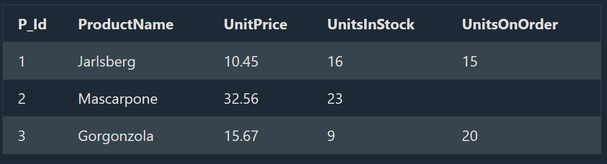

## SQL CASE Expression

# The SQL CASE Expression

--> The CASE expression goes through conditions and returns a value when the first condition is met (like an if-then-else statement). So, once a condition is true, it will stop reading and return the result. If no conditions are true, it returns the value in the ELSE clause.
--> If there is no ELSE part and no conditions are true, it returns NULL.

==> CASE Syntax
CASE
    WHEN condition1 THEN result1
    WHEN condition2 THEN result2
    WHEN conditionN THEN resultN
    ELSE result
END;

# SQL CASE Examples

--> The following SQL goes through conditions and returns a value when the first condition is met:

==> Example

SELECT OrderID, Quantity,
CASE
    WHEN Quantity > 30 THEN 'The quantity is greater than 30'
    WHEN Quantity = 30 THEN 'The quantity is 30'
    ELSE 'The quantity is under 30'
END AS QuantityText
FROM OrderDetails;

--> The following SQL will order the customers by City. However, if City is NULL, then order by Country:

==> Example

SELECT CustomerName, City, Country
FROM Customers
ORDER BY
(CASE
    WHEN City IS NULL THEN Country
    ELSE City
END);

## SQL NULL Functions

# SQL IFNULL(), ISNULL(), COALESCE(), and NVL() Functions

Look at the following "Products" table:



--> Suppose that the "UnitsOnOrder" column is optional, and may contain NULL values.
--> Look at the following SELECT statement:

SELECT ProductName, UnitPrice * (UnitsInStock + UnitsOnOrder)
FROM Products;

==> In the example above, if any of the "UnitsOnOrder" values are NULL, the result will be NULL.

# Solutions

==> MySQL

--> The MySQL IFNULL() function lets you return an alternative value if an expression is NULL:

SELECT ProductName, UnitPrice * (UnitsInStock + IFNULL(UnitsOnOrder, 0))
FROM Products;

--> or we can use the COALESCE() function, like this:

SELECT ProductName, UnitPrice * (UnitsInStock + COALESCE(UnitsOnOrder, 0))
FROM Products;

==> SQL Server

--> The SQL Server ISNULL() function lets you return an alternative value when an expression is NULL:

SELECT ProductName, UnitPrice * (UnitsInStock + ISNULL(UnitsOnOrder, 0))
FROM Products;

--> or we can use the COALESCE() function, like this:

SELECT ProductName, UnitPrice * (UnitsInStock + COALESCE(UnitsOnOrder, 0))
FROM Products;

==> MS Access

--> The MS Access IsNull() function returns TRUE (-1) if the expression is a null value, otherwise FALSE (0):

SELECT ProductName, UnitPrice * (UnitsInStock + IIF(IsNull(UnitsOnOrder), 0, UnitsOnOrder))
FROM Products;

==> Oracle

--> The Oracle NVL() function achieves the same result:

SELECT ProductName, UnitPrice * (UnitsInStock + NVL(UnitsOnOrder, 0))
FROM Products;

--> or we can use the COALESCE() function, like this:

SELECT ProductName, UnitPrice * (UnitsInStock + COALESCE(UnitsOnOrder, 0))
FROM Products;

## SQL Stored Procedures for SQL Server

# What is a Stored Procedure?

--> A stored procedure is a prepared SQL code that you can save, so the code can be reused over and over again.
--> So if you have an SQL query that you write over and over again, save it as a stored procedure, and then just call it to execute it.
--> You can also pass parameters to a stored procedure, so that the stored procedure can act based on the parameter value(s) that is passed.

# Stored Procedure Syntax

CREATE PROCEDURE procedure_name
AS
sql_statement
GO;

# Execute a Stored Procedure

EXEC procedure_name;

# Stored Procedure Example

--> The following SQL statement creates a stored procedure named "SelectAllCustomers" that selects all records from the "Customers" table:

==> Example
CREATE PROCEDURE SelectAllCustomers
AS
SELECT * FROM Customers
GO;

--> Execute the stored procedure above as follows:

==> Example
EXEC SelectAllCustomers;

# Stored Procedure With One Parameter

--> The following SQL statement creates a stored procedure that selects Customers from a particular City from the "Customers" table:

==> Example
CREATE PROCEDURE SelectAllCustomers @City nvarchar(30)
AS
SELECT * FROM Customers WHERE City = @City
GO;

--> Execute the stored procedure above as follows:

==> Example
EXEC SelectAllCustomers @City = 'London';

# Stored Procedure With Multiple Parameters

--> Setting up multiple parameters is very easy. Just list each parameter and the data type separated by a comma as shown below.

--> The following SQL statement creates a stored procedure that selects Customers from a particular City with a particular PostalCode from the "Customers" table:

==> Example
CREATE PROCEDURE SelectAllCustomers @City nvarchar(30), @PostalCode nvarchar(10)
AS
SELECT * FROM Customers WHERE City = @City AND PostalCode = @PostalCode
GO;

--> Execute the stored procedure above as follows:

==> Example
EXEC SelectAllCustomers @City = 'London', @PostalCode = 'WA1 1DP';

## Deep Dive -- Simple CASE vs Searched CASE

--> The `CASE` syntax shown above (with a full boolean condition per `WHEN`) is called "Searched CASE." There's a shorter "Simple CASE" form for the common case of comparing ONE expression against several possible exact values.

```sql
-- Searched CASE (flexible -- any boolean condition per branch)
CASE
    WHEN Quantity > 30 THEN 'High'
    WHEN Quantity = 30 THEN 'Medium'
    ELSE 'Low'
END

-- Simple CASE (more concise, but only checks equality against one expression)
CASE Country
    WHEN 'USA' THEN 'North America'
    WHEN 'Canada' THEN 'North America'
    WHEN 'France' THEN 'Europe'
    ELSE 'Other'
END
```

--> Simple CASE is purely a more concise shorthand for equality checks against a single value -- reach for Searched CASE whenever the condition needs to be more complex than a plain equality comparison (ranges, multiple columns, `AND`/`OR` logic).

## Deep Dive -- Stored Procedures vs Functions

--> Both encapsulate reusable SQL logic, but with real, distinct differences:
--> A **Stored Procedure** can perform actions with side effects (INSERT/UPDATE/DELETE), can return zero, one, or multiple result sets, and is invoked with `EXEC`/`CALL` -- it CANNOT be used directly inside a `SELECT` statement's expression list.
--> A **Function** must return a single value (or a table, for table-valued functions) and generally cannot perform side-effecting DML in most databases -- but CAN be used directly inside a `SELECT`, `WHERE`, or other expression, exactly like a built-in function such as `COUNT()` or `UPPER()`.

```sql
-- A scalar function -- usable directly inside a SELECT expression, unlike a stored procedure
CREATE FUNCTION GetDiscountedPrice(@price DECIMAL, @discountPercent DECIMAL)
RETURNS DECIMAL
AS
BEGIN
    RETURN @price - (@price * @discountPercent / 100);
END;

SELECT ProductName, dbo.GetDiscountedPrice(Price, 10) AS SalePrice FROM Products;
```

## Deep Dive -- SQL Injection Risk With Dynamic SQL Inside Stored Procedures

--> A stored procedure that builds and executes a SQL string DYNAMICALLY (concatenating a parameter directly into a query string executed with `EXEC`/`sp_executesql`) reintroduces the EXACT same SQL injection risk covered in the SQL Views/Injection file -- being "inside a stored procedure" provides zero protection on its own if the procedure itself concatenates untrusted input into SQL text.

```sql
-- VULNERABLE -- even though it's a stored procedure, it dynamically builds a SQL string from a parameter
CREATE PROCEDURE SearchCustomers @searchTerm NVARCHAR(100)
AS
BEGIN
    DECLARE @sql NVARCHAR(MAX);
    SET @sql = 'SELECT * FROM Customers WHERE CustomerName LIKE ''%' + @searchTerm + '%''';
    EXEC(@sql);   -- @searchTerm is concatenated directly -- injectable exactly like raw application code would be
END;
```

--> The fix is the same parameterization discipline covered in the Injection Attacks Deep Dive file -- use `sp_executesql` with proper bound parameters instead of raw string concatenation, or better yet, avoid dynamic SQL inside the procedure entirely when the query structure is actually static and only the VALUE (not column/table names) needs to vary.
