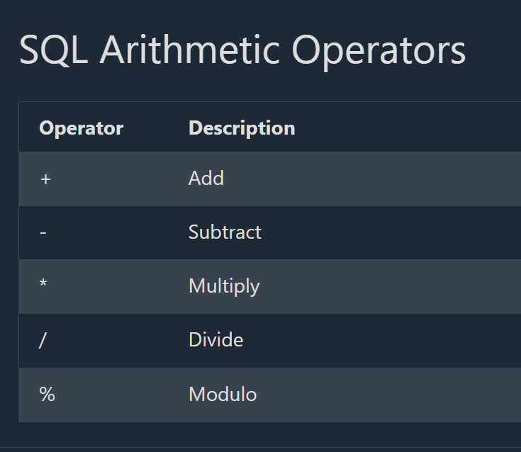
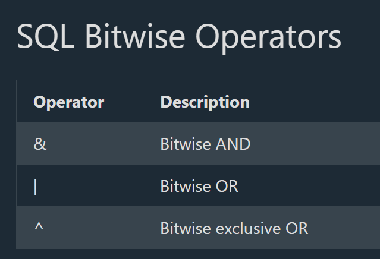
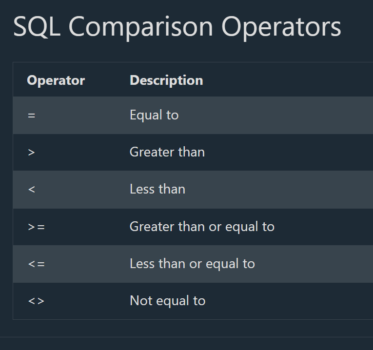
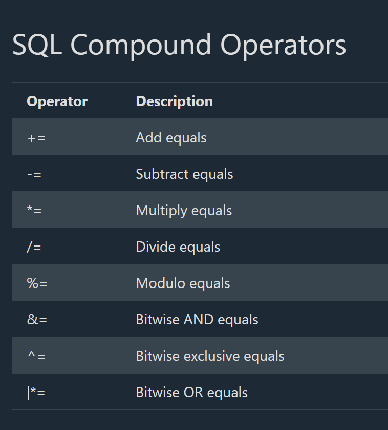
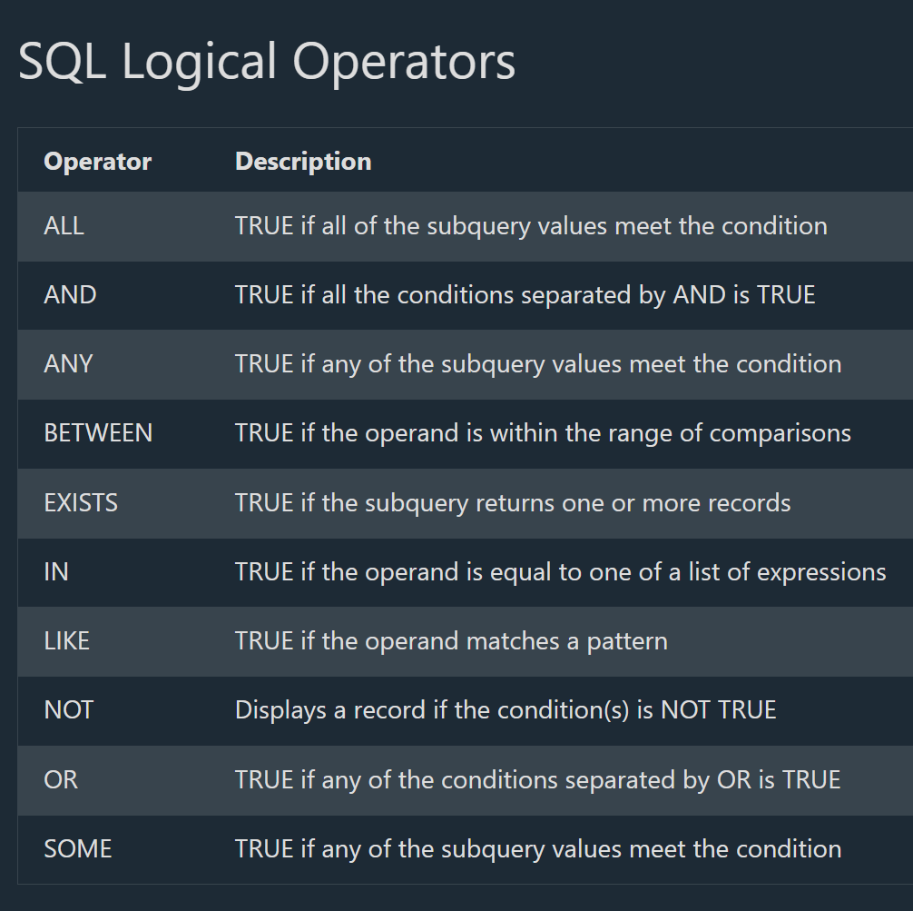

## SQL Comments

# SQL Comments

--> Comments are used to explain sections of SQL statements, or to prevent execution of SQL statements.

**Note**: Comments are not supported in Microsoft Access databases!

# Single Line Comments

--> Single line comments start with --.
--> Any text between -- and the end of the line will be ignored (will not be executed).
--> The following example uses a single-line comment as an explanation:

==> Example
-- Select all:
SELECT * FROM Customers;

--> The following example uses a single-line comment to ignore the end of a line:

==> Example
SELECT * FROM Customers -- WHERE City='Berlin';

# Multi-line Comments

--> Multi-line comments start with /*and end with*/.
--> Any text between /*and*/ will be ignored.
--> The following example uses a multi-line comment as an explanation:

==> Example
/*Select all the columns
of all the records
in the Customers table:*/
SELECT * FROM Customers;

--> The following example uses a multi-line comment to ignore many statements:

==> Example
/*SELECT * FROM Customers;
SELECT * FROM Products;
SELECT * FROM Orders;
SELECT * FROM Categories;*/
SELECT * FROM Suppliers;

--> To ignore just a part of a statement, also use the /**/ comment.
--> The following example uses a comment to ignore part of a line:

==> Example
SELECT CustomerName, /*City,*/ Country FROM Customers;

--> The following example uses a comment to ignore part of a statement:

==> Example
SELECT * FROM Customers WHERE (CustomerName LIKE 'L%'
OR CustomerName LIKE 'R%' /*OR CustomerName LIKE 'S%'
OR CustomerName LIKE 'T%'*/ OR CustomerName LIKE 'W%')
AND Country='USA'
ORDER BY CustomerName;

## SQL Operators











## Deep Dive -- SQL Comments as an Injection Technique

--> Directly connecting to the SQL Injection coverage in the Views/SQL Injection file and the Injection Attacks Deep Dive file in the Ethical Hacking track -- the SAME single-line comment syntax (`--`) demonstrated above for legitimate documentation purposes is also the classic technique attackers use to comment out the REMAINDER of an original query, neutralizing any trailing conditions the application code expected to still apply.

```sql
-- Original intended query (application code appends a password check after the username):
SELECT * FROM Users WHERE username = '<input>' AND password = '<input>';

-- Attacker input for the username field: admin'--
-- Resulting query actually executed:
SELECT * FROM Users WHERE username = 'admin'--' AND password = '...';
-- Everything after -- is now a comment -- the password check never actually runs, and the
-- attacker is logged in as "admin" with NO valid password required at all
```

--> This is precisely why comment syntax appears repeatedly throughout real-world SQL injection payloads -- it isn't a separate technique from the injection patterns covered elsewhere, it's the SAME comment feature covered in this file's "legitimate use" section, just applied adversarially to truncate a query at an attacker-chosen point.

## Deep Dive -- Operator Precedence Order (Beyond Just AND/OR)

--> Directly extending the AND/OR precedence deep dive covered in the ORDER BY and Logical Operators file -- SQL's full operator precedence order, from HIGHEST to LOWEST priority, determines how a complex expression mixing several operator types is actually evaluated:

```
1. Arithmetic operators (* / first, then + -)
2. Comparison operators (=, <>, <, >, <=, >=)
3. NOT
4. AND
5. OR
```

```sql
-- Evaluated as: (price * 1.1) > (100 + 5) -- arithmetic happens before comparison
WHERE price * 1.1 > 100 + 5

-- Evaluated as: (NOT (status = 'cancelled')) AND (total > 100)  -- NOT binds tighter than AND
WHERE NOT status = 'cancelled' AND total > 100
```

--> As with the `AND`/`OR` case, the safe, universally-recommended practice for any expression mixing multiple operator types is EXPLICIT PARENTHESES -- relying on memorized precedence rules for a complex, multi-operator condition is a common source of subtle logic bugs that parentheses eliminate entirely, at zero runtime cost.
