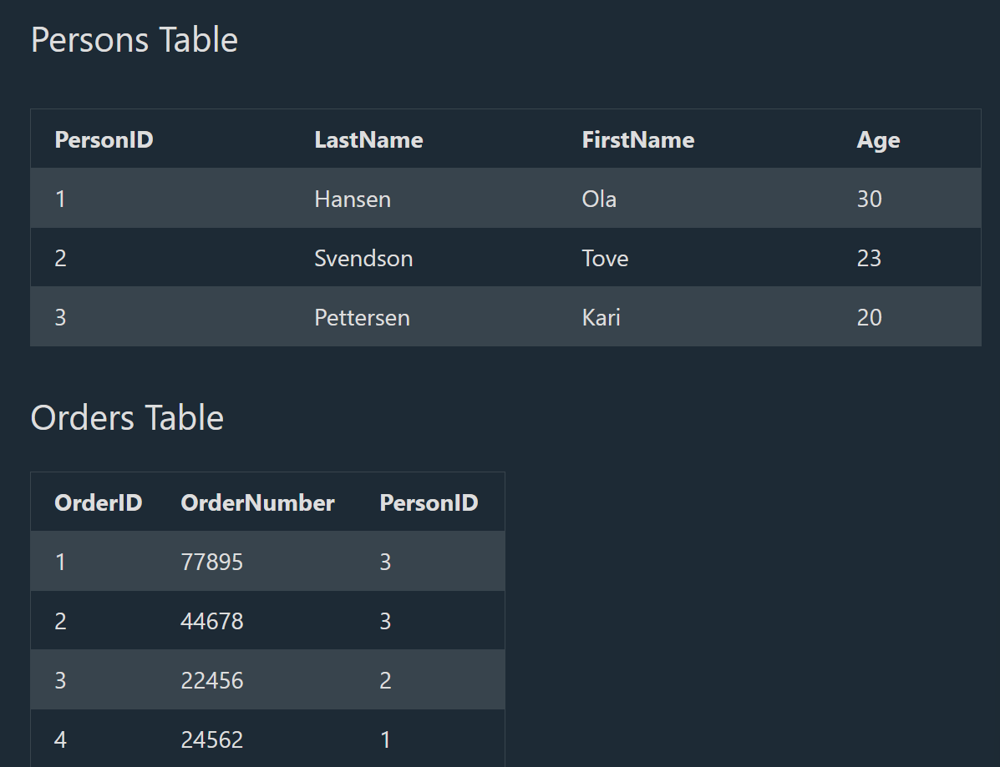

## SQL FOREIGN KEY Constraint

# SQL FOREIGN KEY Constraint

--> The FOREIGN KEY constraint is used to prevent actions that would destroy links between tables.

--> A FOREIGN KEY is a field (or collection of fields) in one table, that refers to the PRIMARY KEY in another table.

--> The table with the foreign key is called the child table, and the table with the primary key is called the referenced or parent table.



--> The "PersonID" column in the "Orders" table points to the "PersonID" column in the "Persons" table.

--> The "PersonID" column in the "Persons" table is the PRIMARY KEY in the "Persons" table.

--> The "PersonID" column in the "Orders" table is a FOREIGN KEY in the "Orders" table.

--> The FOREIGN KEY constraint prevents invalid data from being inserted into the foreign key column, because it has to be one of the values contained in the parent table.

# SQL FOREIGN KEY on CREATE TABLE

--> The following SQL creates a FOREIGN KEY on the "PersonID" column when the "Orders" table is created:

==> MySQL:

CREATE TABLE Orders (
    OrderID int NOT NULL,
    OrderNumber int NOT NULL,
    PersonID int,
    PRIMARY KEY (OrderID),
    FOREIGN KEY (PersonID) REFERENCES Persons(PersonID)
);
==> SQL Server / Oracle / MS Access:

CREATE TABLE Orders (
    OrderID int NOT NULL PRIMARY KEY,
    OrderNumber int NOT NULL,
    PersonID int FOREIGN KEY REFERENCES Persons(PersonID)
);

--> To allow naming of a FOREIGN KEY constraint, and for defining a FOREIGN KEY constraint on multiple columns, use the following SQL syntax:

==> MySQL / SQL Server / Oracle / MS Access:

CREATE TABLE Orders (
    OrderID int NOT NULL,
    OrderNumber int NOT NULL,
    PersonID int,
    PRIMARY KEY (OrderID),
    CONSTRAINT FK_PersonOrder FOREIGN KEY (PersonID)
    REFERENCES Persons(PersonID)
);

# SQL FOREIGN KEY on ALTER TABLE

--> To create a FOREIGN KEY constraint on the "PersonID" column when the "Orders" table is already created, use the following SQL:

# MySQL / SQL Server / Oracle / MS Access

ALTER TABLE Orders
ADD FOREIGN KEY (PersonID) REFERENCES Persons(PersonID);

--> To allow naming of a FOREIGN KEY constraint, and for defining a FOREIGN KEY constraint on multiple columns, use the following SQL syntax:

# MySQL / SQL Server / Oracle / MS Access

ALTER TABLE Orders
ADD CONSTRAINT FK_PersonOrder
FOREIGN KEY (PersonID) REFERENCES Persons(PersonID);

# DROP a FOREIGN KEY Constraint

--> To drop a FOREIGN KEY constraint, use the following SQL:

==> MySQL:

ALTER TABLE Orders
DROP FOREIGN KEY FK_PersonOrder;

==> SQL Server / Oracle / MS Access:

ALTER TABLE Orders
DROP CONSTRAINT FK_PersonOrder;

## SQL CHECK Constraint

# SQL CHECK Constraint

--> The CHECK constraint is used to limit the value range that can be placed in a column.
--> If you define a CHECK constraint on a column it will allow only certain values for this column.
--> If you define a CHECK constraint on a table it can limit the values in certain columns based on values in other columns in the row.

# SQL CHECK on CREATE TABLE

--> The following SQL creates a CHECK constraint on the "Age" column when the "Persons" table is created. The CHECK constraint ensures that the age of a person must be 18, or older:

==> MySQL:

CREATE TABLE Persons (
    ID int NOT NULL,
    LastName varchar(255) NOT NULL,
    FirstName varchar(255),
    Age int,
    CHECK (Age>=18)
);

==> SQL Server / Oracle / MS Access:

CREATE TABLE Persons (
    ID int NOT NULL,
    LastName varchar(255) NOT NULL,
    FirstName varchar(255),
    Age int CHECK (Age>=18)
);

--> To allow naming of a CHECK constraint, and for defining a CHECK constraint on multiple columns, use the following SQL syntax:

==> MySQL / SQL Server / Oracle / MS Access:

CREATE TABLE Persons (
    ID int NOT NULL,
    LastName varchar(255) NOT NULL,
    FirstName varchar(255),
    Age int,
    City varchar(255),
    CONSTRAINT CHK_Person CHECK (Age>=18 AND City='Sandnes')
);

# SQL CHECK on ALTER TABLE

--> To create a CHECK constraint on the "Age" column when the table is already created, use the following SQL:

==> MySQL / SQL Server / Oracle / MS Access:

ALTER TABLE Persons
ADD CHECK (Age>=18);

--> To allow naming of a CHECK constraint, and for defining a CHECK constraint on multiple columns, use the following SQL syntax:

==> MySQL / SQL Server / Oracle / MS Access:

ALTER TABLE Persons
ADD CONSTRAINT CHK_PersonAge CHECK (Age>=18 AND City='Sandnes');

# DROP a CHECK Constraint

--> To drop a CHECK constraint, use the following SQL:

==> SQL Server / Oracle / MS Access:

ALTER TABLE Persons
DROP CONSTRAINT CHK_PersonAge;

==> MySQL:

ALTER TABLE Persons
DROP CHECK CHK_PersonAge;

## SQL DEFAULT Constraint

# SQL DEFAULT Constraint

--> The DEFAULT constraint is used to set a default value for a column.
--> The default value will be added to all new records, if no other value is specified.

# SQL DEFAULT on CREATE TABLE

--> The following SQL sets a DEFAULT value for the "City" column when the "Persons" table is created:

==> My SQL / SQL Server / Oracle / MS Access:

CREATE TABLE Persons (
    ID int NOT NULL,
    LastName varchar(255) NOT NULL,
    FirstName varchar(255),
    Age int,
    City varchar(255) DEFAULT 'Sandnes'
);

--> The DEFAULT constraint can also be used to insert system values, by using functions like GETDATE():

CREATE TABLE Orders (
    ID int NOT NULL,
    OrderNumber int NOT NULL,
    OrderDate date DEFAULT GETDATE()
);

# SQL DEFAULT on ALTER TABLE

To create a DEFAULT constraint on the "City" column when the table is already created, use the following SQL:

==> MySQL:
ALTER TABLE Persons
ALTER City SET DEFAULT 'Sandnes';

==> SQL Server:
ALTER TABLE Persons
ADD CONSTRAINT df_City
DEFAULT 'Sandnes' FOR City;

==> MS Access:
ALTER TABLE Persons
ALTER COLUMN City SET DEFAULT 'Sandnes';

==> Oracle:
ALTER TABLE Persons
MODIFY City DEFAULT 'Sandnes';

# DROP a DEFAULT Constraint

--> To drop a DEFAULT constraint, use the following SQL:

==> MySQL:
ALTER TABLE Persons
ALTER City DROP DEFAULT;

==> SQL Server / Oracle / MS Access:
ALTER TABLE Persons
ALTER COLUMN City DROP DEFAULT;

## Deep Dive -- ON DELETE / ON UPDATE Referential Actions

--> By default, attempting to `DELETE` a parent row (a `Persons` row) that's still referenced by a child row (an `Orders` row with that `PersonID`) is REJECTED with a foreign key violation error -- this default behavior prevents "orphaned" rows, but a foreign key can instead specify what should automatically happen to child rows when their parent is deleted or its key is updated.

```sql
CREATE TABLE Orders (
    OrderID INT NOT NULL PRIMARY KEY,
    PersonID INT,
    FOREIGN KEY (PersonID) REFERENCES Persons(PersonID)
        ON DELETE CASCADE       -- Deleting a Person automatically deletes their Orders too
        ON UPDATE CASCADE        -- If a Person's PersonID ever changes, Orders automatically update to match
);
```

--> **`ON DELETE CASCADE`** -- automatically deletes child rows when the parent is deleted -- appropriate when child rows are genuinely meaningless without their parent (order LINE ITEMS when the order itself is deleted).
--> **`ON DELETE SET NULL`** -- sets the foreign key column to `NULL` instead of deleting the child row -- appropriate when the child record should persist independently (e.g. keeping a historical `Orders` record even if the associated `Person` is removed, with `PersonID` simply becoming NULL/"unknown").
--> **`ON DELETE RESTRICT`** (or the default, `NO ACTION` in most databases) -- blocks the delete entirely if any child rows still reference the parent -- the safest default, forcing an explicit decision (delete children first, or reassign them) rather than silently cascading a potentially destructive delete.
--> **`ON DELETE SET DEFAULT`** -- sets the foreign key column to its declared `DEFAULT` value instead of NULL or cascading.
--> **Why this matters practically** -- `ON DELETE CASCADE` used carelessly on a deep chain of relationships can cause a single delete to silently wipe out far more data than intended (deleting one Customer cascades to their Orders, which cascades to OrderItems, which cascades to Reviews...) -- this is precisely the kind of unintended-blast-radius risk that makes `RESTRICT`/`NO ACTION` the safer default for anything beyond a genuinely tightly-coupled parent-child relationship.

## Deep Dive -- CHECK Constraint Enforcement -- A Historical MySQL Gotcha

--> Older versions of MySQL (before 8.0.16) PARSED `CHECK` constraints without actually ENFORCING them -- a table could be created with a `CHECK (Age >= 18)` constraint that silently accepted rows violating it, with no error at all. This was a genuinely surprising, version-specific gotcha for anyone assuming `CHECK` behaved consistently across all "SQL-compliant" databases.
--> Modern MySQL (8.0.16+), PostgreSQL, SQL Server, and Oracle all properly enforce `CHECK` constraints -- but the historical gap is a good reminder that "the SQL standard says X" doesn't always guarantee every real-world database version actually implements X correctly -- always verify constraint enforcement behavior against the SPECIFIC database version actually in use, especially for older, legacy MySQL deployments still in production.
