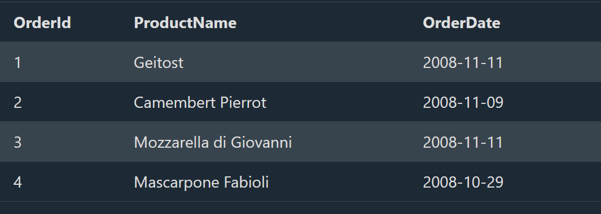

## SQL CREATE INDEX Statement

# SQL CREATE INDEX Statement

The CREATE INDEX statement is used to create indexes in tables.

Indexes are used to retrieve data from the database more quickly than otherwise. The users cannot see the indexes, they are just used to speed up searches/queries.

**Note**: Updating a table with indexes takes more time than updating a table without (because the indexes also need an update). So, only create indexes on columns that will be frequently searched against.

# CREATE INDEX Syntax

--> Creates an index on a table. Duplicate values are allowed:

CREATE INDEX index_name
ON table_name (column1, column2, ...);

# CREATE UNIQUE INDEX Syntax

--> Creates a unique index on a table. Duplicate values are not allowed:

CREATE UNIQUE INDEX index_name
ON table_name (column1, column2, ...);

**Note**: The syntax for creating indexes varies among different databases. Therefore: Check the syntax for creating indexes in your database.

# CREATE INDEX Example

--> The SQL statement below creates an index named "idx_lastname" on the "LastName" column in the "Persons" table:

CREATE INDEX idx_lastname
ON Persons (LastName);

--> If you want to create an index on a combination of columns, you can list the column names within the parentheses, separated by commas:

CREATE INDEX idx_pname
ON Persons (LastName, FirstName);

# DROP INDEX Statement

The DROP INDEX statement is used to delete an index in a table.

==> MS Access:

DROP INDEX index_name ON table_name;

==> SQL Server:

DROP INDEX table_name.index_name;

==> DB2/Oracle:

DROP INDEX index_name;

==> MySQL:

ALTER TABLE table_name
DROP INDEX index_name;

## SQL AUTO INCREMENT Field

# AUTO INCREMENT Field

Auto-increment allows a unique number to be generated automatically when a new record is inserted into a table.

Often this is the primary key field that we would like to be created automatically every time a new record is inserted.

# Syntax for MySQL

The following SQL statement defines the "Personid" column to be an auto-increment primary key field in the "Persons" table:

CREATE TABLE Persons (
    Personid int NOT NULL AUTO_INCREMENT,
    LastName varchar(255) NOT NULL,
    FirstName varchar(255),
    Age int,
    PRIMARY KEY (Personid)
);

--> MySQL uses the AUTO_INCREMENT keyword to perform an auto-increment feature.

--> By default, the starting value for AUTO_INCREMENT is 1, and it will increment by 1 for each new record.

--> To let the AUTO_INCREMENT sequence start with another value, use the following SQL statement:

ALTER TABLE Persons AUTO_INCREMENT=100;

--> To insert a new record into the "Persons" table, we will NOT have to specify a value for the "Personid" column (a unique value will be added automatically):

INSERT INTO Persons (FirstName,LastName)
VALUES ('Lars','Monsen');

--> The SQL statement above would insert a new record into the "Persons" table. The "Personid" column would be assigned a unique value.
--> The "FirstName" column would be set to "Lars" and the "LastName" column would be set to "Monsen".

# Syntax for SQL Server

--> The following SQL statement defines the "Personid" column to be an auto-increment primary key field in the "Persons" table

CREATE TABLE Persons (
    Personid int IDENTITY(1,1) PRIMARY KEY,
    LastName varchar(255) NOT NULL,
    FirstName varchar(255),
    Age int
);

--> The MS SQL Server uses the IDENTITY keyword to perform an auto-increment feature.

--> In the example above, the starting value for IDENTITY is 1, and it will increment by 1 for each new record.

**Tip**: To specify that the "Personid" column should start at value 10 and increment by 5, change it to IDENTITY(10,5).

--> To insert a new record into the "Persons" table, we will NOT have to specify a value for the "Personid" column (a unique value will be added automatically):

INSERT INTO Persons (FirstName,LastName)
VALUES ('Lars','Monsen');

The SQL statement above would insert a new record into the "Persons" table. The "Personid" column would be assigned a unique value. The "FirstName" column would be set to "Lars" and the "LastName" column would be set to "Monsen".

# Syntax for Access

--> The following SQL statement defines the "Personid" column to be an auto-increment primary key field in the "Persons" table:

CREATE TABLE Persons (
    Personid AUTOINCREMENT PRIMARY KEY,
    LastName varchar(255) NOT NULL,
    FirstName varchar(255),
    Age int
);
--> The MS Access uses the AUTOINCREMENT keyword to perform an auto-increment feature.

--> By default, the starting value for AUTOINCREMENT is 1, and it will increment by 1 for each new record.

**Tip**: To specify that the "Personid" column should start at value 10 and increment by 5, change the autoincrement to AUTOINCREMENT(10,5).

--> To insert a new record into the "Persons" table, we will NOT have to specify a value for the "Personid" column (a unique value will be added automatically):

INSERT INTO Persons (FirstName,LastName)
VALUES ('Lars','Monsen');

--> The SQL statement above would insert a new record into the "Persons" table. The "Personid" column would be assigned a unique value. The "FirstName" column would be set to "Lars" and the "LastName" column would be set to "Monsen".

# Syntax for Oracle

--> In Oracle the code is a little bit more tricky.

--> You will have to create an auto-increment field with the sequence object (this object generates a number sequence).

--> Use the following CREATE SEQUENCE syntax:

CREATE SEQUENCE seq_person
MINVALUE 1
START WITH 1
INCREMENT BY 1
CACHE 10;

--> The code above creates a sequence object called seq_person, that starts with 1 and will increment by 1. It will also cache up to 10 values for performance. The cache option specifies how many sequence values will be stored in memory for faster access.

--> To insert a new record into the "Persons" table, we will have to use the nextval function (this function retrieves the next value from seq_person sequence):

INSERT INTO Persons (Personid,FirstName,LastName)
VALUES (seq_person.nextval,'Lars','Monsen');

--> The SQL statement above would insert a new record into the "Persons" table. The "Personid" column would be assigned the next number from the seq_person sequence. The "FirstName" column would be set to "Lars" and the "LastName" column would be set to "Monsen".

## SQL Working With Dates

# SQL Dates

--> As long as your data contains only the date portion, your queries will work as expected. However, if a time portion is involved, it gets more complicated.

# SQL Date Data Types

MySQL comes with the following data types for storing a date or a date/time value in the database:

DATE - format YYYY-MM-DD
DATETIME - format: YYYY-MM-DD HH:MI:SS
TIMESTAMP - format: YYYY-MM-DD HH:MI:SS
YEAR - format YYYY or YY

==> SQL Server comes with the following data types for storing a date or a date/time value in the database:

DATE - format YYYY-MM-DD
DATETIME - format: YYYY-MM-DD HH:MI:SS
SMALLDATETIME - format: YYYY-MM-DD HH:MI:SS
TIMESTAMP - format: a unique number
Note: The date types are chosen for a column when you create a new table in your database!

# SQL Working with Dates

Look at the following table:

Orders Table


Now we want to select the records with an OrderDate of "2008-11-11" from the table above.

We use the following SELECT statement:

SELECT * FROM Orders WHERE OrderDate='2008-11-11'
The result-set will look like this:


## Deep Dive -- Why Exact-Match Date Queries Silently Fail on DATETIME Columns

--> The exact-match query shown above (`WHERE OrderDate='2008-11-11'`) works correctly ONLY if the column's data type is `DATE` (date only, no time component). If the column is actually `DATETIME`/`TIMESTAMP`, every stored value includes a time portion (`2008-11-11 14:32:07`), and an exact match against `'2008-11-11'` (implicitly `2008-11-11 00:00:00`) will match ONLY rows recorded at EXACTLY midnight -- silently excluding every other order placed that same day.

```sql
-- Fails silently on a DATETIME column -- only matches orders placed at exactly midnight
SELECT * FROM Orders WHERE OrderDate = '2008-11-11';

-- Correct approach for a DATETIME/TIMESTAMP column -- match the full day as a range
SELECT * FROM Orders WHERE OrderDate >= '2008-11-11' AND OrderDate < '2008-11-12';

-- Alternative -- extract just the date portion for comparison (works, but can prevent index use --
-- directly connecting to the "applying a function to a column" caveat in the SQL Introduction file)
SELECT * FROM Orders WHERE DATE(OrderDate) = '2008-11-11';
```

--> This is the exact same underlying "half-open range" fix covered for `BETWEEN` in the IN and BETWEEN Operators file, applied here to simple equality instead -- both stem from the same root cause: a `DATETIME` column storing more precision than the comparison value accounts for.

## Deep Dive -- Auto-Increment/Sequence Gaps Are Normal, Not a Bug

--> A genuinely common point of confusion -- auto-incrementing IDs frequently have GAPS (1, 2, 5, 6, 9...) rather than a perfectly continuous sequence, even without any rows ever being deleted. This happens because the sequence counter increments EVERY TIME an insert is ATTEMPTED, even if that specific insert later fails or is rolled back (e.g. due to a constraint violation, or an explicit `ROLLBACK` inside a transaction) -- the counter itself doesn't roll back with the failed insert.
--> **Why this matters practically** -- auto-incrementing IDs should never be relied upon to indicate exactly how many rows exist, how much time has passed between two IDs, or that IDs are perfectly sequential with no gaps -- any business logic assuming otherwise (e.g. "invoice numbers must have zero gaps for accounting compliance") needs its OWN separate, explicitly-managed sequence/counter, not the database's auto-increment mechanism, which was designed purely to guarantee uniqueness, not gap-free continuity.

## Deep Dive -- Indexes and Auto-Increment Working Together

--> A `PRIMARY KEY` column is automatically indexed by virtually every database (as noted in the Indexing and Performance Tuning file) -- combining this with `AUTO_INCREMENT` means every table with a standard auto-incrementing primary key already has an efficient index for looking up rows by ID, with zero additional `CREATE INDEX` work needed. Additional indexes (like the `idx_lastname` example above) are for columns OTHER than the primary key that are also frequently searched/filtered/joined on.
