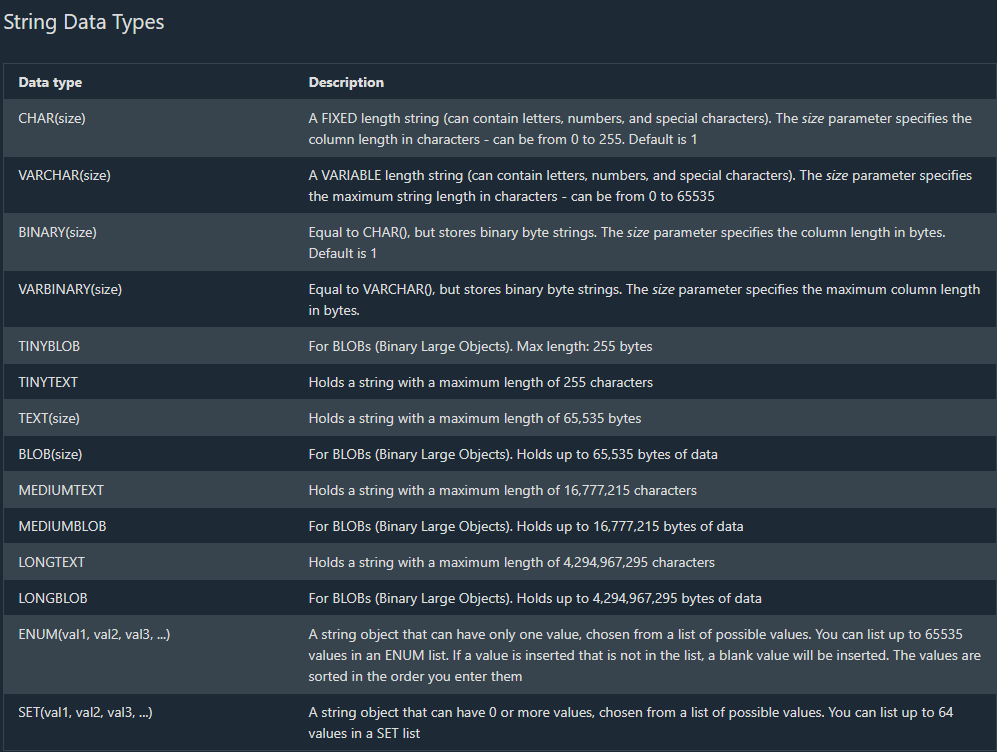
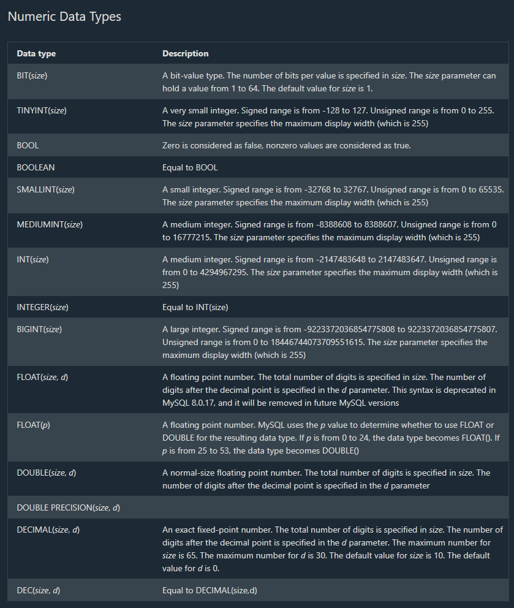
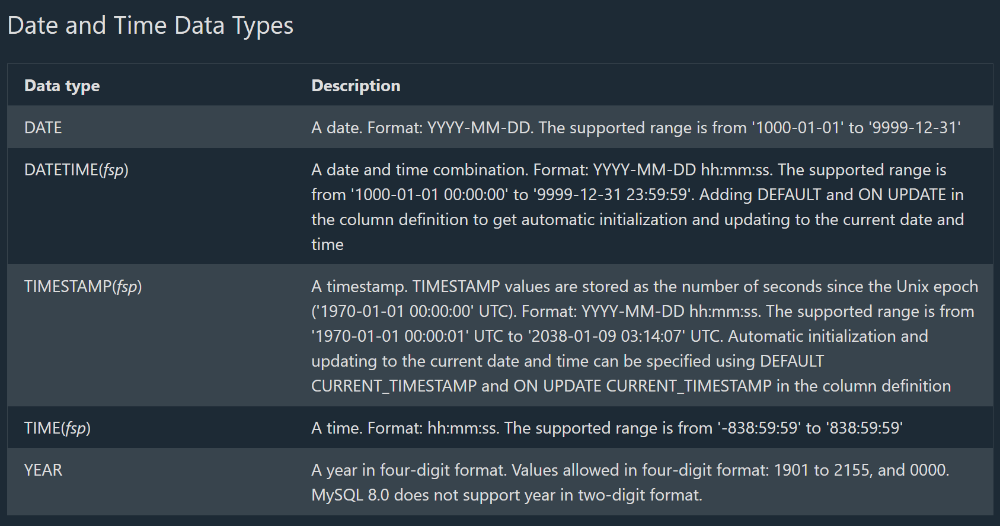
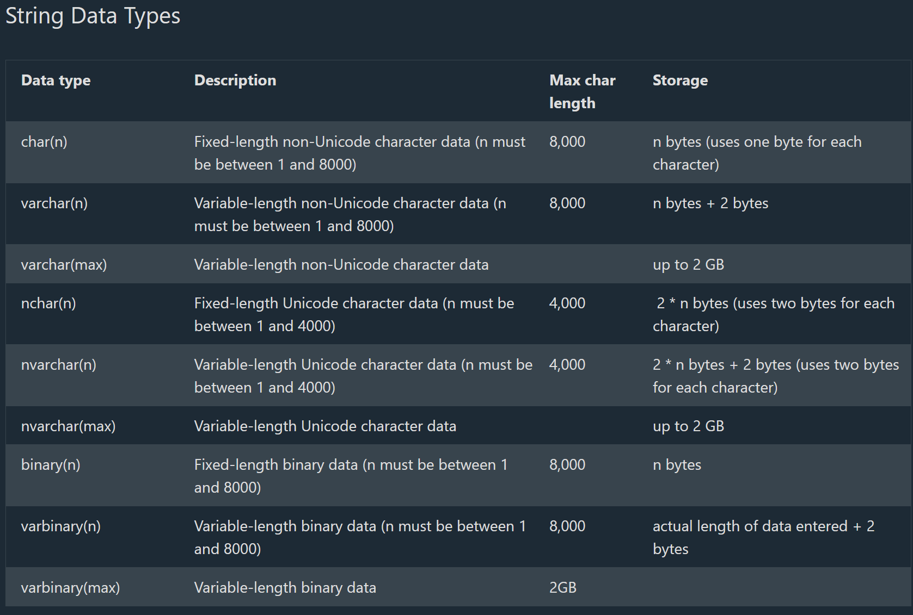
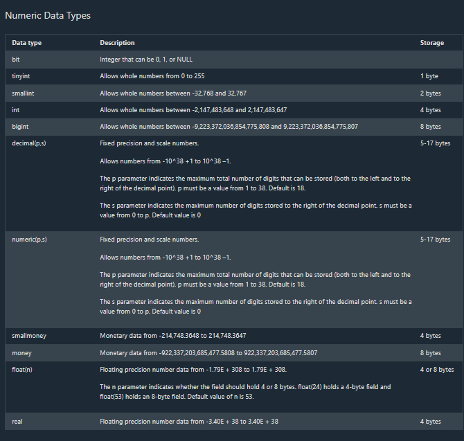
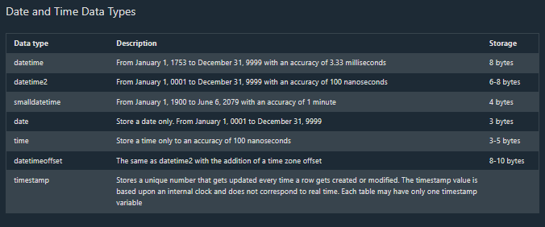
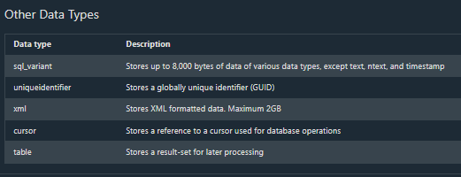
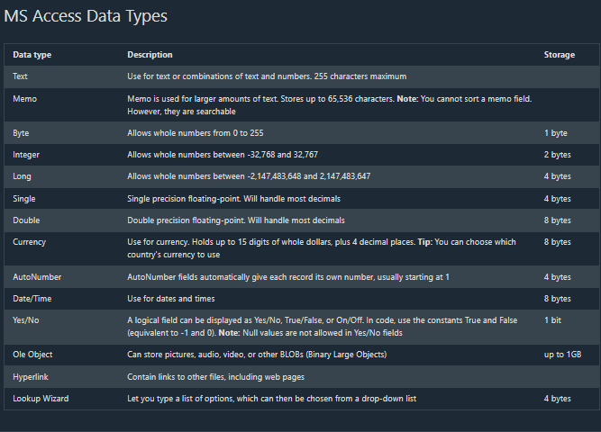

## SQL Views

# SQL CREATE VIEW Statement

--> In SQL, a view is a virtual table based on the result-set of an SQL statement.

--> A view contains rows and columns, just like a real table. The fields in a view are fields from one or more real tables in the database.

--> You can add SQL statements and functions to a view and present the data as if the data were coming from one single table.

--> A view is created with the CREATE VIEW statement.

# CREATE VIEW Syntax

CREATE VIEW view_name AS
SELECT column1, column2, ...
FROM table_name
WHERE condition;
Note: A view always shows up-to-date data! The database engine recreates the view, every time a user queries it.

# SQL CREATE VIEW Examples

The following SQL creates a view that shows all customers from Brazil:

==> Example

CREATE VIEW [Brazil Customers] AS
SELECT CustomerName, ContactName
FROM Customers
WHERE Country = 'Brazil';

--> We can query the view above as follows:

==> Example

SELECT * FROM [Brazil Customers];

--> The following SQL creates a view that selects every product in the "Products" table with a price higher than the average price:

==> Example

CREATE VIEW [Products Above Average Price] AS
SELECT ProductName, Price
FROM Products
WHERE Price > (SELECT AVG(Price) FROM Products);

--> We can query the view above as follows:

==> Example

SELECT * FROM [Products Above Average Price];

# SQL Updating a View

A view can be updated with the CREATE OR REPLACE VIEW statement.

==> SQL CREATE OR REPLACE VIEW Syntax

CREATE OR REPLACE VIEW view_name AS
SELECT column1, column2, ...
FROM table_name
WHERE condition;

--> The following SQL adds the "City" column to the "Brazil Customers" view:

==> Example

CREATE OR REPLACE VIEW [Brazil Customers] AS
SELECT CustomerName, ContactName, City
FROM Customers
WHERE Country = 'Brazil';

# SQL Dropping a View

--> A view is deleted with the DROP VIEW statement.

==> SQL DROP VIEW Syntax

DROP VIEW view_name;
The following SQL drops the "Brazil Customers" view:

==> Example
DROP VIEW [Brazil Customers];

## SQL Injection

# SQL Injection

--> SQL injection is a code injection technique that might destroy your database.

--> SQL injection is one of the most common web hacking techniques.

--> SQL injection is the placement of malicious code in SQL statements, via web page input.

# SQL in Web Pages

--> SQL injection usually occurs when you ask a user for input, like their username/userid, and instead of a name/id, the user gives you an SQL statement that you will unknowingly run on your database.

Look at the following example which creates a SELECT statement by adding a variable (txtUserId) to a select string. The variable is fetched from user input (getRequestString):

Example
txtUserId = getRequestString("UserId");
txtSQL = "SELECT * FROM Users WHERE UserId = " + txtUserId;

# SQL Injection Based on 1=1 is Always True

--> Look at the example above again. The original purpose of the code was to create an SQL statement to select a user, with a given user id.

--> If there is nothing to prevent a user from entering "wrong" input, the user can enter some "smart" input like this:

--> UserId:
105 OR 1=1

--> Then, the SQL statement will look like this:

SELECT * FROM Users WHERE UserId = 105 OR 1=1;

--> The SQL above is valid and will return ALL rows from the "Users" table, since OR 1=1 is always TRUE.

==> Does the example above look dangerous? What if the "Users" table contains names and passwords

--> The SQL statement above is much the same as this:

SELECT UserId, Name, Password FROM Users WHERE UserId = 105 or 1=1;

--> A hacker might get access to all the user names and passwords in a database, by simply inserting 105 OR 1=1 into the input field.

# SQL Injection Based on ""="" is Always True

Here is an example of a user login on a web site:

Username:  John Doe
Password:  myPass

Example: uName = getRequestString("username");
uPass = getRequestString("userpassword");

sql = 'SELECT *FROM Users WHERE Name ="' + uName + '" AND Pass ="' + uPass + '"'
Result
SELECT* FROM Users WHERE Name ="John Doe" AND Pass ="myPass"
A hacker might get access to user names and passwords in a database by simply inserting " OR ""=" into the user name or password text box:

User Name:
" or ""="

Password:
" or ""="

The code at the server will create a valid SQL statement like this:

Result
SELECT * FROM Users WHERE Name ="" or ""="" AND Pass ="" or ""=""
The SQL above is valid and will return all rows from the "Users" table, since OR ""="" is always TRUE.

# SQL Injection Based on Batched SQL Statements

--> Most databases support batched SQL statement.
--> A batch of SQL statements is a group of two or more SQL statements, separated by semicolons.
--> The SQL statement below will return all rows from the "Users" table, then delete the "Suppliers" table.

==> Example
SELECT * FROM Users; DROP TABLE Suppliers
Look at the following example:

==> Example
txtUserId = getRequestString("UserId");
txtSQL = "SELECT * FROM Users WHERE UserId = " + txtUserId;

And the following input:
User id: 105; DROP TABLE Suppliers
The valid SQL statement would look like this:

==> Result

SELECT * FROM Users WHERE UserId = 105; DROP TABLE Suppliers;

# Use SQL Parameters for Protection

--> To protect a web site from SQL injection, you can use SQL parameters.
--> SQL parameters are values that are added to an SQL query at execution time, in a controlled manner.

==> ASP.NET Razor Example
txtUserId = getRequestString("UserId");
txtSQL = "SELECT * FROM Users WHERE UserId = @0";
db.Execute(txtSQL,txtUserId);

Note that parameters are represented in the SQL statement by a @ marker.
The SQL engine checks each parameter to ensure that it is correct for its column and are treated literally, and not as part of the SQL to be executed.

==> Another Example
txtNam = getRequestString("CustomerName");
txtAdd = getRequestString("Address");
txtCit = getRequestString("City");
txtSQL = "INSERT INTO Customers (CustomerName,Address,City) Values(@0,@1,@2)";
db.Execute(txtSQL,txtNam,txtAdd,txtCit);

==> Examples
The following examples shows how to build parameterized queries in some common web languages.

==> SELECT STATEMENT IN ASP.NET:

txtUserId = getRequestString("UserId");
sql = "SELECT * FROM Customers WHERE CustomerId = @0";
command = new SqlCommand(sql);
command.Parameters.AddWithValue("@0",txtUserId);
command.ExecuteReader();

==> INSERT INTO STATEMENT IN ASP.NET:

txtNam = getRequestString("CustomerName");
txtAdd = getRequestString("Address");
txtCit = getRequestString("City");
txtSQL = "INSERT INTO Customers (CustomerName,Address,City) Values(@0,@1,@2)";
command = new SqlCommand(txtSQL);
command.Parameters.AddWithValue("@0",txtNam);
command.Parameters.AddWithValue("@1",txtAdd);
command.Parameters.AddWithValue("@2",txtCit);
command.ExecuteNonQuery();

==> INSERT INTO STATEMENT IN PHP:

$stmt = $dbh->prepare("INSERT INTO Customers (CustomerName,Address,City)
VALUES (:nam, :add, :cit)");
$stmt->bindParam(':nam', $txtNam);
$stmt->bindParam(':add', $txtAdd);
$stmt->bindParam(':cit', $txtCit);
$stmt->execute();

## SQL Hosting

# SQL Hosting

--> If you want your web site to be able to store and retrieve data from a database, your web server should have access to a database-system that uses the SQL language.
--> If your web server is hosted by an Internet Service Provider (ISP), you will have to look for SQL hosting plans.
--> The most common SQL hosting databases are MS SQL Server, Oracle, MySQL, and MS Access.

==> MS SQL Server
--> Microsoft's SQL Server is a popular database software for database-driven web sites with high traffic.
--> SQL Server is a very powerful, robust and full featured SQL database system.

==> Oracle
--> Oracle is also a popular database software for database-driven web sites with high traffic.
--> Oracle is a very powerful, robust and full featured SQL database system.

==> MySQL
--> MySQL is also a popular database software for web sites.
--> MySQL is a very powerful, robust and full featured SQL database system.
--> MySQL is an inexpensive alternative to the expensive Microsoft and Oracle solutions.

==> MS Access
--> When a web site requires only a simple database, Microsoft Access can be a solution.
--> MS Access is not well suited for very high-traffic, and not as powerful as MySQL, SQL Server, or Oracle.

## SQL Data Types for MySQL, SQL Server, and MS Access

--> The data type of a column defines what value the column can hold: integer, character, money, date and time, binary, and so on.

# SQL Data Types

--> Each column in a database table is required to have a name and a data type.

--> An SQL developer must decide what type of data that will be stored inside each column when creating a table. The data type is a guideline for SQL to understand what type of data is expected inside of each column, and it also identifies how SQL will interact with the stored data.

**Note** : Data types might have different names in different database. And even if the name is the same, the size and other details may be different!

# MySQL Data Types





# MS SQL Server Data Types






# MS Access Data Types



## Deep Dive -- Materialized Views vs Regular Views

--> The `CREATE VIEW` covered above defines a VIRTUAL table -- as the note above correctly says, "the database engine recreates the view every time a user queries it," meaning a view's underlying query re-runs from scratch on every single access, with no data actually stored for the view itself.
--> A **Materialized View** (supported by PostgreSQL, Oracle, and others) instead PHYSICALLY STORES the query's result, refreshed periodically or on demand rather than on every single read -- trading data freshness for read performance, directly analogous to the CQRS "read model" concept covered in the Software Architecture files. Appropriate for expensive aggregate queries (a dashboard's daily sales summary) where slightly stale data is an acceptable trade-off for dramatically faster reads.

```sql
CREATE MATERIALIZED VIEW daily_sales_summary AS
SELECT DATE(order_date) AS day, SUM(amount) AS total_sales
FROM orders
GROUP BY DATE(order_date);

REFRESH MATERIALIZED VIEW daily_sales_summary;   -- Must be explicitly refreshed -- doesn't auto-update like a regular view
```

## Deep Dive -- Why Modern Applications Rarely Write Raw SQL String Concatenation Anymore

--> The SQL injection examples above show the vulnerability at its rawest -- directly concatenating user input into a SQL string. Modern application development has largely moved to using an ORM (covered in the ORM SQLAlchemy and Django ORM file) or a query builder, which parameterizes queries automatically as a natural consequence of how their API works, rather than requiring a developer to remember to do it manually every single time.

```python
# SQLAlchemy ORM -- parameterization happens automatically, the developer never manually builds a SQL string at all
user = session.query(User).filter(User.id == user_id).first()

# Django ORM -- same automatic protection
user = User.objects.get(id=user_id)
```

--> This is precisely why SQL injection, despite being one of the OLDEST known web vulnerabilities (referenced in depth in the Injection Attacks and Broken Access Control Deep Dive file in the Ethical Hacking track), REMAINS a top finding in real security assessments today -- it's not that the defense (parameterized queries) is unknown, it's that raw string concatenation is still occasionally written by hand (especially for complex dynamic queries an ORM doesn't handle gracefully), and each instance re-introduces the exact same decades-old vulnerability class.

## Deep Dive -- Injection Beyond WHERE Clauses -- ORDER BY and LIMIT

--> A frequently overlooked injection surface -- dynamically building the `ORDER BY` or `LIMIT` portion of a query from user input (e.g. a "sort by" dropdown) CANNOT always be parameterized the same way a `WHERE` value can, since column/table names and SQL keywords generally can't be passed as bind parameters in most database drivers.

```python
# Vulnerable -- "sort_column" comes directly from user input (e.g. a URL query parameter)
query = f"SELECT * FROM products ORDER BY {sort_column}"
```

--> The correct defense here is an ALLOWLIST -- validate that `sort_column` is one of a small, known set of legitimate column names BEFORE using it in the query, rather than attempting to sanitize or parameterize it directly.

```python
ALLOWED_SORT_COLUMNS = {"name", "price", "created_at"}
if sort_column not in ALLOWED_SORT_COLUMNS:
    raise ValueError("Invalid sort column")
query = f"SELECT * FROM products ORDER BY {sort_column}"   # Now safe -- only a known-good value can reach this point
```
